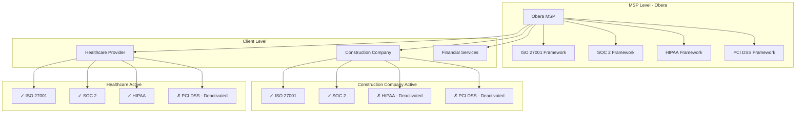

# Compliance Hierarchical Model Documentation
## MSP-to-Client Cascade Architecture

**Last Updated:** October 13, 2025  
**Model Type:** Hierarchical MSP Cascade  
**Version:** 1.0

---

## 📋 Overview

The OberaConnect compliance system now implements a **hierarchical MSP model** similar to NinjaOne's policy cascade functionality. This allows Obera (acting as the MSP) to define compliance frameworks that automatically cascade to all client organizations while respecting each client's unique compliance needs.

### Key Principles

1. **MSP Framework Definition** - Obera defines master compliance frameworks at the MSP level
2. **Automatic Cascade** - Frameworks automatically propagate to all client customers
3. **Client Control** - Each client can activate/deactivate specific frameworks they need
4. **Inheritance Tracking** - System tracks which frameworks/controls are inherited vs. custom

---

## 🏗️ Architecture

### Customer Hierarchy



### Database Schema Changes

#### customers Table
```sql
-- Hierarchical customer structure
parent_customer_id UUID        -- References parent MSP/customer
customer_type TEXT             -- 'msp', 'client', 'end_user'
inherit_compliance BOOLEAN     -- Whether to inherit frameworks from parent
```

#### compliance_frameworks Table
```sql
-- Framework inheritance tracking
inherited_from_parent BOOLEAN       -- True if cascaded from parent
parent_framework_id UUID           -- Links to parent framework
is_active BOOLEAN                  -- Client can deactivate inherited frameworks
```

#### compliance_controls Table
```sql
-- Control inheritance tracking
inherited_from_parent BOOLEAN       -- True if cascaded from parent
parent_control_id UUID             -- Links to parent control
```

---

## ⚙️ How It Works

### 1. Framework Creation at MSP Level

When Obera (MSP) creates or activates a compliance framework:

```sql
-- Example: Obera activates ISO 27001
INSERT INTO compliance_frameworks (
  customer_id,          -- Obera's customer_id
  framework_name,       -- 'ISO 27001'
  version,              -- '2013'
  is_active,            -- true
  inherited_from_parent -- false (it's the source)
) VALUES (...);
```

**Trigger fires automatically:**
- `trigger_cascade_framework()` detects MSP-level framework creation
- Calls `cascade_framework_to_children()` function
- Propagates to all clients with `inherit_compliance = true`

### 2. Automatic Cascade to Clients

The cascade function:

```sql
CREATE OR REPLACE FUNCTION cascade_framework_to_children(
  _framework_id UUID, 
  _parent_customer_id UUID
)
```

**Process:**
1. Queries all child customers of the MSP
2. Filters for customers with `inherit_compliance = true`
3. For each child:
   - Checks if framework already exists
   - Creates inherited framework (if new)
   - Cascades all associated controls
   - Marks as `inherited_from_parent = true`
   - Links via `parent_framework_id`

### 3. Client-Level Control

Each client can manage their inherited frameworks:

**Deactivate Unnecessary Frameworks:**
```sql
-- Construction company deactivates HIPAA
UPDATE compliance_frameworks
SET is_active = false
WHERE customer_id = 'construction-company-id'
  AND framework_name = 'HIPAA';
```

**Reactivate When Needed:**
```sql
-- Later decides they need HIPAA
UPDATE compliance_frameworks
SET is_active = true
WHERE customer_id = 'construction-company-id'
  AND framework_name = 'HIPAA';
```

**Important:** Clients can only toggle `is_active` - they cannot delete inherited frameworks or modify core framework details (version, controls, etc.)

---

## 🎯 Use Cases

### Use Case 1: Construction Company

**Scenario:** Construction company doesn't need healthcare compliance

**Inherited Frameworks:**
- ✅ ISO 27001 (active) - General security best practices
- ✅ SOC 2 (active) - Required for MSP contracts
- ❌ HIPAA (deactivated) - Not handling healthcare data
- ❌ PCI DSS (deactivated) - Not processing credit cards

**Implementation:**
```sql
-- Admin deactivates HIPAA and PCI DSS for construction client
UPDATE compliance_frameworks
SET is_active = false
WHERE customer_id = 'construction-co-uuid'
  AND framework_name IN ('HIPAA', 'PCI DSS');
```

### Use Case 2: Healthcare Provider

**Scenario:** Healthcare provider needs all frameworks

**Inherited Frameworks:**
- ✅ ISO 27001 (active)
- ✅ SOC 2 (active)
- ✅ HIPAA (active)
- ❌ PCI DSS (deactivated initially, may activate later)

### Use Case 3: Adding New Framework at MSP Level

**Scenario:** Obera adds CMMC Level 2 for DoD contractors

**Process:**
1. Obera creates CMMC framework
2. Trigger automatically cascades to all clients
3. Each client sees CMMC (active by default)
4. Non-DoD clients can deactivate it
5. DoD contractors keep it active

---

## 🔧 Database Functions

### get_customer_hierarchy()
Returns customer hierarchy from child to parent.

```sql
SELECT * FROM get_customer_hierarchy('client-uuid');
```

**Returns:**
| customer_id | level | path |
|-------------|-------|------|
| client-uuid | 0 | [client-uuid] |
| obera-uuid | 1 | [client-uuid, obera-uuid] |

### get_child_customers()
Returns all children of a parent customer.

```sql
SELECT * FROM get_child_customers('obera-uuid');
```

**Returns:**
| customer_id | level | customer_name | customer_type |
|-------------|-------|---------------|---------------|
| client1-uuid | 1 | Construction Co | client |
| client2-uuid | 1 | Healthcare Inc | client |

### cascade_framework_to_children()
Cascades framework and controls to all children.

```sql
SELECT cascade_framework_to_children(
  'framework-uuid',
  'obera-uuid'
);
```

**Behavior:**
- Creates inherited framework copies
- Cascades all associated controls
- Respects existing client preferences
- Does NOT override client's `is_active` status

---

## 📊 Querying Hierarchical Data

### View All Active Frameworks for a Client

```sql
SELECT 
  cf.framework_name,
  cf.version,
  cf.is_active,
  cf.inherited_from_parent,
  c.company_name as source_organization
FROM compliance_frameworks cf
LEFT JOIN compliance_frameworks parent_cf 
  ON cf.parent_framework_id = parent_cf.id
LEFT JOIN customers c 
  ON parent_cf.customer_id = c.id
WHERE cf.customer_id = 'client-uuid'
ORDER BY cf.framework_name;
```

### Find Clients That Deactivated Specific Framework

```sql
SELECT 
  c.company_name,
  cf.framework_name,
  cf.is_active,
  cf.updated_at
FROM compliance_frameworks cf
JOIN customers c ON cf.customer_id = c.id
WHERE cf.inherited_from_parent = true
  AND cf.framework_name = 'HIPAA'
  AND cf.is_active = false;
```

### Compliance Coverage Report Across All Clients

```sql
SELECT 
  c.company_name,
  COUNT(DISTINCT cf.id) as total_frameworks,
  COUNT(DISTINCT CASE WHEN cf.is_active THEN cf.id END) as active_frameworks,
  COUNT(DISTINCT cc.id) as total_controls,
  COUNT(DISTINCT CASE WHEN cc.implementation_status = 'implemented' 
    THEN cc.id END) as implemented_controls
FROM customers c
LEFT JOIN compliance_frameworks cf ON c.id = cf.customer_id
LEFT JOIN compliance_controls cc ON cf.id = cc.framework_id
WHERE c.parent_customer_id = 'obera-uuid'
GROUP BY c.id, c.company_name
ORDER BY c.company_name;
```

---

## 🔐 Access Control

### RLS Policies

Clients can only view/modify their own frameworks:

```sql
-- Clients can view their frameworks
CREATE POLICY "Users view own frameworks"
ON compliance_frameworks FOR SELECT
USING (
  customer_id IN (
    SELECT customer_id FROM user_profiles WHERE user_id = auth.uid()
  )
);

-- Clients can update (activate/deactivate) their frameworks
CREATE POLICY "Users manage framework status"
ON compliance_frameworks FOR UPDATE
USING (
  customer_id IN (
    SELECT customer_id FROM user_profiles WHERE user_id = auth.uid()
  )
  AND inherited_from_parent = true  -- Can only modify inherited frameworks
)
WITH CHECK (
  -- Only allow changing is_active
  is_active IS DISTINCT FROM old.is_active
  AND framework_name = old.framework_name
  AND version = old.version
);
```

### MSP-Level Controls

Only MSP admins can create/modify source frameworks:

```sql
CREATE POLICY "MSP admins manage frameworks"
ON compliance_frameworks FOR ALL
USING (
  customer_id IN (
    SELECT id FROM customers WHERE customer_type = 'msp'
  )
  AND has_role(auth.uid(), 'admin'::app_role)
);
```

---

## 🎨 UI Considerations

### Framework List Display

Show inherited status clearly:

```tsx
<Badge variant={framework.inherited_from_parent ? "secondary" : "default"}>
  {framework.inherited_from_parent ? "Inherited from MSP" : "Custom"}
</Badge>

<Switch 
  checked={framework.is_active}
  onCheckedChange={(checked) => handleToggleFramework(framework.id, checked)}
  disabled={!framework.inherited_from_parent} // Only inherited can be toggled
/>
```

### Compliance Dashboard

```tsx
// Show inherited vs custom frameworks
const inheritedFrameworks = frameworks.filter(f => f.inherited_from_parent);
const customFrameworks = frameworks.filter(f => !f.inherited_from_parent);

<Tabs>
  <TabsList>
    <TabsTrigger>All Frameworks</TabsTrigger>
    <TabsTrigger>Inherited ({inheritedFrameworks.length})</TabsTrigger>
    <TabsTrigger>Custom ({customFrameworks.length})</TabsTrigger>
  </TabsList>
</Tabs>
```

---

## 🚀 Migration & Deployment

### Deploying Hierarchical Model

1. **Run migration:**
   ```bash
   # Migration adds columns and functions
   # Already deployed via migration tool
   ```

2. **Set Obera as MSP:**
   ```sql
   UPDATE customers
   SET customer_type = 'msp',
       parent_customer_id = NULL
   WHERE id = 'obera-customer-id';
   ```

3. **Configure client relationships:**
   ```sql
   UPDATE customers
   SET parent_customer_id = 'obera-customer-id',
       customer_type = 'client',
       inherit_compliance = true
   WHERE id IN ('client1-id', 'client2-id', ...);
   ```

4. **Manually cascade existing frameworks:**
   ```sql
   -- For each existing Obera framework
   SELECT cascade_framework_to_children(
     framework_id,
     'obera-customer-id'
   ) FROM compliance_frameworks
   WHERE customer_id = 'obera-customer-id';
   ```

---

## ✅ Benefits

1. **Centralized Management** - Obera maintains single source of truth
2. **Automatic Updates** - Framework changes cascade automatically
3. **Client Autonomy** - Clients control what's relevant to them
4. **Consistency** - Standard controls across all clients
5. **Flexibility** - Clients can add custom frameworks too
6. **Audit Trail** - Clear tracking of inherited vs custom compliance

---

## 🔍 Troubleshooting

### Framework Not Cascading

**Check:**
```sql
-- Verify parent is MSP
SELECT customer_type FROM customers WHERE id = 'parent-id';

-- Verify child has inheritance enabled
SELECT inherit_compliance FROM customers WHERE id = 'child-id';

-- Verify trigger is enabled
SELECT * FROM pg_trigger 
WHERE tgname = 'cascade_framework_on_insert';
```

### Client Can't Deactivate Framework

**Check:**
```sql
-- Verify framework is inherited
SELECT inherited_from_parent 
FROM compliance_frameworks 
WHERE id = 'framework-id';

-- Verify RLS policy
-- User should have UPDATE permission on their customer's frameworks
```

---

## 📚 Related Documentation

- **Database Schema:** See migration file for complete schema
- **API Integration:** See API_REFERENCE.md for querying hierarchical data
- **Security Model:** See SECURITY_MASTER_PLAN.md for RLS policies
- **Compliance Workflows:** See COMPLIANCE_AUDIT.md for audit procedures

---

**Implementation Status:** ✅ Deployed  
**Next Steps:** Update UI to show inherited status, add bulk framework toggle
