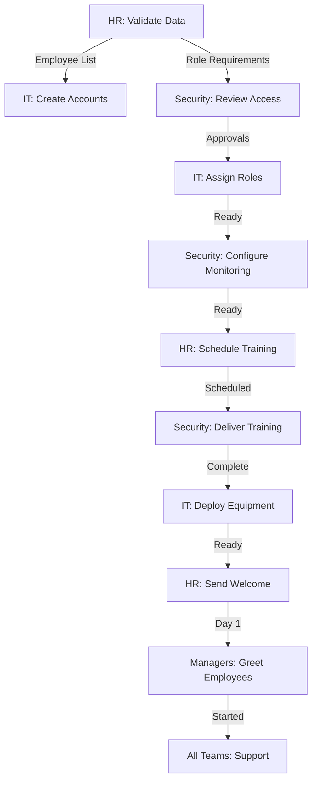

# Employee Security Onboarding Master Plan

**Version:** 1.1  
**Last Updated:** October 13, 2025  
**Status:** Ready for Implementation  
**Classification:** Internal Use Only  
**Security Rating:** A (94/100) - Updated Oct 2025

---

## Executive Summary

This master plan provides a comprehensive, coordinated approach to onboarding all employees into the OberaConnect security framework during the first implementation iteration. It serves as the single source of truth for the baseline employee integration process.

### Purpose
Establish a secure, compliant, and efficient onboarding process that:
- Integrates all employees into the security framework
- Ensures proper access control and authentication
- Delivers comprehensive security awareness training
- Creates audit trails for compliance
- Provides excellent employee experience

### Scope
- **Timeline:** 3 weeks from initiation to first employee start dates
- **Coverage:** All employees across all departments
- **Teams Involved:** HR, IT, Security, Managers
- **Deliverable:** Fully onboarded, security-compliant workforce

### Success Criteria
- 100% of employees with active, secure accounts
- 100% role assignment accuracy
- 100% security training completion
- <5% support ticket rate
- Zero security incidents during onboarding
- >4.0/5.0 employee satisfaction

---

## Table of Contents

1. [Overview and Timeline](#overview-and-timeline)
2. [Team Responsibilities](#team-responsibilities)
3. [Pre-Implementation Phase](#pre-implementation-phase)
4. [Implementation Phase](#implementation-phase)
5. [Post-Implementation Phase](#post-implementation-phase)
6. [Master Coordination Process](#master-coordination-process)
7. [Security and Compliance](#security-and-compliance)
8. [Metrics and Reporting](#metrics-and-reporting)
9. [Appendices](#appendices)

---

## Overview and Timeline

### 3-Week Implementation Timeline

```
Week 0 (Pre-Implementation)
├── Day 1-2: HR validates employee data
├── Day 2-3: IT prepares infrastructure
├── Day 3: Security audits systems
└── Day 3: All teams coordination meeting

Week 1 (Account Creation & Setup)
├── Day 1-2: IT creates accounts from HR data
├── Day 3-4: Security approves elevated roles
├── Day 4-5: IT assigns roles and application access
└── Day 5: Security establishes baselines

Week 2 (Training & Equipment)
├── Day 1-3: Security delivers training (all sessions)
├── Day 4-5: IT deploys equipment
├── Day 5: HR sends welcome communications
└── Day 5: Final readiness verification

Week 3 (Go-Live & Support)
├── Day 1: First employees start
├── Day 1-5: Full support mode (all teams)
├── Day 5: End of week reviews
└── Day 5: Lessons learned meeting

Week 4-5 (Ongoing)
├── 30-day check-ins with all employees
├── Metrics reporting
└── Process improvement
```

### Dependencies Map



---

## Team Responsibilities

### HR Team (Lead: HR Manager)

**Pre-Implementation:**
- Validate all employee data
- Create master employee list
- Define role assignments
- Prepare CSV for IT
- Schedule all training sessions

**Implementation:**
- Coordinate training delivery
- Send welcome communications
- Process benefits enrollment
- Track compliance documentation
- Conduct first day support

**Post-Implementation:**
- Send employee surveys
- Conduct 30-day check-ins
- Compile feedback reports
- Update onboarding materials

**Detailed Plan:** See `HR_TEAM_EMPLOYEE_ONBOARDING_PLAN.md`

---

### IT Team (Lead: IT Manager)

**Pre-Implementation:**
- Validate infrastructure
- Test authentication system
- Prepare bulk creation tools
- Stage equipment inventory
- Configure application catalog

**Implementation:**
- Create user accounts (bulk)
- Assign roles and permissions
- Configure application access
- Deploy workstations
- Provide technical support

**Post-Implementation:**
- Resolve access issues
- Final system validation
- Hardware inventory update
- Documentation updates

**Detailed Plan:** See `IT_TEAM_EMPLOYEE_ONBOARDING_PLAN.md`

---

### Security Team (Lead: Security Manager)

**Pre-Implementation:**
- Audit security infrastructure
- Validate RLS policies
- Review RBAC configuration
- Prepare training materials
- Test monitoring systems

**Implementation:**
- Review elevated access requests
- Approve admin roles
- Deliver security training
- Establish user baselines
- Configure anomaly detection

**Post-Implementation:**
- Monitor audit logs
- Generate security metrics
- Conduct security review
- Create improvement plan

**Detailed Plan:** See `SECURITY_TEAM_EMPLOYEE_ONBOARDING_PLAN.md`

---

### Managers/Department Heads (All People Managers)

**Pre-Implementation:**
- Review new hire information
- Prepare workspaces
- Plan first week schedules
- Announce to teams
- Coordinate with IT/HR

**Implementation:**
- Greet employees on Day 1
- Conduct role overview meetings
- Provide daily check-ins
- Assign progressive tasks
- Verify security compliance

**Post-Implementation:**
- Conduct week 1 reviews
- Provide ongoing 1-on-1s
- Monitor adaptation
- Conduct 30-day reviews

**Detailed Plan:** See `MANAGER_EMPLOYEE_ONBOARDING_PLAN.md`

---

## Pre-Implementation Phase

### Week 0: Preparation (All Teams)

#### Day 1: HR Data Validation

**Owner:** HR Team  
**Duration:** 6 hours

**Activities:**
1. Gather employee data from all sources
2. Create master employee list with all required fields
3. Validate data accuracy and completeness
4. Map employees to departments
5. Define initial role assignments

**Required Fields:**
```
- Full Name
- Email Address
- Department
- Job Title
- Employee Type (FT/PT/Contract)
- Start Date
- Manager Name & Email
- Location
```

**Deliverable:** Validated employee list in CSV format

---

#### Day 2: IT Infrastructure Validation

**Owner:** IT Team  
**Duration:** 4 hours

**Activities:**
1. Verify authentication system operational
2. Test login/signup/password reset flows
3. Validate RLS policies on all tables
4. Test RBAC functionality with test accounts
5. Prepare bulk account creation scripts

**Validation Queries:**
```sql
-- Verify RLS enabled
SELECT tablename, rowsecurity 
FROM pg_tables 
WHERE schemaname = 'public' 
AND tablename IN ('user_profiles', 'user_roles', 'audit_logs');

-- Verify roles exist
SELECT name FROM roles ORDER BY name;

-- Test account creation (sample)
-- Run bulk import with 3 test accounts
```

**Deliverable:** Infrastructure validation report (PASS/FAIL)

---

#### Day 3: Security Audit

**Owner:** Security Team  
**Duration:** 8 hours

**Activities:**
1. Audit authentication security controls
2. Validate RLS policy effectiveness
3. Test audit logging coverage
4. Review RBAC permission matrix
5. Verify privileged access management

**Security Checklist:**
- [ ] Password policy enforced (12+ chars)
- [ ] MFA enrollment flow working
- [ ] Session management configured
- [ ] Account lockout after 5 attempts
- [ ] RLS enabled on all critical tables
- [ ] Audit logs capturing all required events
- [ ] RBAC roles properly configured
- [ ] No excessive default permissions

**Deliverable:** Security infrastructure audit report

---

#### Day 3: All-Teams Coordination Meeting

**Attendees:** HR Manager, IT Manager, Security Manager, Key Department Heads  
**Duration:** 2 hours  
**Location:** Conference room or virtual

**Agenda:**

1. **Review Master Employee List (30 min)**
   - HR presents validated data
   - Confirm headcount by department
   - Review role assignment plan
   - Address data questions

2. **Technical Readiness (20 min)**
   - IT confirms infrastructure ready
   - Review bulk creation process
   - Discuss equipment availability
   - Timeline for account creation

3. **Security Requirements (20 min)**
   - Security presents audit findings
   - Review elevated access approval process
   - Discuss training schedule
   - Monitoring and compliance

4. **Timeline Alignment (20 min)**
   - Confirm 3-week timeline
   - Identify dependencies
   - Assign accountability
   - Set daily standup schedule

5. **Communication Protocols (15 min)**
   - Daily standup format
   - Escalation procedures
   - Shared tracking tools
   - Status reporting

6. **Q&A and Action Items (15 min)**

**Deliverable:** Meeting minutes, signed-off implementation plan

---

## Implementation Phase

### Week 1: Account Creation & Access Setup

#### Days 1-2: Bulk Account Creation

**Owner:** IT Team  
**Support:** HR provides data, Security monitors

**Process:**

1. **HR Handoff (Monday Morning)**
   - HR delivers final validated CSV
   - IT reviews and confirms format
   - Address any last-minute data issues

2. **Bulk Account Creation**
   
   **For Small Organizations (<50 employees):**
   - Manual creation via Admin Dashboard
   - Target: 15-20 accounts per day
   - Document each creation
   
   **For Large Organizations (>50 employees):**
   - Use bulk import edge function
   - Process in batches of 20-30
   - Validate after each batch

3. **Account Creation Steps (per employee):**
   ```typescript
   // Pseudo-code for bulk creation
   for each employee in csv:
     1. Create auth user
     2. Create user_profile record
     3. Assign default "User" role
     4. Log creation in audit_logs
     5. Update tracking spreadsheet
   ```

4. **Validation After Creation:**
   ```sql
   -- Verify all accounts created
   SELECT COUNT(*) FROM user_profiles
   WHERE created_at >= CURRENT_DATE;
   
   -- Verify all have User role
   SELECT COUNT(*) FROM user_profiles up
   JOIN user_roles ur ON ur.user_id = up.user_id
   JOIN roles r ON r.id = ur.role_id
   WHERE up.created_at >= CURRENT_DATE
   AND r.name = 'User';
   ```

**Daily Goal:** 15-20 accounts/day (manual) or 50+ accounts/day (bulk)

**Tracking:**
```
Employee Name | Email | Account Created | Profile Created | Role Assigned | Status | Notes
```

---

#### Days 3-4: Role Assignment & Approvals

**Owner:** Security Team (approval), IT Team (implementation)

**Process:**

1. **Security Review of Elevated Access (Day 3)**
   
   **For Each Admin Role Request:**
   - Review business justification
   - Assess risk factors
   - Verify manager approval
   - Check background/training status
   - Document approval decision
   
   **Approval Criteria:**
   - Clear business need
   - Cannot perform duties with lower role
   - No security concerns in background
   - MFA enrollment committed
   - Training completion confirmed
   
   **Approval Form:**
   ```
   Employee: _______
   Requested Role: _______
   Justification: _______
   Risk Assessment: Low/Medium/High
   Compensating Controls: _______
   Approval: YES/NO/CONDITIONAL
   Approved By: _______ (Security Manager)
   Date: _______
   ```

2. **IT Role Assignment (Day 4)**
   
   **Via RBAC Portal:**
   - Navigate to `/rbac`
   - Search for employee email
   - Assign approved role
   - Add justification note
   - Verify in audit log
   
   **Via SQL (bulk):**
   ```sql
   -- Assign Admin role
   INSERT INTO user_roles (user_id, role_id)
   SELECT up.user_id, r.id
   FROM user_profiles up
   CROSS JOIN roles r
   WHERE up.email IN ('admin1@company.com', 'admin2@company.com')
   AND r.name = 'Admin';
   ```

3. **Enhanced Monitoring Configuration**
   
   For privileged users:
   ```sql
   -- Tag for enhanced monitoring
   UPDATE user_profiles
   SET security_classification = 'privileged',
       attributes = jsonb_set(
         COALESCE(attributes, '{}'::jsonb),
         '{security_monitoring}',
         '"enhanced"'::jsonb
       )
   WHERE email IN (SELECT email FROM privileged_users_list);
   ```

**Deliverable:** All roles assigned, documented, and monitored

---

#### Days 4-5: Application Access Configuration

**Owner:** IT Team

**Process:**

1. **Review Application Requirements by Department**
   
   Create application access matrix:
   ```
   Department | Applications Required | Access Level
   IT | All systems | Admin
   HR | HRIS, Payroll, Time | Admin
   Finance | Accounting, Budget, Expense | Admin/Edit
   Sales | CRM, Email, Calendar | Edit
   Operations | Projects, Documentation | Edit
   All | Dashboard, AI Assistant, App Launcher | View
   ```

2. **Configure Application Access**
   
   Via Applications Admin (`/applications-admin`):
   - Select application
   - Navigate to "Access Control"
   - Assign departments or roles
   - Set permission level
   - Save and test

3. **Validate Application Launcher**
   
   Test with sample users:
   - Log in as user from each department
   - Verify App Launcher shows correct apps
   - Test each application opens
   - Verify no unauthorized access
   - Document any issues

**Deliverable:** Application access matrix implemented and tested

---

### Week 2: Training & Equipment Deployment

#### Days 1-3: Security Awareness Training

**Owner:** Security Team  
**Support:** HR coordinates, Managers ensure attendance

**Training Sessions:**

**Session 1: Security Basics (30 min)**
- Target: All employees
- Sessions: 5-7 sessions to accommodate all
- Topics:
  - Strong passwords & MFA
  - Phishing recognition
  - Data protection basics
  - Incident reporting

**Session 2: Platform Navigation (30 min)**
- Target: All employees  
- Sessions: 5-7 sessions
- Topics:
  - Logging in
  - Dashboard tour
  - Application launcher
  - AI assistant basics
  - Getting help

**Session 3: Admin/Manager Training (45 min)**
- Target: Elevated roles only
- Sessions: 1-2 focused sessions
- Topics:
  - Privileged access responsibilities
  - Approval workflows
  - Audit log reviews
  - Security best practices

**Training Logistics:**
- [ ] Calendar invites sent 1 week prior
- [ ] Virtual meeting links prepared
- [ ] Materials distributed beforehand
- [ ] Attendance tracked in real-time
- [ ] Recording available afterward
- [ ] Quiz/assessment (optional)
- [ ] Certificate of completion

**Training Metrics:**
```
Session Date | Type | Invited | Attended | Completion % | Avg Score | Satisfaction
```

---

#### Days 4-5: Equipment Deployment

**Owner:** IT Team

**Workstation Setup Process:**

**For Each Employee:**

1. **Hardware Assignment**
   - Assign computer from inventory
   - Select appropriate peripherals
   - Document serial numbers

2. **System Configuration**
   - Install/verify OS and software
   - Join to domain/Azure AD
   - Configure security settings
   - Install endpoint protection
   - Configure VPN client

3. **User Profile Setup**
   - Create local/domain account
   - Map network drives
   - Configure email client
   - Install department applications
   - Set corporate branding

4. **Security Hardening**
   - Enable full disk encryption
   - Configure screen lock (10 min)
   - Set password policy
   - Enable MFA where applicable
   - Install monitoring agent

5. **Quality Check**
   - Test all applications
   - Verify network connectivity
   - Check security settings
   - Document in CMDB
   - Stage at workspace

**Daily Deployment Goal:** 5-8 complete workstations

**Workstation Checklist:**
```
☐ Computer configured
☐ Monitor(s) connected
☐ Peripherals assigned
☐ Software installed
☐ Security enabled
☐ Network tested
☐ CMDB updated
☐ Staged at desk
☐ Equipment form signed
```

---

#### Day 5: Welcome Communications & Final Prep

**Owner:** HR Team

**Activities:**

1. **Send Welcome Emails (Day Before Start)**
   
   Template:
   ```
   Subject: Welcome to [Company] - Your First Day

   Dear [Name],

   Welcome! We're excited for you to start as [Title] on [Date].

   First Day Details:
   - Time: [Start Time]
   - Location: [Address/Link]
   - Report to: [Manager Name]

   What to Expect:
   ✓ System access setup
   ✓ Benefits enrollment  
   ✓ Team introductions
   ✓ Security training
   ✓ Platform orientation

   What to Bring:
   - Government ID (I-9)
   - Bank info (direct deposit)
   - Completed forms

   Questions? Contact [HR Email] or [IT Support]

   See you tomorrow!
   [HR Team]
   ```

2. **Final Verification**
   
   For each employee starting next week:
   - [ ] Account created and tested
   - [ ] Role assigned correctly
   - [ ] Application access configured
   - [ ] Training scheduled
   - [ ] Equipment staged
   - [ ] Welcome email sent
   - [ ] Manager notified
   - [ ] No outstanding blockers

3. **Prepare Support Resources**
   - HR staffing plan for Day 1
   - IT priority support roster
   - Security monitoring readiness
   - Manager first-day checklists

---

### Week 3: Go-Live & Active Support

#### Day 1: First Day Support

**All Teams: Full Support Mode**

**HR Team Activities:**
- [ ] Staff reception/HR desk (8 AM - 5 PM)
- [ ] Greet new employees
- [ ] Conduct I-9 verification
- [ ] Distribute welcome packets
- [ ] Troubleshoot credential issues (with IT)
- [ ] Schedule benefits enrollment
- [ ] Track first-day completion

**IT Team Activities:**
- [ ] Priority hotline staffed
- [ ] Rapid response to login issues
- [ ] On-site support available
- [ ] Troubleshoot application access
- [ ] Equipment fixes
- [ ] Document all issues

**Security Team Activities:**
- [ ] Monitor audit logs actively
- [ ] Watch for anomalies
- [ ] Respond to security questions
- [ ] Validate MFA enrollment
- [ ] Track compliance

**Manager Activities:**
- [ ] Greet each team member warmly
- [ ] Conduct office/team tour
- [ ] Hold 1-on-1 role overview
- [ ] Assign first tasks
- [ ] Check in at end of day
- [ ] Report any issues to HR/IT

**First Day Checklist (per employee):**
```
☐ Employee arrived/logged in
☐ Credentials working
☐ Met with manager
☐ Received welcome packet
☐ I-9 completed
☐ Benefits session scheduled
☐ Training confirmed
☐ No blockers
```

---

#### Days 2-5: Ongoing Support & Monitoring

**Daily Standup (All Teams - 15 min @ 9 AM):**
- Yesterday's completions
- Today's priorities
- Current blockers
- Escalations needed

**HR Activities:**
- Benefits enrollment sessions
- Collect compliance documents
- Address employee questions
- Track training attendance
- Monitor satisfaction

**IT Activities:**
- Resolve technical issues
- Additional access requests
- Equipment adjustments
- System troubleshooting
- Update documentation

**Security Activities:**
- Monitor user behavior patterns
- Review audit logs daily
- Respond to alerts
- Validate security compliance
- Document incidents

**Manager Activities:**
- Daily morning check-ins
- Assign progressive tasks
- Provide feedback
- Mid-week 1-on-1 (Day 3)
- End-of-week review (Day 5)

---

#### End of Week 3: Review & Retrospective

**Friday Afternoon: Lessons Learned Meeting**

**Attendees:** All team leads + Department heads  
**Duration:** 90 minutes

**Agenda:**

1. **Metrics Review (20 min)**
   - Accounts created: ___/___
   - Training completion: ___%
   - Equipment deployed: ___/___
   - Support tickets: ___
   - Issues encountered: ___
   - Employee satisfaction: ___/5.0

2. **What Went Well (20 min)**
   - Successes to celebrate
   - Effective processes
   - Good collaboration examples
   - Positive feedback received

3. **What Needs Improvement (30 min)**
   - Challenges encountered
   - Process bottlenecks
   - Communication gaps
   - Resource constraints
   - Technical issues

4. **Action Items (15 min)**
   - Process improvements
   - Documentation updates
   - Resource needs
   - Training adjustments

5. **Next Steps (5 min)**
   - 30-day check-in plan
   - Ongoing support model
   - Next review date

**Deliverable:** Retrospective report with action items

---

## Post-Implementation Phase

### Weeks 4-5: Stabilization & Feedback

#### 30-Day Employee Check-ins

**Owner:** HR Team + Managers

**Process:**

1. **HR Sends Survey (End of Week 1)**
   
   Survey questions:
   - Overall onboarding experience rating (1-5)
   - Pre-boarding communication clarity
   - Equipment/access timeliness
   - Training quality and value
   - Preparedness for role
   - What went well
   - What needs improvement
   - Outstanding concerns
   - Would you recommend (1-10)

2. **Managers Conduct 1-on-1s (Week 4)**
   
   30-Day Review Meeting (60 min):
   - Employee self-assessment
   - Manager feedback (strengths & development areas)
   - Goal setting for next 60 days
   - Career development discussion
   - Address any concerns
   - Document in HR system

3. **HR Compiles Feedback Report (Week 5)**
   
   Report includes:
   - Participation rate
   - Overall satisfaction scores
   - Quantitative results summary
   - Qualitative themes
   - Issues requiring immediate action
   - Recommended process improvements
   - Comparison to previous cohorts (if applicable)

---

#### Ongoing Monitoring & Optimization

**Weekly Tasks (All Teams):**
- Review support tickets and resolution times
- Monitor security compliance
- Track training completion stragglers
- Process additional access requests
- Update documentation

**Monthly Tasks:**
- Generate comprehensive metrics report
- Conduct process improvement review
- Update onboarding materials
- Audit role assignments
- Review security baselines

**Quarterly Tasks:**
- Full access recertification
- Comprehensive security audit
- Employee retention analysis
- Manager feedback sessions
- Executive summary report

---

## Master Coordination Process

### Communication Cadence

**Daily (During Implementation):**
- **Standup Meeting:** 15 min @ 9 AM
  - Attendees: IT Lead, HR Lead, Security Lead
  - Format: Yesterday/Today/Blockers
  - Location: Conference room or video call

**Weekly:**
- **Status Meeting:** 60 min, Fridays @ 3 PM
  - Attendees: All team leads + Department heads
  - Review metrics dashboard
  - Discuss escalations
  - Plan next week

**As Needed:**
- **Escalation Meetings:** For critical issues
- **Executive Updates:** For leadership visibility

---

### Shared Tools & Tracking

**Master Tracking Dashboard (Shared Spreadsheet):**

Update daily by all teams:

```
| Employee | Dept | Start | IT Acct | Profile | Role | Training | Equipment | Status | Owner | Notes |
|----------|------|-------|---------|---------|------|----------|-----------|--------|-------|-------|
```

**Status Legend:**
- 🟢 Complete
- 🟡 In Progress  
- 🔴 Blocked
- ⚪ Not Started
- ⚠️ Issue/Escalation

**Cloud Storage Structure:**
```
/Onboarding-Master/
├── Employee-Data/
│   ├── master-employee-list.csv
│   ├── role-assignments.xlsx
│   └── tracking-dashboard.xlsx
├── Training-Materials/
│   ├── security-basics-slides.pptx
│   ├── platform-training-slides.pptx
│   └── admin-training-slides.pptx
├── Templates/
│   ├── welcome-email.txt
│   ├── manager-checklist.pdf
│   └── first-day-schedule.docx
├── Metrics/
│   ├── daily-progress.xlsx
│   └── weekly-status.xlsx
└── Reports/
    ├── infrastructure-audit.pdf
    ├── security-validation.pdf
    └── lessons-learned.pdf
```

---

### Escalation Matrix

**Level 1: Team Lead Handles**
- Routine issues within team scope
- Standard troubleshooting
- Normal process questions
- Response SLA: 2 hours

**Level 2: Cross-Team Coordination**
- Issues spanning multiple teams
- Process exceptions
- Resource conflicts
- Response SLA: 4 hours
- Escalated to: Daily standup or ad-hoc meeting

**Level 3: Management Intervention**
- Critical blockers
- Executive approvals needed
- Policy exceptions
- Major technical failures
- Response SLA: 1 hour
- Escalated to: Department heads

**Level 4: Executive**
- Business-critical issues
- Major security incidents
- Legal/compliance concerns
- Response SLA: Immediate
- Escalated to: CHRO, CTO, CISO, CEO

---

## Security and Compliance

### Security Controls Checklist

**Authentication:**
- [ ] Strong password policy enforced (12+ chars, complexity)
- [ ] ⚠️ **ACTION REQUIRED:** Enable leaked password protection in Lovable Cloud auth settings
- [ ] MFA enrollment process working
- [ ] Session management configured (30 min idle, 8 hr max)
- [ ] Account lockout after 5 failed attempts
- [ ] Password reset process secure

**Authorization:**
- [ ] RBAC roles defined and documented
- [ ] Role permissions follow least privilege
- [ ] **SECURITY CHECKPOINT:** Verify role_permissions table is admin-only (Oct 2025 fix applied)
- [ ] **SECURITY CHECKPOINT:** All SECURITY DEFINER functions have search_path set (Oct 2025 fix applied)
- [ ] RLS policies enabled on all critical tables (160 tables total)
- [ ] RLS policies tested and validated
- [ ] No users without role assignments
- [ ] Elevated access properly justified and approved
- [ ] No client-side admin checks (verified secure)

**Audit & Monitoring:**
- [ ] Audit logging capturing all critical events
- [ ] Privileged access specifically logged
- [ ] Audit logs protected from tampering
- [ ] Security baselines established per user
- [ ] Anomaly detection rules configured
- [ ] Alert routing and SLAs defined

**Data Protection:**
- [ ] Data classification levels defined
- [ ] Encryption in transit (HTTPS)
- [ ] Encryption at rest (database)
- [ ] Sensitive data masked in logs
- [ ] Data access logged and monitored

**Training & Awareness:**
- [ ] Security awareness training mandatory for all
- [ ] Role-specific training for privileged users
- [ ] Training completion tracked and verified
- [ ] Ongoing security awareness program planned

---

### Compliance Requirements

**Regulatory Compliance:**

**SOC 2 Type II:**
- Access control policies documented
- User access reviews conducted quarterly
- Audit logs retained for 1 year minimum
- Security training completion tracked
- Incident response procedures documented

**HIPAA (if applicable):**
- Minimum necessary access principle applied
- Business associate agreements in place
- Security awareness training required
- Access audit logs maintained
- Breach notification procedures ready

**ISO 27001:**
- Information security policies documented
- Access control procedures defined
- Employee security training provided
- Audit logs captured and reviewed
- Continuous improvement process established

**GDPR/Privacy:**
- Data minimization applied
- User consent obtained where required
- Privacy notice provided
- Data subject rights processes defined
- Data breach response plan ready

---

### Compliance Documentation

**Required Documents:**
- Employee onboarding policy
- Access control policy
- Security awareness training policy
- Data classification policy
- Incident response plan
- Privacy notice
- Acceptable use policy
- RBAC permission matrix
- Audit logging specification
- Compliance mapping matrix

**Evidence Collection:**
- Training completion records
- Access approval forms
- Audit log samples
- Security validation reports
- Employee acknowledgment forms
- Background check records
- Privileged access justifications
- Incident response records (if any)

---

## Metrics and Reporting

### Key Performance Indicators (KPIs)

**Operational Metrics:**

| Metric | Target | How Measured |
|--------|--------|--------------|
| Account Creation Time | <10 min/user | Time tracking |
| First Login Success Rate | >95% | Audit logs |
| Role Assignment Accuracy | 100% | RBAC audit |
| Application Access Setup Time | <15 min/user | Time tracking |
| Equipment Deployment On-Time | 100% | Asset tracking |

**Training Metrics:**

| Metric | Target | How Measured |
|--------|--------|--------------|
| Training Attendance | 100% | LMS/attendance sheets |
| Training Completion | 100% | LMS tracking |
| Training Satisfaction | >4.0/5.0 | Post-training survey |
| Quiz Pass Rate | >80% | LMS scoring |

**Support Metrics:**

| Metric | Target | How Measured |
|--------|--------|--------------|
| Support Ticket Rate | <5% of users | Ticket system |
| Average Resolution Time | <2 hours | Ticket timestamps |
| First Contact Resolution | >70% | Ticket analysis |
| Critical Issue Response | <1 hour | Ticket timestamps |

**Security Metrics:**

| Metric | Target | How Measured |
|--------|--------|--------------|
| MFA Enrollment | 100% | Auth system |
| Security Training Completion | 100% | LMS tracking |
| Security Incidents | 0 | Incident log |
| RLS Policy Violations | 0 | Database audit |
| Failed Login Rate | <5% | Audit logs |

**Employee Experience Metrics:**

| Metric | Target | How Measured |
|--------|--------|--------------|
| Overall Satisfaction | >4.0/5.0 | Survey |
| Would Recommend | >8/10 | NPS question |
| Time to Productivity | <30 days | Manager assessment |
| 30-Day Retention | >98% | HR analytics |
| 90-Day Retention | >95% | HR analytics |

---

### Reporting Schedule

**Daily (During Implementation):**
- Account creation progress
- Support ticket volume
- Critical issues log
- Update to tracking dashboard

**Weekly:**
- Comprehensive status report
- Metrics dashboard summary
- Issues and resolutions
- Next week forecast

**Monthly (Ongoing):**
- Security compliance report
- Training completion status
- Access review summary
- Employee feedback summary

**Quarterly:**
- Executive summary report
- ROI and cost analysis
- Process improvement recommendations
- Compliance attestation

---

### Sample Metrics Dashboard

**Implementation Progress:**
```
Total Employees: 150
─────────────────────────────────
Accounts Created:    150/150  [========] 100%
Roles Assigned:      150/150  [========] 100%
Training Complete:   148/150  [========] 98.7%
Equipment Deployed:  150/150  [========] 100%
─────────────────────────────────
Status: 🟢 ON TRACK
```

**Security Posture:**
```
MFA Enrollment:      120/150  [======--] 80%
Admin Approvals:     15/15    [========] 100%
Training Complete:   148/150  [========] 98.7%
Security Incidents:  0        [========] ✓
RLS Violations:      0        [========] ✓
─────────────────────────────────
Status: 🟢 COMPLIANT (2 pending MFA enrollments)
```

**Support Activity:**
```
Total Tickets:       12       (8% of users)
Avg Resolution:      1.2 hrs  (Target: <2 hrs) ✓
Open Tickets:        2        (Being addressed)
Critical Issues:     0        ✓
─────────────────────────────────
Status: 🟢 WITHIN SLA
```

**Employee Feedback:**
```
Survey Responses:    142/150  (94.7%)
Avg Satisfaction:    4.3/5.0  (Target: >4.0) ✓
Would Recommend:     8.7/10   (Target: >8.0) ✓
Time to Productivity: 21 days  (Target: <30) ✓
─────────────────────────────────
Status: 🟢 EXCELLENT
```

---

## Appendices

### Appendix A: Quick Reference Documents

This master plan references detailed department-specific plans:

1. **Employee Security Onboarding Checklist**
   - File: `EMPLOYEE_SECURITY_ONBOARDING_CHECKLIST.md`
   - Purpose: Step-by-step baseline checklist for all employees
   - Audience: All teams

2. **IT Team Employee Onboarding Plan**
   - File: `IT_TEAM_EMPLOYEE_ONBOARDING_PLAN.md`
   - Purpose: Detailed IT implementation guide
   - Audience: IT Team

3. **HR Team Employee Onboarding Plan**
   - File: `HR_TEAM_EMPLOYEE_ONBOARDING_PLAN.md`
   - Purpose: HR coordination and training guide
   - Audience: HR Team

4. **Security Team Employee Onboarding Plan**
   - File: `SECURITY_TEAM_EMPLOYEE_ONBOARDING_PLAN.md`
   - Purpose: Security validation and monitoring guide
   - Audience: Security Team

5. **Manager Employee Onboarding Plan**
   - File: `MANAGER_EMPLOYEE_ONBOARDING_PLAN.md`
   - Purpose: Manager support and supervision guide
   - Audience: All People Managers

6. **Holistic Onboarding Coordination Checklist**
   - File: `HOLISTIC_ONBOARDING_COORDINATION_CHECKLIST.md`
   - Purpose: Master coordination checklist
   - Audience: All teams

---

### Appendix B: Database Queries Reference

**Validate All Accounts Created:**
```sql
SELECT COUNT(*) as total_accounts
FROM user_profiles
WHERE created_at >= '2025-10-01';
```

**Check for Users Without Roles:**
```sql
SELECT up.email, up.full_name
FROM user_profiles up
WHERE NOT EXISTS (
  SELECT 1 FROM user_roles ur WHERE ur.user_id = up.user_id
);
-- Expected: 0 rows
```

**Department Distribution:**
```sql
SELECT department, COUNT(*) as employee_count
FROM user_profiles
WHERE created_at >= '2025-10-01'
GROUP BY department
ORDER BY employee_count DESC;
```

**Role Distribution:**
```sql
SELECT r.name as role_name, COUNT(ur.user_id) as user_count
FROM roles r
LEFT JOIN user_roles ur ON ur.role_id = r.id
LEFT JOIN user_profiles up ON up.user_id = ur.user_id
WHERE up.created_at >= '2025-10-01' OR up.created_at IS NULL
GROUP BY r.name
ORDER BY user_count DESC;
```

**MFA Enrollment Rate:**
```sql
SELECT 
  COUNT(CASE WHEN au.mfa_enabled THEN 1 END)::FLOAT / COUNT(*) * 100 
  as mfa_enrollment_percent
FROM auth.users au
JOIN user_profiles up ON up.user_id = au.id
WHERE up.created_at >= '2025-10-01';
```

**Failed Login Attempts:**
```sql
SELECT 
  up.email,
  COUNT(*) as failed_attempts
FROM audit_logs al
JOIN user_profiles up ON up.user_id = al.user_id
WHERE al.action_type = 'login_failed'
  AND al.created_at >= '2025-10-01'
GROUP BY up.email
HAVING COUNT(*) > 5
ORDER BY failed_attempts DESC;
```

---

### Appendix C: Contact Directory

**Program Leadership:**
- Program Manager: [name@company.com]
- CHRO: [name@company.com]
- CTO: [name@company.com]
- CISO: [name@company.com]

**Team Leads:**
- HR Manager: [name@company.com] | [phone]
- IT Manager: [name@company.com] | [phone]
- Security Manager: [name@company.com] | [phone]

**Support Contacts:**
- HR Hotline: [number] | [hr@company.com]
- IT Helpdesk: [number] | [support@company.com]
- Security Team: [number] | [security@company.com]

**After-Hours/Emergency:**
- On-Call Manager: [number]
- Security Incident: [number]
- Facilities Emergency: [number]

---

### Appendix D: Glossary

**RBAC:** Role-Based Access Control - Access permissions assigned based on user roles

**RLS:** Row-Level Security - Database-level security that filters data based on user

**MFA:** Multi-Factor Authentication - Security requiring 2+ verification methods

**CMDB:** Configuration Management Database - System for tracking IT assets

**I-9:** Employment Eligibility Verification form required by US law

**W-4:** Employee's Withholding Certificate for tax purposes

**NDA:** Non-Disclosure Agreement - Confidentiality agreement

**SSO:** Single Sign-On - One login for multiple applications

**SAW:** Secure Admin Workstation - Hardened device for privileged access

**Privileged Access:** Administrative or elevated system permissions

**Least Privilege:** Security principle of minimal necessary access

**Audit Trail:** Chronological record of system activities

**Compliance Tags:** Labels for regulatory requirement tracking

**Behavioral Baseline:** Normal pattern of user activity for anomaly detection

---

### Appendix E: Change Log

| Version | Date | Author | Changes |
|---------|------|--------|---------|
| 1.0 | Oct 2025 | Security Team | Initial baseline master plan |
| | | | |

**Next Review Date:** 30 days post-implementation  
**Document Owner:** CHRO / Program Manager  
**Approval Required:** CHRO, CTO, CISO

---

## Getting Started

**To implement this plan:**

1. **Read this master plan thoroughly** - All team leads
2. **Review your team-specific plan** - Each team
3. **Attend coordination meeting** - All leads
4. **Begin pre-implementation tasks** - Week 0
5. **Execute according to timeline** - Weeks 1-3
6. **Monitor and adjust** - Ongoing
7. **Conduct retrospective** - End of Week 3
8. **Implement improvements** - Continuous

**Questions or concerns?** Contact the Program Manager or your team lead.

**Ready to begin?** Start with Week 0, Day 1 activities.

---

**End of Master Plan**

**This document serves as the single source of truth for employee security onboarding. All teams should reference this plan and their detailed team-specific plans throughout the implementation.**

**Success depends on coordination, communication, and commitment from all teams. Together, we will onboard our employees securely, efficiently, and with an excellent experience.**
