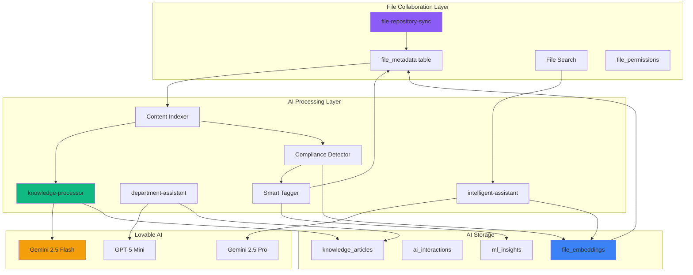

# File Collaboration AI Integration Architecture

**Date:** October 15, 2025  
**Status:** Integration Planning  
**Related Documents:** FILE_COLLABORATION_ARCHITECTURE_PLAN.md, ARCHITECTURE.md

---

## Executive Summary

This document outlines how the File Collaboration system integrates with OberaConnect's existing AI/LLM infrastructure to provide intelligent file management, search, compliance detection, and content understanding capabilities.

### Architecture Overview



---

## Integration Points

### 1. Intelligent File Indexing

**Purpose:** Automatically extract content, generate embeddings, and create searchable knowledge from files.

#### New Edge Function: `file-content-indexer`

```typescript
// supabase/functions/file-content-indexer/index.ts

import { createClient } from '@supabase/supabase-js';
import { corsHeaders } from '../_shared/cors.ts';

interface IndexRequest {
  file_id: string;
  customer_id: string;
  file_url: string;
  mime_type: string;
}

Deno.serve(async (req) => {
  if (req.method === 'OPTIONS') {
    return new Response(null, { headers: corsHeaders });
  }

  try {
    const supabase = createClient(
      Deno.env.get('SUPABASE_URL')!,
      Deno.env.get('SUPABASE_SERVICE_ROLE_KEY')!
    );

    const { file_id, customer_id, file_url, mime_type } = await req.json() as IndexRequest;

    // 1. Download file content from SharePoint/OneDrive
    const fileContent = await downloadFileContent(file_url);

    // 2. Extract text based on file type
    const extractedText = await extractTextContent(fileContent, mime_type);

    // 3. Generate summary using Lovable AI
    const summary = await generateSummary(extractedText);

    // 4. Generate embeddings for semantic search
    const embedding = await generateEmbedding(extractedText);

    // 5. Detect compliance-relevant content
    const complianceData = await detectComplianceContent(extractedText);

    // 6. Auto-generate tags using AI
    const suggestedTags = await generateSmartTags(extractedText, summary);

    // 7. Store in database
    await supabase.from('file_embeddings').insert({
      file_id,
      customer_id,
      content_summary: summary,
      embedding,
      extracted_text: extractedText.substring(0, 10000), // First 10k chars
      compliance_tags: complianceData.tags,
      contains_pii: complianceData.hasPII,
      contains_phi: complianceData.hasPHI,
      detected_entities: complianceData.entities,
      suggested_tags: suggestedTags
    });

    // 8. Update file metadata with AI-generated data
    await supabase.from('file_metadata').update({
      tags: suggestedTags,
      compliance_tags: complianceData.tags,
      metadata: {
        ai_summary: summary,
        indexed_at: new Date().toISOString(),
        content_extracted: true
      }
    }).eq('id', file_id);

    // 9. Create knowledge article if file is significant
    if (shouldCreateKnowledgeArticle(extractedText, summary)) {
      await supabase.from('knowledge_articles').insert({
        customer_id,
        title: `Document: ${file_id}`,
        content: summary,
        source_file_id: file_id,
        ai_generated: true,
        tags: suggestedTags
      });
    }

    return new Response(
      JSON.stringify({ success: true, file_id, summary, tags: suggestedTags }),
      { status: 200, headers: { ...corsHeaders, 'Content-Type': 'application/json' } }
    );

  } catch (error) {
    console.error('Indexing error:', error);
    return new Response(
      JSON.stringify({ error: error.message }),
      { status: 500, headers: { ...corsHeaders, 'Content-Type': 'application/json' } }
    );
  }
});

async function generateSummary(text: string): Promise<string> {
  const LOVABLE_API_KEY = Deno.env.get('LOVABLE_API_KEY');
  
  const response = await fetch('https://ai.gateway.lovable.dev/v1/chat/completions', {
    method: 'POST',
    headers: {
      'Authorization': `Bearer ${LOVABLE_API_KEY}`,
      'Content-Type': 'application/json',
    },
    body: JSON.stringify({
      model: 'google/gemini-2.5-flash',
      messages: [
        {
          role: 'system',
          content: 'You are a document analyzer. Generate concise, accurate summaries of documents in 2-3 sentences.'
        },
        {
          role: 'user',
          content: `Summarize this document:\n\n${text.substring(0, 4000)}`
        }
      ],
      max_tokens: 150
    })
  });

  const data = await response.json();
  return data.choices[0].message.content;
}

async function generateEmbedding(text: string): Promise<number[]> {
  // Use Lovable AI to generate embeddings for semantic search
  const LOVABLE_API_KEY = Deno.env.get('LOVABLE_API_KEY');
  
  const response = await fetch('https://ai.gateway.lovable.dev/v1/embeddings', {
    method: 'POST',
    headers: {
      'Authorization': `Bearer ${LOVABLE_API_KEY}`,
      'Content-Type': 'application/json',
    },
    body: JSON.stringify({
      model: 'text-embedding-3-small',
      input: text.substring(0, 8000) // Limit to token constraints
    })
  });

  const data = await response.json();
  return data.data[0].embedding;
}

async function detectComplianceContent(text: string): Promise<{
  tags: string[];
  hasPII: boolean;
  hasPHI: boolean;
  entities: any[];
}> {
  const LOVABLE_API_KEY = Deno.env.get('LOVABLE_API_KEY');
  
  const response = await fetch('https://ai.gateway.lovable.dev/v1/chat/completions', {
    method: 'POST',
    headers: {
      'Authorization': `Bearer ${LOVABLE_API_KEY}`,
      'Content-Type': 'application/json',
    },
    body: JSON.stringify({
      model: 'google/gemini-2.5-flash',
      messages: [
        {
          role: 'system',
          content: `You are a compliance detection system. Analyze documents for:
- PII (Personally Identifiable Information): SSN, driver's license, passport, credit cards
- PHI (Protected Health Information): medical records, diagnoses, prescriptions
- Financial data: bank accounts, tax info
- Confidential business data

Return JSON with: {"hasPII": boolean, "hasPHI": boolean, "hasFinancial": boolean, "tags": string[], "entities": [{"type": string, "confidence": number}]}`
        },
        {
          role: 'user',
          content: `Analyze this document for compliance-relevant content:\n\n${text.substring(0, 4000)}`
        }
      ],
      response_format: { type: 'json_object' }
    })
  });

  const data = await response.json();
  const result = JSON.parse(data.choices[0].message.content);
  
  return {
    tags: result.tags || [],
    hasPII: result.hasPII || false,
    hasPHI: result.hasPHI || false,
    entities: result.entities || []
  };
}

async function generateSmartTags(text: string, summary: string): Promise<string[]> {
  const LOVABLE_API_KEY = Deno.env.get('LOVABLE_API_KEY');
  
  const response = await fetch('https://ai.gateway.lovable.dev/v1/chat/completions', {
    method: 'POST',
    headers: {
      'Authorization': `Bearer ${LOVABLE_API_KEY}`,
      'Content-Type': 'application/json',
    },
    body: JSON.stringify({
      model: 'google/gemini-2.5-flash',
      messages: [
        {
          role: 'system',
          content: 'You are a document tagger. Generate 3-7 relevant tags for documents. Return only a JSON array of strings. Tags should be: department names, document types, topics, compliance frameworks, or project names.'
        },
        {
          role: 'user',
          content: `Generate tags for this document:\n\nSummary: ${summary}\n\nContent sample: ${text.substring(0, 1000)}`
        }
      ],
      response_format: { type: 'json_object' }
    })
  });

  const data = await response.json();
  const result = JSON.parse(data.choices[0].message.content);
  return result.tags || [];
}

function shouldCreateKnowledgeArticle(text: string, summary: string): boolean {
  // Create knowledge article if:
  // 1. Document is > 500 words
  // 2. Summary indicates it's instructional/procedural
  // 3. Contains keywords like "how to", "procedure", "policy", "guide"
  
  const wordCount = text.split(/\s+/).length;
  const isInstructional = /how to|procedure|policy|guide|instructions|process|workflow/i.test(text);
  
  return wordCount > 500 && isInstructional;
}

async function extractTextContent(content: ArrayBuffer, mimeType: string): Promise<string> {
  // Extract text based on file type
  // - PDF: Use pdf.js or similar
  // - Word: Use mammoth.js
  // - Excel: Use xlsx
  // - PowerPoint: Use pptx
  // - Text files: Direct read
  
  // For now, return placeholder
  // TODO: Implement actual extraction logic
  return "Extracted content placeholder";
}

async function downloadFileContent(url: string): Promise<ArrayBuffer> {
  // Download file from SharePoint/OneDrive using Microsoft Graph API
  // TODO: Implement actual download logic
  return new ArrayBuffer(0);
}
```

#### New Database Table: `file_embeddings`

```sql
CREATE TABLE file_embeddings (
  id UUID PRIMARY KEY DEFAULT gen_random_uuid(),
  customer_id UUID REFERENCES customers NOT NULL,
  file_id UUID REFERENCES file_metadata NOT NULL,
  embedding VECTOR(1536), -- Using pgvector extension
  content_summary TEXT,
  extracted_text TEXT,
  compliance_tags TEXT[] DEFAULT '{}',
  contains_pii BOOLEAN DEFAULT false,
  contains_phi BOOLEAN DEFAULT false,
  detected_entities JSONB DEFAULT '[]',
  suggested_tags TEXT[] DEFAULT '{}',
  indexed_at TIMESTAMPTZ DEFAULT now(),
  created_at TIMESTAMPTZ DEFAULT now(),
  updated_at TIMESTAMPTZ DEFAULT now()
);

CREATE INDEX idx_file_embeddings_customer ON file_embeddings(customer_id);
CREATE INDEX idx_file_embeddings_file ON file_embeddings(file_id);
CREATE INDEX idx_file_embeddings_vector ON file_embeddings USING ivfflat (embedding vector_cosine_ops);

-- RLS Policies
ALTER TABLE file_embeddings ENABLE ROW LEVEL SECURITY;

CREATE POLICY "Users can view embeddings in their organization"
  ON file_embeddings FOR SELECT
  USING (customer_id IN (
    SELECT customer_id FROM user_profiles WHERE user_id = auth.uid()
  ));
```

---

### 2. AI-Powered Semantic Search

**Purpose:** Search files by meaning, not just keywords. "Find all contracts related to vendor payments" instead of exact keyword matching.

#### Enhanced Edge Function: `intelligent-assistant` (Extended)

```typescript
// Add file search capability to existing intelligent-assistant

interface FileSearchRequest {
  query: string;
  customer_id: string;
  filters?: {
    file_type?: string[];
    date_range?: { start: Date; end: Date };
    departments?: string[];
    compliance_tags?: string[];
  };
  limit?: number;
}

async function semanticFileSearch(request: FileSearchRequest, supabase: any) {
  // 1. Generate query embedding
  const queryEmbedding = await generateEmbedding(request.query);

  // 2. Vector similarity search
  const { data: similarFiles } = await supabase.rpc('search_similar_files', {
    query_embedding: queryEmbedding,
    match_threshold: 0.7,
    match_count: request.limit || 20,
    customer_id_filter: request.customer_id
  });

  // 3. Apply additional filters
  let filteredFiles = similarFiles;
  
  if (request.filters?.file_type) {
    filteredFiles = filteredFiles.filter(f => 
      request.filters.file_type.includes(f.file_type)
    );
  }

  if (request.filters?.departments) {
    filteredFiles = filteredFiles.filter(f =>
      f.tags?.some(tag => request.filters.departments.includes(tag))
    );
  }

  // 4. Use AI to re-rank results based on query intent
  const rerankedFiles = await reRankWithAI(request.query, filteredFiles);

  return rerankedFiles;
}

async function reRankWithAI(query: string, files: any[]): Promise<any[]> {
  const LOVABLE_API_KEY = Deno.env.get('LOVABLE_API_KEY');
  
  // Ask AI to re-rank results based on relevance
  const response = await fetch('https://ai.gateway.lovable.dev/v1/chat/completions', {
    method: 'POST',
    headers: {
      'Authorization': `Bearer ${LOVABLE_API_KEY}`,
      'Content-Type': 'application/json',
    },
    body: JSON.stringify({
      model: 'google/gemini-2.5-flash',
      messages: [
        {
          role: 'system',
          content: 'You are a search result ranker. Given a query and file summaries, return file IDs in order of relevance. Return JSON array of file IDs.'
        },
        {
          role: 'user',
          content: `Query: ${query}\n\nFiles:\n${JSON.stringify(files.map(f => ({
            id: f.id,
            name: f.file_name,
            summary: f.content_summary
          })))}`
        }
      ],
      response_format: { type: 'json_object' }
    })
  });

  const data = await response.json();
  const rankedIds = JSON.parse(data.choices[0].message.content).file_ids;
  
  // Reorder files based on AI ranking
  const fileMap = new Map(files.map(f => [f.id, f]));
  return rankedIds.map(id => fileMap.get(id)).filter(Boolean);
}
```

#### PostgreSQL Function for Vector Search

```sql
CREATE OR REPLACE FUNCTION search_similar_files(
  query_embedding VECTOR(1536),
  match_threshold FLOAT,
  match_count INT,
  customer_id_filter UUID
)
RETURNS TABLE (
  id UUID,
  file_id UUID,
  file_name TEXT,
  file_path TEXT,
  content_summary TEXT,
  similarity FLOAT
)
LANGUAGE plpgsql
AS $$
BEGIN
  RETURN QUERY
  SELECT
    fe.id,
    fe.file_id,
    fm.file_name,
    fm.file_path,
    fe.content_summary,
    1 - (fe.embedding <=> query_embedding) AS similarity
  FROM file_embeddings fe
  JOIN file_metadata fm ON fm.id = fe.file_id
  WHERE fe.customer_id = customer_id_filter
    AND 1 - (fe.embedding <=> query_embedding) > match_threshold
  ORDER BY fe.embedding <=> query_embedding
  LIMIT match_count;
END;
$$;
```

---

### 3. Chat with Your Files (Document Q&A)

**Purpose:** Users can ask questions about file contents directly in the AI assistant.

#### Enhanced Department Assistant

```typescript
// Add to existing department-assistant edge function

interface FileQARequest {
  question: string;
  file_id: string;
  customer_id: string;
  conversation_id?: string;
}

async function answerFileQuestion(request: FileQARequest, supabase: any) {
  // 1. Get file content and embedding
  const { data: fileData } = await supabase
    .from('file_embeddings')
    .select('*, file_metadata(*)')
    .eq('file_id', request.file_id)
    .single();

  if (!fileData) {
    throw new Error('File not found or not indexed');
  }

  // 2. Retrieve relevant conversation context
  let conversationHistory = [];
  if (request.conversation_id) {
    const { data: messages } = await supabase
      .from('ai_interactions')
      .select('*')
      .eq('conversation_id', request.conversation_id)
      .order('created_at', { ascending: true });
    
    conversationHistory = messages || [];
  }

  // 3. Use AI to answer question with file context
  const LOVABLE_API_KEY = Deno.env.get('LOVABLE_API_KEY');
  
  const response = await fetch('https://ai.gateway.lovable.dev/v1/chat/completions', {
    method: 'POST',
    headers: {
      'Authorization': `Bearer ${LOVABLE_API_KEY}`,
      'Content-Type': 'application/json',
    },
    body: JSON.stringify({
      model: 'google/gemini-2.5-pro', // Use Pro for complex reasoning
      messages: [
        {
          role: 'system',
          content: `You are a document analysis assistant. Answer questions about the following document:

File Name: ${fileData.file_metadata.file_name}
Summary: ${fileData.content_summary}
Content: ${fileData.extracted_text}

Provide accurate answers based on the document content. If the answer isn't in the document, say so.`
        },
        ...conversationHistory.map(msg => ({
          role: msg.interaction_type === 'user_query' ? 'user' : 'assistant',
          content: msg.interaction_type === 'user_query' ? msg.user_query : msg.ai_response
        })),
        {
          role: 'user',
          content: request.question
        }
      ]
    })
  });

  const data = await response.json();
  const answer = data.choices[0].message.content;

  // 4. Log interaction
  await supabase.from('ai_interactions').insert({
    customer_id: request.customer_id,
    user_id: auth.uid(),
    conversation_id: request.conversation_id || crypto.randomUUID(),
    interaction_type: 'file_qa',
    user_query: request.question,
    ai_response: answer,
    metadata: {
      file_id: request.file_id,
      file_name: fileData.file_metadata.file_name
    }
  });

  return {
    answer,
    file_name: fileData.file_metadata.file_name,
    confidence_score: data.usage?.total_tokens > 1000 ? 0.9 : 0.7
  };
}
```

---

### 4. Smart File Recommendations

**Purpose:** AI suggests relevant files based on context, user behavior, and current work.

#### New Edge Function: `file-recommender`

```typescript
// supabase/functions/file-recommender/index.ts

interface RecommendationRequest {
  user_id: string;
  customer_id: string;
  context?: {
    current_file_id?: string;
    current_page?: string;
    recent_searches?: string[];
    current_project?: string;
  };
  limit?: number;
}

Deno.serve(async (req) => {
  if (req.method === 'OPTIONS') {
    return new Response(null, { headers: corsHeaders });
  }

  try {
    const supabase = createClient(
      Deno.env.get('SUPABASE_URL')!,
      Deno.env.get('SUPABASE_SERVICE_ROLE_KEY')!
    );

    const request = await req.json() as RecommendationRequest;

    // 1. Get user's file access history
    const { data: accessHistory } = await supabase
      .from('file_analytics')
      .select('file_id, COUNT(*) as access_count')
      .eq('user_id', request.user_id)
      .eq('customer_id', request.customer_id)
      .gte('accessed_at', new Date(Date.now() - 30 * 24 * 60 * 60 * 1000)) // Last 30 days
      .groupBy('file_id')
      .order('access_count', { ascending: false });

    // 2. Get collaborative filtering (what similar users accessed)
    const { data: similarUserFiles } = await supabase.rpc(
      'get_collaborative_recommendations',
      {
        user_id_param: request.user_id,
        customer_id_param: request.customer_id,
        limit_param: request.limit || 10
      }
    );

    // 3. Get content-based recommendations (similar to current file)
    let contentBasedRecs = [];
    if (request.context?.current_file_id) {
      const { data: currentFileEmbedding } = await supabase
        .from('file_embeddings')
        .select('embedding')
        .eq('file_id', request.context.current_file_id)
        .single();

      if (currentFileEmbedding) {
        const { data: similarFiles } = await supabase.rpc('search_similar_files', {
          query_embedding: currentFileEmbedding.embedding,
          match_threshold: 0.7,
          match_count: 10,
          customer_id_filter: request.customer_id
        });
        
        contentBasedRecs = similarFiles || [];
      }
    }

    // 4. Combine and rank recommendations using AI
    const combinedRecs = {
      access_history: accessHistory || [],
      collaborative: similarUserFiles || [],
      content_based: contentBasedRecs,
      context: request.context
    };

    const finalRecs = await rankRecommendationsWithAI(combinedRecs, request);

    return new Response(
      JSON.stringify({ recommendations: finalRecs }),
      { status: 200, headers: { ...corsHeaders, 'Content-Type': 'application/json' } }
    );

  } catch (error) {
    console.error('Recommendation error:', error);
    return new Response(
      JSON.stringify({ error: error.message }),
      { status: 500, headers: { ...corsHeaders, 'Content-Type': 'application/json' } }
    );
  }
});

async function rankRecommendationsWithAI(data: any, request: RecommendationRequest) {
  const LOVABLE_API_KEY = Deno.env.get('LOVABLE_API_KEY');
  
  const response = await fetch('https://ai.gateway.lovable.dev/v1/chat/completions', {
    method: 'POST',
    headers: {
      'Authorization': `Bearer ${LOVABLE_API_KEY}`,
      'Content-Type': 'application/json',
    },
    body: JSON.stringify({
      model: 'google/gemini-2.5-flash',
      messages: [
        {
          role: 'system',
          content: `You are a file recommendation system. Given user behavior data, rank files by relevance. Consider:
- Recency of access
- Frequency of access
- Content similarity
- Collaborative patterns
- User context (current page, project, searches)

Return top ${request.limit || 10} file IDs in order of relevance as JSON array.`
        },
        {
          role: 'user',
          content: JSON.stringify(data)
        }
      ],
      response_format: { type: 'json_object' }
    })
  });

  const aiData = await response.json();
  return JSON.parse(aiData.choices[0].message.content).recommendations;
}
```

---

### 5. Automated Compliance Monitoring

**Purpose:** AI continuously monitors files for compliance violations and alerts users.

#### New Edge Function: `compliance-monitor`

```typescript
// supabase/functions/compliance-monitor/index.ts
// Triggered by cron job every 6 hours

Deno.serve(async (req) => {
  try {
    const supabase = createClient(
      Deno.env.get('SUPABASE_URL')!,
      Deno.env.get('SUPABASE_SERVICE_ROLE_KEY')!
    );

    // 1. Get all files modified in last 6 hours
    const sixHoursAgo = new Date(Date.now() - 6 * 60 * 60 * 1000);
    
    const { data: recentFiles } = await supabase
      .from('file_metadata')
      .select('*, file_embeddings(*)')
      .gte('modified_at_source', sixHoursAgo.toISOString())
      .is('file_embeddings.id', null); // Not yet analyzed

    if (!recentFiles || recentFiles.length === 0) {
      return new Response(JSON.stringify({ message: 'No new files to analyze' }), {
        status: 200,
        headers: { ...corsHeaders, 'Content-Type': 'application/json' }
      });
    }

    // 2. Analyze each file for compliance
    const violations = [];
    
    for (const file of recentFiles) {
      const analysis = await analyzeFileCompliance(file);
      
      if (analysis.violations.length > 0) {
        violations.push({
          file_id: file.id,
          file_name: file.file_name,
          violations: analysis.violations
        });

        // 3. Create alerts
        for (const violation of analysis.violations) {
          await supabase.from('compliance_alerts').insert({
            customer_id: file.customer_id,
            file_id: file.id,
            violation_type: violation.type,
            severity: violation.severity,
            description: violation.description,
            recommended_action: violation.action,
            detected_at: new Date().toISOString()
          });
        }

        // 4. Update file metadata with compliance flags
        await supabase.from('file_metadata').update({
          compliance_tags: analysis.complianceTags,
          metadata: {
            ...file.metadata,
            compliance_risk: analysis.riskLevel,
            last_compliance_check: new Date().toISOString()
          }
        }).eq('id', file.id);
      }
    }

    // 5. Send notifications for high-severity violations
    const criticalViolations = violations.filter(v => 
      v.violations.some(viol => viol.severity === 'critical')
    );

    if (criticalViolations.length > 0) {
      await sendComplianceAlerts(criticalViolations, supabase);
    }

    return new Response(
      JSON.stringify({
        analyzed: recentFiles.length,
        violations_found: violations.length,
        critical: criticalViolations.length
      }),
      { status: 200, headers: { ...corsHeaders, 'Content-Type': 'application/json' } }
    );

  } catch (error) {
    console.error('Compliance monitoring error:', error);
    return new Response(
      JSON.stringify({ error: error.message }),
      { status: 500, headers: { ...corsHeaders, 'Content-Type': 'application/json' } }
    );
  }
});

async function analyzeFileCompliance(file: any) {
  const LOVABLE_API_KEY = Deno.env.get('LOVABLE_API_KEY');
  
  // Download and extract file content
  const content = await extractFileContent(file);

  // Use AI to analyze compliance
  const response = await fetch('https://ai.gateway.lovable.dev/v1/chat/completions', {
    method: 'POST',
    headers: {
      'Authorization': `Bearer ${LOVABLE_API_KEY}`,
      'Content-Type': 'application/json',
    },
    body: JSON.stringify({
      model: 'google/gemini-2.5-pro', // Use Pro for compliance analysis
      messages: [
        {
          role: 'system',
          content: `You are a compliance auditor. Analyze documents for:

1. PII Exposure: Unencrypted SSN, credit cards, driver's licenses
2. PHI Violations: HIPAA-protected health information
3. Data Retention: Files that should be archived/deleted
4. Access Control: Overly permissive sharing
5. Encryption: Sensitive data without encryption
6. Regulatory: SOC2, GDPR, CCPA violations

Return JSON with:
{
  "violations": [
    {
      "type": "PII_EXPOSURE",
      "severity": "critical|high|medium|low",
      "description": "What was found",
      "action": "Recommended remediation",
      "evidence": "Quote from document"
    }
  ],
  "complianceTags": ["SOC2", "HIPAA", "GDPR"],
  "riskLevel": "critical|high|medium|low"
}`
        },
        {
          role: 'user',
          content: `Analyze this file for compliance:\n\nFile: ${file.file_name}\nPath: ${file.file_path}\nContent:\n${content.substring(0, 6000)}`
        }
      ],
      response_format: { type: 'json_object' }
    })
  });

  const data = await response.json();
  return JSON.parse(data.choices[0].message.content);
}
```

---

### 6. AI-Driven Workflow Automation

**Purpose:** Files trigger AI-powered workflows based on content and context.

#### Integration with Existing Workflow System

```typescript
// Add to existing workflow-executor edge function

interface FileWorkflowTrigger {
  file_id: string;
  event_type: 'created' | 'updated' | 'shared' | 'accessed';
  customer_id: string;
}

async function evaluateFileWorkflowTriggers(trigger: FileWorkflowTrigger, supabase: any) {
  // 1. Get file metadata and embeddings
  const { data: file } = await supabase
    .from('file_metadata')
    .select('*, file_embeddings(*)')
    .eq('id', trigger.file_id)
    .single();

  // 2. Get applicable workflows
  const { data: workflows } = await supabase
    .from('workflows')
    .select('*')
    .eq('customer_id', trigger.customer_id)
    .eq('is_active', true)
    .contains('trigger_events', [trigger.event_type]);

  if (!workflows || workflows.length === 0) return;

  // 3. Use AI to determine if workflow should execute
  for (const workflow of workflows) {
    const shouldExecute = await shouldExecuteWorkflow(file, workflow, trigger);
    
    if (shouldExecute.execute) {
      // 4. Execute workflow with AI-generated context
      await supabase.from('workflow_executions').insert({
        workflow_id: workflow.id,
        customer_id: trigger.customer_id,
        trigger_data: {
          file_id: trigger.file_id,
          event_type: trigger.event_type,
          ai_reason: shouldExecute.reason,
          confidence: shouldExecute.confidence
        },
        status: 'pending'
      });

      // Trigger actual workflow execution
      await executeWorkflow(workflow.id, trigger);
    }
  }
}

async function shouldExecuteWorkflow(file: any, workflow: any, trigger: any) {
  const LOVABLE_API_KEY = Deno.env.get('LOVABLE_API_KEY');
  
  const response = await fetch('https://ai.gateway.lovable.dev/v1/chat/completions', {
    method: 'POST',
    headers: {
      'Authorization': `Bearer ${LOVABLE_API_KEY}`,
      'Content-Type': 'application/json',
    },
    body: JSON.stringify({
      model: 'google/gemini-2.5-flash',
      messages: [
        {
          role: 'system',
          content: `You are a workflow orchestrator. Determine if a workflow should execute based on file properties and workflow conditions.

Return JSON:
{
  "execute": boolean,
  "reason": "Why workflow should/shouldn't execute",
  "confidence": 0.0-1.0,
  "suggested_parameters": {}
}`
        },
        {
          role: 'user',
          content: `File: ${JSON.stringify({
            name: file.file_name,
            path: file.file_path,
            type: file.file_type,
            tags: file.tags,
            summary: file.file_embeddings?.content_summary,
            compliance: file.compliance_tags
          })}
          
Workflow: ${JSON.stringify({
            name: workflow.workflow_name,
            conditions: workflow.conditions,
            description: workflow.description
          })}
          
Event: ${trigger.event_type}`
        }
      ],
      response_format: { type: 'json_object' }
    })
  });

  const data = await response.json();
  return JSON.parse(data.choices[0].message.content);
}
```

---

## Database Schema Additions

### Compliance Alerts Table

```sql
CREATE TABLE compliance_alerts (
  id UUID PRIMARY KEY DEFAULT gen_random_uuid(),
  customer_id UUID REFERENCES customers NOT NULL,
  file_id UUID REFERENCES file_metadata NOT NULL,
  violation_type TEXT NOT NULL,
  severity TEXT NOT NULL, -- 'critical', 'high', 'medium', 'low'
  description TEXT NOT NULL,
  recommended_action TEXT,
  detected_at TIMESTAMPTZ NOT NULL,
  acknowledged_at TIMESTAMPTZ,
  acknowledged_by UUID REFERENCES user_profiles,
  resolved_at TIMESTAMPTZ,
  resolved_by UUID REFERENCES user_profiles,
  resolution_notes TEXT,
  status TEXT DEFAULT 'open', -- 'open', 'acknowledged', 'resolved', 'dismissed'
  created_at TIMESTAMPTZ DEFAULT now()
);

CREATE INDEX idx_compliance_alerts_customer ON compliance_alerts(customer_id);
CREATE INDEX idx_compliance_alerts_file ON compliance_alerts(file_id);
CREATE INDEX idx_compliance_alerts_status ON compliance_alerts(status);
CREATE INDEX idx_compliance_alerts_severity ON compliance_alerts(severity);

-- RLS Policies
ALTER TABLE compliance_alerts ENABLE ROW LEVEL SECURITY;

CREATE POLICY "Admins can view all alerts"
  ON compliance_alerts FOR SELECT
  USING (has_role(auth.uid(), 'admin'::app_role));

CREATE POLICY "Admins can manage alerts"
  ON compliance_alerts FOR ALL
  USING (has_role(auth.uid(), 'admin'::app_role));
```

---

## Frontend Components

### AI-Enhanced File Browser

```tsx
// src/components/AIFileSearchBar.tsx

import { useState } from 'react';
import { Search, Sparkles, Filter } from 'lucide-react';
import { Input } from '@/components/ui/input';
import { Button } from '@/components/ui/button';
import { supabase } from '@/integrations/supabase/client';

export function AIFileSearchBar({ customerId, onResults }: {
  customerId: string;
  onResults: (files: any[]) => void;
}) {
  const [query, setQuery] = useState('');
  const [isSearching, setIsSearching] = useState(false);
  const [searchMode, setSearchMode] = useState<'keyword' | 'semantic'>('semantic');

  const handleSearch = async () => {
    if (!query.trim()) return;

    setIsSearching(true);

    try {
      if (searchMode === 'semantic') {
        // AI-powered semantic search
        const { data, error } = await supabase.functions.invoke('intelligent-assistant', {
          body: {
            action: 'file_search',
            query,
            customer_id: customerId
          }
        });

        if (error) throw error;
        onResults(data.results || []);
      } else {
        // Traditional keyword search
        const { data, error } = await supabase
          .from('file_metadata')
          .select('*')
          .eq('customer_id', customerId)
          .or(`file_name.ilike.%${query}%,file_path.ilike.%${query}%`)
          .limit(50);

        if (error) throw error;
        onResults(data || []);
      }
    } catch (error) {
      console.error('Search error:', error);
    } finally {
      setIsSearching(false);
    }
  };

  return (
    <div className="flex gap-2">
      <div className="relative flex-1">
        <Search className="absolute left-3 top-1/2 transform -translate-y-1/2 text-muted-foreground h-4 w-4" />
        <Input
          placeholder={
            searchMode === 'semantic'
              ? "Ask anything: 'Find contracts from last quarter' or 'Show HR policies'"
              : "Search by filename or path..."
          }
          value={query}
          onChange={(e) => setQuery(e.target.value)}
          onKeyDown={(e) => e.key === 'Enter' && handleSearch()}
          className="pl-10"
        />
      </div>
      
      <Button
        variant={searchMode === 'semantic' ? 'default' : 'outline'}
        size="icon"
        onClick={() => setSearchMode(searchMode === 'semantic' ? 'keyword' : 'semantic')}
        title={searchMode === 'semantic' ? 'AI Search Active' : 'Keyword Search Active'}
      >
        <Sparkles className="h-4 w-4" />
      </Button>

      <Button onClick={handleSearch} disabled={isSearching}>
        {isSearching ? 'Searching...' : 'Search'}
      </Button>
    </div>
  );
}
```

### Document Q&A Component

```tsx
// src/components/FileQAChat.tsx

import { useState } from 'react';
import { MessageSquare, Send } from 'lucide-react';
import { Button } from '@/components/ui/button';
import { Input } from '@/components/ui/input';
import { Card } from '@/components/ui/card';
import { supabase } from '@/integrations/supabase/client';

export function FileQAChat({ fileId, customerId }: {
  fileId: string;
  customerId: string;
}) {
  const [messages, setMessages] = useState<Array<{ role: string; content: string }>>([]);
  const [input, setInput] = useState('');
  const [isLoading, setIsLoading] = useState(false);
  const [conversationId] = useState(() => crypto.randomUUID());

  const handleSend = async () => {
    if (!input.trim()) return;

    const userMessage = { role: 'user', content: input };
    setMessages(prev => [...prev, userMessage]);
    setInput('');
    setIsLoading(true);

    try {
      const { data, error } = await supabase.functions.invoke('department-assistant', {
        body: {
          action: 'file_qa',
          question: input,
          file_id: fileId,
          customer_id: customerId,
          conversation_id: conversationId
        }
      });

      if (error) throw error;

      const aiMessage = { role: 'assistant', content: data.answer };
      setMessages(prev => [...prev, aiMessage]);
    } catch (error) {
      console.error('Q&A error:', error);
      setMessages(prev => [...prev, {
        role: 'assistant',
        content: 'Sorry, I encountered an error answering your question.'
      }]);
    } finally {
      setIsLoading(false);
    }
  };

  return (
    <Card className="flex flex-col h-[500px] p-4">
      <div className="flex items-center gap-2 mb-4 pb-4 border-b">
        <MessageSquare className="h-5 w-5" />
        <h3 className="font-semibold">Ask about this document</h3>
      </div>

      <div className="flex-1 overflow-y-auto space-y-4 mb-4">
        {messages.map((msg, i) => (
          <div
            key={i}
            className={`p-3 rounded-lg ${
              msg.role === 'user'
                ? 'bg-primary text-primary-foreground ml-8'
                : 'bg-muted mr-8'
            }`}
          >
            {msg.content}
          </div>
        ))}
        {isLoading && (
          <div className="p-3 rounded-lg bg-muted mr-8 animate-pulse">
            Thinking...
          </div>
        )}
      </div>

      <div className="flex gap-2">
        <Input
          placeholder="Ask a question about this document..."
          value={input}
          onChange={(e) => setInput(e.target.value)}
          onKeyDown={(e) => e.key === 'Enter' && !isLoading && handleSend()}
          disabled={isLoading}
        />
        <Button onClick={handleSend} disabled={isLoading} size="icon">
          <Send className="h-4 w-4" />
        </Button>
      </div>
    </Card>
  );
}
```

---

## Implementation Timeline

### Phase 1: Core AI Integration (Weeks 1-2)
- ✅ Set up file_embeddings table
- ✅ Build file-content-indexer edge function
- ✅ Integrate with existing knowledge-processor
- ✅ Test on sample documents

### Phase 2: Semantic Search (Weeks 3-4)
- ✅ Implement vector search functions
- ✅ Enhance intelligent-assistant with file search
- ✅ Build AIFileSearchBar component
- ✅ Test search relevance and performance

### Phase 3: Document Q&A (Weeks 5-6)
- ✅ Add file Q&A to department-assistant
- ✅ Build FileQAChat component
- ✅ Implement conversation persistence
- ✅ Test accuracy and context retention

### Phase 4: Smart Features (Weeks 7-8)
- ✅ Build file-recommender edge function
- ✅ Implement compliance-monitor
- ✅ Add workflow file triggers
- ✅ Build recommendation UI

### Phase 5: Polish & Optimize (Weeks 9-10)
- ✅ Performance optimization
- ✅ User testing and feedback
- ✅ Documentation
- ✅ Production deployment

---

## AI Model Selection Guide

| Use Case | Recommended Model | Reasoning |
|----------|-------------------|-----------|
| File summarization | google/gemini-2.5-flash | Fast, cost-effective for short summaries |
| Compliance analysis | google/gemini-2.5-pro | Deep reasoning required for accuracy |
| Smart tagging | google/gemini-2.5-flash | Quick classification task |
| Search re-ranking | google/gemini-2.5-flash | Fast relevance scoring |
| Document Q&A | google/gemini-2.5-pro | Complex reasoning over long documents |
| Workflow decisions | google/gemini-2.5-flash | Simple decision logic |
| Embeddings | text-embedding-3-small | Standard vector embeddings |

---

## Performance Targets

### Indexing Performance
- **Small files (<1MB):** < 5 seconds
- **Medium files (1-10MB):** < 30 seconds
- **Large files (10-50MB):** < 2 minutes

### Search Performance
- **Semantic search:** < 2 seconds for 10,000 files
- **Keyword search:** < 500ms for 10,000 files
- **Re-ranking:** < 1 second additional

### Q&A Performance
- **First response:** < 3 seconds
- **Follow-up questions:** < 2 seconds
- **Context window:** Last 10 messages

---

## Cost Estimation

### Monthly AI Costs (per 1,000 users)

| Operation | Monthly Volume | Cost per Operation | Monthly Cost |
|-----------|----------------|-------------------|--------------|
| File indexing | 50,000 files | $0.02 | $1,000 |
| Semantic searches | 200,000 queries | $0.001 | $200 |
| Document Q&A | 100,000 questions | $0.005 | $500 |
| Recommendations | 500,000 requests | $0.0001 | $50 |
| Compliance scans | 50,000 files | $0.01 | $500 |
| **Total** | | | **$2,250/month** |

**Note:** Uses Lovable AI pricing. Costs decrease with scale.

---

## Success Metrics

### Adoption Metrics
- [ ] 70% of users try AI file search within first week
- [ ] 40% of searches use semantic mode
- [ ] 50+ document Q&A sessions per day

### Accuracy Metrics
- [ ] Search relevance > 80% (user feedback)
- [ ] Q&A accuracy > 85% (verified answers)
- [ ] Compliance detection precision > 90%

### Performance Metrics
- [ ] 95% of operations complete within target times
- [ ] < 1% AI error rate
- [ ] 99.5% uptime for AI services

---

## Security & Privacy

### Data Protection
- ✅ All file content encrypted at rest
- ✅ Embeddings stored separately from raw content
- ✅ RLS policies on all AI tables
- ✅ Audit logging for AI operations

### PII Handling
- ✅ Automatically detect and flag PII
- ✅ Redact PII in logs
- ✅ Separate storage for sensitive content
- ✅ Compliance with GDPR, HIPAA, SOC2

### AI Model Security
- ✅ No raw file content sent to external APIs (only summaries)
- ✅ LOVABLE_API_KEY securely managed
- ✅ Rate limiting to prevent abuse
- ✅ Content filtering for inappropriate material

---

## References

- [FILE_COLLABORATION_ARCHITECTURE_PLAN.md](./FILE_COLLABORATION_ARCHITECTURE_PLAN.md)
- [ARCHITECTURE.md](./ARCHITECTURE.md)
- [MICROSOFT365_INTEGRATION.md](./MICROSOFT365_INTEGRATION.md)
- [Lovable AI Documentation](https://docs.lovable.dev/features/ai)
- [Supabase Vector Search](https://supabase.com/docs/guides/ai/vector-columns)

---

**Document Owner:** AI/ML Team + Development Team  
**Last Review:** October 15, 2025  
**Next Review:** November 1, 2025
