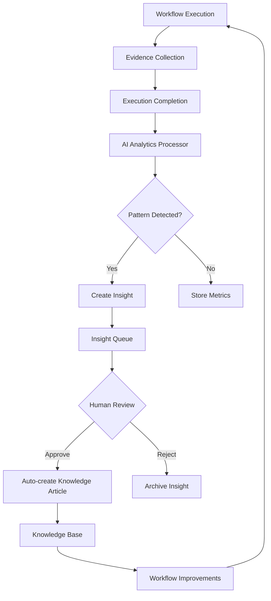

# Knowledge Base & Workflow Intelligence Integration

**Last Updated:** October 20, 2025  
**Version:** 1.0  
**Status:** Production Ready

## Overview

This document details the Knowledge Base and Workflow Intelligence integration system - an AI-powered learning ecosystem that automatically captures insights from workflow executions and transforms them into actionable knowledge articles.

## Table of Contents

1. [System Architecture](#system-architecture)
2. [Core Components](#core-components)
3. [Data Flow](#data-flow)
4. [UI Components](#ui-components)
5. [Database Schema](#database-schema)
6. [Edge Functions](#edge-functions)
7. [Learning Loops](#learning-loops)
8. [User Workflows](#user-workflows)

---

## System Architecture

### Three-Layer Learning Architecture

```
┌─────────────────────────────────────────────────────────────┐
│                    LAYER 3: KNOWLEDGE BASE                   │
│  ┌────────────────┐  ┌────────────────┐  ┌───────────────┐ │
│  │   Knowledge    │  │   Automation   │  │  Best Practice│ │
│  │   Articles     │  │  Suggestions   │  │  Propagation  │ │
│  └────────────────┘  └────────────────┘  └───────────────┘ │
└─────────────────────────────────────────────────────────────┘
                              ▲
                              │ Auto-generates
                              │
┌─────────────────────────────────────────────────────────────┐
│                  LAYER 2: INSIGHT PROCESSING                 │
│  ┌────────────────┐  ┌────────────────┐  ┌───────────────┐ │
│  │ Insight Queue  │  │   AI Analysis  │  │   Pattern     │ │
│  │  Management    │  │   & Scoring    │  │   Detection   │ │
│  └────────────────┘  └────────────────┘  └───────────────┘ │
└─────────────────────────────────────────────────────────────┘
                              ▲
                              │ Captures insights
                              │
┌─────────────────────────────────────────────────────────────┐
│                LAYER 1: WORKFLOW EXECUTION                   │
│  ┌────────────────┐  ┌────────────────┐  ┌───────────────┐ │
│  │   Workflow     │  │   Evidence     │  │  Execution    │ │
│  │   Templates    │  │   Collection   │  │   Metrics     │ │
│  └────────────────┘  └────────────────┘  └───────────────┘ │
└─────────────────────────────────────────────────────────────┘
```

---

## Core Components

### 1. Insight Queue Management (`/insight-queue`)

**Purpose:** Central hub for reviewing, approving, and managing AI-generated insights before they become knowledge articles.

**Key Features:**
- Real-time insight queue with status filtering
- Multi-select bulk actions (approve, reject, archive)
- AI confidence scoring with visual indicators
- Source tracking (workflows, executions, patterns)
- Department-level insights with categorization
- Automatic knowledge article creation on approval

**Status Lifecycle:**
```
pending → reviewed → approved → published (as knowledge_article)
        → rejected → archived
```

### 2. Workflow-Knowledge Integration Dashboard (`/workflow-knowledge-integration`)

**Purpose:** Visualizes the real-time flow from workflow executions to knowledge articles.

**Key Features:**
- **Three-Layer Learning Loop Visualization:**
  - Layer 1: Workflow Executions (real-time metrics)
  - Layer 2: Insights Generated (queued for review)
  - Layer 3: Knowledge Articles (published)

- **Workflow → Insight → Article Flow:**
  - Tracks individual workflow executions
  - Shows which insights were generated
  - Links to resulting knowledge articles
  - Real-time execution status

- **Knowledge Creation Pipeline (6 Stages):**
  1. **Execution** - Workflow runs with evidence collection
  2. **Analysis** - AI analyzes execution data
  3. **Insight** - Pattern detected, queued for review
  4. **Review** - Human validation in insight queue
  5. **Approval** - Insight approved for publication
  6. **Article** - Knowledge article auto-created

- **Department Intelligence:**
  - Per-department execution volumes
  - Insight generation rates
  - Knowledge article counts
  - Success metrics

**Real-time Updates:**
- Supabase subscription to `workflow_executions`
- Auto-refresh on new completions
- Live metrics recalculation

---

## Data Flow

### Complete Workflow → Knowledge Pipeline



### Data Tables Involved

#### Primary Tables:
- `workflow_executions` - Execution records with metrics
- `workflow_evidence_files` - Evidence collected during execution
- `knowledge_insights` - Queued insights awaiting review
- `knowledge_articles` - Published articles in knowledge base
- `ai_learning_metrics` - Performance tracking

#### Supporting Tables:
- `automated_workflows` - Workflow definitions
- `workflow_steps` - Step configurations
- `ai_agent_tasks` - Scheduled AI analysis tasks
- `ai_interactions` - AI conversation logs

---

## UI Components

### 1. Insight Queue Page (`src/pages/InsightQueue.tsx`)

**State Management:**
```typescript
- insights: knowledge_insights[]
- selectedInsights: Set<string>
- filterStatus: 'pending' | 'reviewed' | 'approved' | 'rejected' | 'archived'
```

**Key Functions:**
- `handleApprove()` - Approves insights, creates knowledge articles
- `handleReject()` - Rejects and archives insights
- `handleBulkAction()` - Processes multiple insights at once
- Real-time subscription via Supabase channels

**UI Elements:**
- Status filter tabs
- Bulk action toolbar
- Insight cards with confidence scores
- Source attribution
- Department tags

### 2. Workflow-Knowledge Integration (`src/pages/WorkflowKnowledgeIntegration.tsx`)

**State Management:**
```typescript
- executions: workflow_executions[]
- insights: knowledge_insights[]
- articles: knowledge_articles[]
- metrics: calculated from above
```

**Key Metrics Calculated:**
- Total executions (last 30 days)
- Insights generated
- Knowledge articles created
- Average execution time
- Success rate
- Insight → Article conversion rate

**Real-time Updates:**
```typescript
supabase
  .channel('workflow-knowledge-integration')
  .on('postgres_changes', {
    event: '*',
    schema: 'public',
    table: 'workflow_executions'
  }, handleRealtimeUpdate)
```

---

## Database Schema

### Key Tables

#### `knowledge_insights`
```sql
CREATE TABLE knowledge_insights (
  id UUID PRIMARY KEY,
  customer_id UUID NOT NULL,
  insight_type TEXT NOT NULL, -- 'workflow_optimization', 'best_practice', 'automation_suggestion'
  title TEXT NOT NULL,
  content TEXT NOT NULL,
  confidence_score NUMERIC(3,2), -- 0.00 to 1.00
  source_type TEXT, -- 'workflow_execution', 'ai_pattern', 'user_feedback'
  source_id UUID, -- References source table
  category TEXT,
  department TEXT,
  status TEXT DEFAULT 'pending', -- 'pending', 'reviewed', 'approved', 'rejected', 'archived'
  reviewed_by UUID,
  reviewed_at TIMESTAMPTZ,
  related_article_id UUID, -- Links to created knowledge_article
  metadata JSONB,
  created_at TIMESTAMPTZ DEFAULT NOW()
);
```

#### `workflow_executions`
```sql
CREATE TABLE workflow_executions (
  id UUID PRIMARY KEY,
  customer_id UUID NOT NULL,
  workflow_id UUID NOT NULL,
  triggered_by UUID,
  status TEXT, -- 'pending', 'running', 'completed', 'failed'
  started_at TIMESTAMPTZ,
  completed_at TIMESTAMPTZ,
  execution_data JSONB,
  results JSONB,
  error_message TEXT,
  department TEXT,
  created_at TIMESTAMPTZ DEFAULT NOW()
);
```

#### `workflow_evidence_files`
```sql
CREATE TABLE workflow_evidence_files (
  id UUID PRIMARY KEY,
  customer_id UUID NOT NULL,
  workflow_execution_id UUID NOT NULL,
  file_name TEXT NOT NULL,
  file_path TEXT NOT NULL,
  file_type TEXT,
  file_size_bytes INTEGER,
  evidence_type TEXT, -- 'screenshot', 'log', 'document', 'report'
  metadata JSONB,
  created_at TIMESTAMPTZ DEFAULT NOW()
);
```

#### `knowledge_articles`
```sql
CREATE TABLE knowledge_articles (
  id UUID PRIMARY KEY,
  customer_id UUID NOT NULL,
  title TEXT NOT NULL,
  content TEXT NOT NULL,
  category TEXT NOT NULL,
  department TEXT,
  tags TEXT[],
  source_insight_id UUID, -- Tracks which insight created this
  author_id UUID,
  is_published BOOLEAN DEFAULT true,
  view_count INTEGER DEFAULT 0,
  helpful_count INTEGER DEFAULT 0,
  not_helpful_count INTEGER DEFAULT 0,
  created_at TIMESTAMPTZ DEFAULT NOW(),
  updated_at TIMESTAMPTZ DEFAULT NOW()
);
```

---

## Edge Functions

### Active Edge Functions Supporting This System

#### 1. `analytics-processor`
**Purpose:** Analyzes completed workflow executions and generates insights

**Trigger:** Scheduled (hourly) or on-demand

**Process:**
1. Fetches recent completed executions
2. Analyzes patterns and anomalies
3. Generates insights with confidence scores
4. Queues insights in `knowledge_insights` table

#### 2. `autonomous-agent-scheduler`
**Purpose:** Orchestrates AI agents across departments

**Trigger:** Scheduled (every 15 minutes)

**Process:**
1. Checks `ai_agent_tasks` for pending work
2. Triggers department-specific analysis
3. Coordinates insight generation
4. Updates agent state

#### 3. `automation-suggester`
**Purpose:** Identifies automation opportunities from patterns

**Trigger:** On workflow completion or scheduled

**Process:**
1. Detects repetitive manual tasks
2. Calculates time savings potential
3. Suggests automation workflows
4. Creates insights with ROI data

---

## Learning Loops

### 1. Individual Workflow Learning

**Input:** Single workflow execution  
**Process:** Capture evidence → Analyze performance → Generate insight  
**Output:** Optimization suggestions for that specific workflow

**Example:**
```
Workflow: Employee Onboarding
Execution: 45 minutes (expected: 30)
Evidence: Manual step took 20 minutes
Insight: "Automate background check API call"
Confidence: 0.87
```

### 2. Department-Level Learning

**Input:** All executions within a department  
**Process:** Aggregate patterns → Identify trends → Create best practices  
**Output:** Department-wide knowledge articles

**Example:**
```
Department: HR
Executions Analyzed: 156
Pattern: 80% of onboardings delay at IT setup
Insight: "IT Equipment Pre-provisioning Process"
Confidence: 0.92
Article Created: "Best Practice - Pre-provision IT Equipment"
```

### 3. Cross-Department Learning

**Input:** Patterns across all departments  
**Process:** Compare approaches → Identify successful patterns → Share knowledge  
**Output:** Organization-wide best practices

**Example:**
```
Pattern: IT's automated ticket routing reduces resolution time by 40%
Insight: "Apply automated routing to HR requests"
Confidence: 0.89
Article Created: "Cross-Department Best Practice - Automated Request Routing"
```

---

## User Workflows

### Workflow 1: Approve an Insight

1. Navigate to `/insight-queue`
2. Filter by status: `pending`
3. Review insight card:
   - Read title and content
   - Check confidence score
   - Verify source (workflow execution)
   - Review department tag
4. Click "Approve" button
5. System automatically:
   - Updates insight status to `approved`
   - Creates new knowledge article
   - Links article back to insight
   - Notifies relevant department

### Workflow 2: Bulk Process Insights

1. Navigate to `/insight-queue`
2. Select multiple insights (checkboxes)
3. Click "Bulk Actions" → "Approve Selected"
4. System processes all selected insights:
   - Creates multiple knowledge articles
   - Updates all statuses
   - Sends batch notifications

### Workflow 3: Monitor Integration Health

1. Navigate to `/workflow-knowledge-integration`
2. View Three-Layer Learning Loop:
   - Check execution volume (Layer 1)
   - Monitor insight queue size (Layer 2)
   - Track knowledge article growth (Layer 3)
3. Review Knowledge Creation Pipeline:
   - Identify bottlenecks in stages
   - Monitor approval rates
4. Check Department Intelligence:
   - Compare department performance
   - Identify high-performing areas

### Workflow 4: Trace Insight to Source

1. In Insight Queue, click on an insight
2. View "Source" section:
   - See originating workflow execution
3. Click "View Execution" link
4. Navigate to execution details:
   - Review execution timeline
   - Check evidence files
   - Analyze performance metrics

---

## Navigation

### Added Routes

```typescript
// App.tsx
<Route path="/insight-queue" element={<InsightQueue />} />
<Route path="/workflow-knowledge-integration" element={<WorkflowKnowledgeIntegration />} />
```

### Navigation Links

**Desktop Navigation:**
- "Insight Queue" - `/insight-queue` (Brain icon)
- "Workflow Integration" - `/workflow-knowledge-integration` (Zap icon)

**Mobile Navigation:**
- Same links available in mobile menu

---

## Future Enhancements

### Planned Features

1. **AI-Assisted Review:**
   - Auto-approve high-confidence insights (>0.95)
   - Flag low-quality insights for rejection
   - Suggest related articles

2. **Advanced Analytics:**
   - Insight → Article conversion trends
   - Department comparison dashboards
   - ROI tracking for automated workflows

3. **Collaborative Review:**
   - Multi-person approval workflows
   - Comment threads on insights
   - Expertise-based routing

4. **Enhanced Visualization:**
   - Interactive knowledge graph
   - Workflow dependency mapping
   - Real-time execution monitoring

---

## Technical Notes

### Performance Considerations

- **Real-time Subscriptions:** Use Supabase channels for live updates
- **Bulk Operations:** Process in batches of 50 for optimal performance
- **Pagination:** Insight queue loads 100 items at a time
- **Caching:** Metrics cached for 5 minutes on integration dashboard

### Security

- **RLS Policies:** All tables filtered by `customer_id`
- **Role Checks:** Only admins can approve/reject insights
- **Audit Trail:** All insight status changes logged to `audit_logs`

### Error Handling

- Failed insight approvals log to `audit_logs`
- Article creation failures rollback insight status
- Real-time subscription errors auto-reconnect

---

## Conclusion

The Knowledge Base & Workflow Intelligence Integration creates a closed-loop learning system where:

1. **Workflows execute** and collect evidence
2. **AI analyzes** patterns and generates insights
3. **Humans review** insights for quality
4. **Knowledge articles** are auto-created
5. **Workflows improve** based on new knowledge

This system continuously learns and improves organizational processes, creating a self-optimizing knowledge base that grows smarter with every workflow execution.

---

## Related Documentation

- `VALIDATION_PROCEDURES.md` - For workflow validation details
- `MODULE_STRUCTURE.md` - For overall system architecture
- `API_REFERENCE.md` - For edge function details
- `RECENT_FIXES_2025_10_15.md` - For recent updates

---

**Document Maintained By:** AI Development Team  
**Review Cycle:** Weekly  
**Last Reviewed:** October 20, 2025
