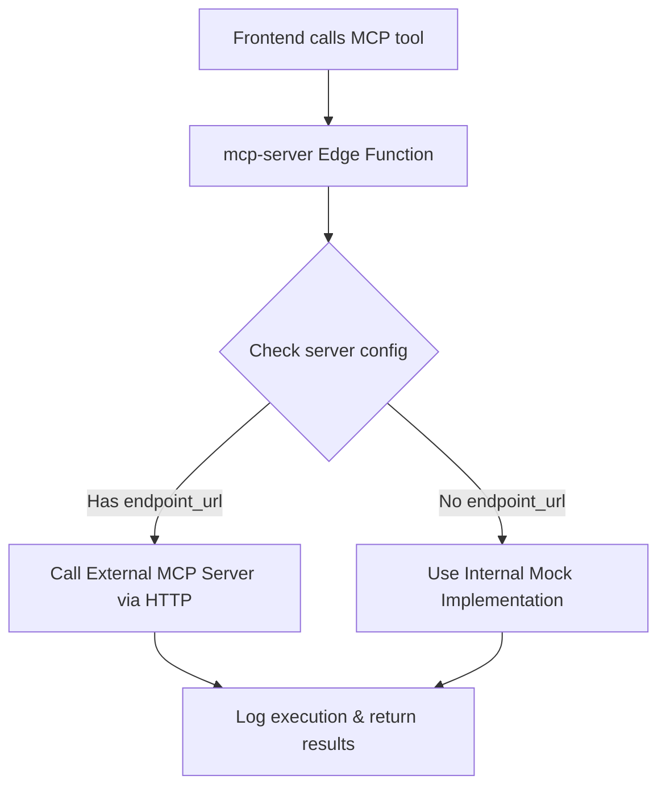

# Connecting Real MCP Protocol Servers

## Overview

The MCP infrastructure now supports **both** external MCP protocol servers and internal mock implementations:

- **External MCP Servers**: When a server has an `endpoint_url` configured, the system makes HTTP requests following the MCP protocol specification
- **Internal Mock Servers**: When `endpoint_url` is `null`, the system falls back to built-in mock implementations

## How It Works

### Architecture Flow



### MCP Protocol Implementation

When calling external servers, the system sends JSON-RPC 2.0 requests:

```json
{
  "jsonrpc": "2.0",
  "id": "unique-request-id",
  "method": "tools/call",
  "params": {
    "name": "tool_name",
    "arguments": {
      "input_param": "value"
    }
  }
}
```

Expected response format:
```json
{
  "jsonrpc": "2.0",
  "id": "unique-request-id",
  "result": {
    "output_data": "value"
  }
}
```

## Connecting Real MCP Servers

### Step 1: Configure Server with Endpoint URL

Update an existing MCP server to add an endpoint URL:

```sql
-- Example: Connect to a real MCP server
UPDATE mcp_servers 
SET endpoint_url = 'https://your-mcp-server.example.com/api/mcp'
WHERE server_name = 'Compliance Manager';
```

Or create a new server with an endpoint:

```sql
INSERT INTO mcp_servers (
  customer_id,
  server_name,
  server_type,
  description,
  endpoint_url,
  capabilities,
  status
) VALUES (
  'your-customer-id',
  'External Compliance Server',
  'compliance',
  'Real MCP server for compliance operations',
  'https://compliance-mcp.example.com/api',
  '{"monitoring": true, "automation": true}',
  'active'
);
```

### Step 2: Configure Authentication (if needed)

For servers requiring authentication, you can:

1. **Use API Keys in URL** (simple):
   ```
   https://mcp-server.com/api?api_key=your_key_here
   ```

2. **Add to Edge Function** (more secure):
   Modify the `callExternalMCPServer` function to include auth headers:
   ```typescript
   headers: {
     'Content-Type': 'application/json',
     'Accept': 'application/json',
     'X-MCP-Version': '1.0',
     'Authorization': `Bearer ${Deno.env.get('MCP_API_KEY')}`, // Add this
   }
   ```

### Step 3: Test the Connection

Use the MCP Server Status dashboard to test tools:

1. Navigate to **MCP Server Dashboard** (`/mcp-servers`)
2. Find your configured server
3. Click **Test** on any tool
4. Check execution logs for results

Or test via API:

```javascript
const { data } = await supabase.functions.invoke('mcp-server', {
  body: {
    server_id: 'your-server-id',
    tool_name: 'query_compliance_status',
    customer_id: 'your-customer-id',
    user_id: 'your-user-id',
    input_data: {
      framework_code: 'ISO27001'
    }
  }
});
```

## Example: Popular MCP Server Integrations

### Example 1: Local Development MCP Server

```bash
# Run a local MCP server (example using Node.js)
npm install @modelcontextprotocol/server
node mcp-server.js --port 3001
```

Configure in database:
```sql
UPDATE mcp_servers 
SET endpoint_url = 'http://localhost:3001/mcp'
WHERE server_name = 'Development Server';
```

### Example 2: Cloud-Hosted MCP Service

```sql
UPDATE mcp_servers 
SET endpoint_url = 'https://api.mcp-provider.io/v1/execute'
WHERE server_name = 'Cloud Compliance MCP';
```

### Example 3: Custom Internal MCP Server

```sql
INSERT INTO mcp_servers (
  customer_id,
  server_name,
  server_type,
  endpoint_url,
  capabilities
) VALUES (
  'customer-uuid',
  'Internal Security Scanner',
  'it',
  'https://internal-mcp.company.com/security/api',
  '{"scanning": true, "remediation": true}'
);
```

## Security Considerations

### Timeout Protection
- All external MCP calls have a **30-second timeout**
- Prevents hanging requests from blocking the system

### Error Handling
- Failed external calls are logged with full error details
- System gracefully handles:
  - Network timeouts
  - Invalid JSON responses
  - HTTP errors (4xx, 5xx)
  - JSON-RPC errors

### Input Validation
All requests are validated before sending to external servers:
- `tool_name`: Max 100 characters
- `server_id`: Must be valid UUID
- `customer_id`: Must be valid UUID
- `input_data`: Max 1MB payload size

## Monitoring & Debugging

### Check Execution Logs

```sql
SELECT 
  tool_name,
  status,
  execution_time_ms,
  error_message,
  timestamp
FROM mcp_execution_logs
WHERE server_id = 'your-server-id'
ORDER BY timestamp DESC
LIMIT 50;
```

### View Server Health

```sql
SELECT 
  server_name,
  endpoint_url,
  status,
  last_health_check,
  (SELECT COUNT(*) FROM mcp_execution_logs WHERE server_id = s.id AND status = 'success') as success_count,
  (SELECT COUNT(*) FROM mcp_execution_logs WHERE server_id = s.id AND status = 'error') as error_count
FROM mcp_servers s
WHERE endpoint_url IS NOT NULL;
```

### Common Issues

| Issue | Cause | Solution |
|-------|-------|----------|
| "Server configuration not found" | Invalid server_id | Check server exists in database |
| "External MCP server request timed out" | Server too slow or unreachable | Check endpoint URL, increase timeout if needed |
| "MCP Error: Unknown tool" | Tool not available on external server | Verify tool is implemented on external server |
| Connection refused | Endpoint not accessible | Check firewall, network config, URL |

## Migration Path

### Current State (68 servers)
All existing servers have `endpoint_url: null` and use internal mocks.

### Migration Strategy

1. **Identify High-Value Servers**
   - Compliance Manager (most used)
   - Operations Optimizer 
   - Executive Intelligence

2. **Deploy External MCP Servers**
   - Set up real MCP protocol servers for these types
   - Test thoroughly in development

3. **Update Configuration**
   - Set `endpoint_url` for migrated servers
   - Monitor execution logs for issues

4. **Gradual Rollout**
   - Update 1-2 servers at a time
   - Validate success rate remains high
   - Roll back if needed (set `endpoint_url` back to `null`)

## Testing Checklist

- [ ] Server responds to MCP protocol requests
- [ ] Response follows JSON-RPC 2.0 format
- [ ] Tool execution completes within 30 seconds
- [ ] Error cases handled gracefully
- [ ] Execution logs show success status
- [ ] Output data structure matches expectations
- [ ] Authentication works (if required)
- [ ] Performance is acceptable (< 5s for most operations)

## Next Steps

1. **Deploy an MCP Server**: Choose a server type and deploy a real implementation
2. **Configure Endpoint**: Update the `endpoint_url` in the database
3. **Test Tools**: Use the dashboard to execute and verify tools
4. **Monitor Logs**: Check execution logs for any issues
5. **Scale Up**: Once validated, connect more servers

## Resources

- [MCP Protocol Specification](https://modelcontextprotocol.io)
- MCP Server Status Dashboard: `/mcp-servers`
- Edge Function: `supabase/functions/mcp-server/index.ts`
- Database Schema: `mcp_servers`, `mcp_tools`, `mcp_execution_logs`
