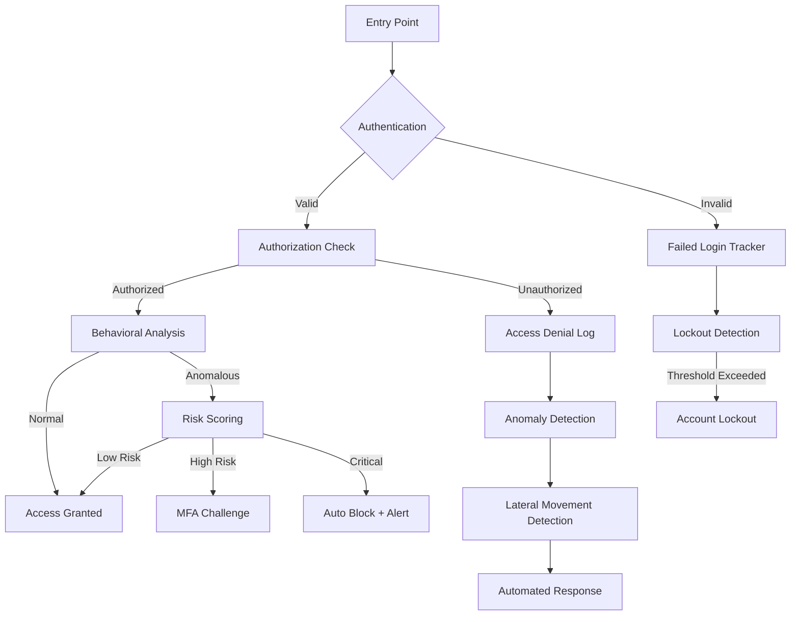

# Penetration Testing & Threat Detection Guide

## Overview

OberaConnect implements an "assume breach" security architecture with advanced threat detection capabilities. This guide covers the penetration testing approach, bad actor identification, and AI-powered threat analysis.

---

## Table of Contents

1. [Security Architecture](#security-architecture)
2. [Assume Breach Principles](#assume-breach-principles)
3. [Threat Detection Capabilities](#threat-detection-capabilities)
4. [Penetration Testing Methodology](#penetration-testing-methodology)
5. [Bad Actor Identification](#bad-actor-identification)
6. [AI Threat Analysis](#ai-threat-analysis)
7. [Response Automation](#response-automation)
8. [Implementation Guide](#implementation-guide)

---

## Security Architecture

### Core Principle: **Zero Trust + Assume Breach**

**Assumptions:**
- Attackers are already inside the network
- Every request must be verified
- Trust nothing, verify everything
- Detect and respond, don't just prevent

### Defense Layers



---

## Assume Breach Principles

### 1. **Continuous Authentication**

Don't trust initial authentication - verify continuously:

**Implementation:**
- Session anomaly detection (IP changes, device switches)
- Behavioral baseline monitoring
- Privileged action verification
- Break-glass access auditing

### 2. **Lateral Movement Detection**

Track unusual access patterns between resources:

**Indicators:**
- User accessing resources outside normal scope
- Rapid successive access to multiple systems
- Accessing critical systems without business justification
- Unusual time-of-day access

**Database Table: `lateral_movement_indicators`**
```sql
CREATE TABLE lateral_movement_indicators (
  id UUID PRIMARY KEY,
  user_id UUID,
  from_resource TEXT,      -- Where they came from
  to_resource TEXT,        -- Where they went
  access_pattern TEXT,     -- Description of pattern
  risk_score INTEGER,      -- 0-100
  was_blocked BOOLEAN,
  triggered_at TIMESTAMPTZ
);
```

### 3. **Data Exfiltration Monitoring**

Watch for bulk data access and exports:

**Triggers:**
- Query size exceeds user baseline
- Export attempts of sensitive data
- Data access from new locations
- Off-hours database dumps

**Database Table: `data_access_anomalies`**
```sql
CREATE TABLE data_access_anomalies (
  id UUID PRIMARY KEY,
  user_id UUID,
  table_accessed TEXT,
  records_queried INTEGER,
  normal_baseline INTEGER,     -- User's typical query size
  deviation_percentage NUMERIC,
  export_attempted BOOLEAN,
  was_blocked BOOLEAN
);
```

---

## Threat Detection Capabilities

### 1. **Failed Login Tracking**

**Purpose:** Detect brute force, credential stuffing, password spraying

**Tracked Metrics:**
- Failed attempts per email
- Failed attempts per IP
- Geographic anomalies
- User agent patterns
- Time-based patterns

**Auto-Response:**
- After 5 failed attempts: Alert
- After 10 failed attempts: Temporary lockout (15 min)
- After 20 failed attempts: Account lockout (requires admin unlock)

### 2. **Attack Kill Chain Mapping**

Track attacks through all stages:

**Stages:**
1. **Reconnaissance** - Scanning, enumeration
2. **Weaponization** - Exploit preparation
3. **Delivery** - Payload delivery
4. **Exploitation** - Vulnerability exploitation
5. **Installation** - Persistence mechanisms
6. **Command & Control** - C2 establishment
7. **Actions on Objectives** - Data theft, destruction

**Database Table: `attack_chain_events`**
```sql
CREATE TABLE attack_chain_events (
  id UUID PRIMARY KEY,
  chain_id UUID,           -- Groups related events
  stage TEXT,              -- One of the 7 stages above
  user_id UUID,
  event_details JSONB,
  was_prevented BOOLEAN
);
```

### 3. **Honeypot Resources**

Fake resources that should never be accessed:

**Types:**
- Fake database tables (e.g., `admin_credentials_backup`)
- Fake API endpoints (`/api/internal/admin-panel`)
- Fake files (`salary_database.xlsx`)
- Fake credentials (honey accounts)

**Response:**
- Log access immediately
- Create high-priority incident
- Optionally auto-block user
- Alert SOC team

### 4. **Behavioral Deviation Detection**

Track user behavior baseline and flag deviations:

**Baseline Metrics:**
- Typical login times
- Normal IP ranges
- Standard resources accessed
- Average query sizes
- Usual work hours

**Deviations Flagged:**
- Login from new country (especially impossible travel)
- Access outside work hours (without justification)
- Bulk data access (>200% of normal)
- Privilege escalation attempts
- Role switching frequency

---

## Penetration Testing Methodology

### Pre-Production Testing

**1. Authentication Bypass**
```
Test: Attempt to bypass authentication
- Session hijacking
- Token theft/replay
- OAuth flow manipulation
- Cookie manipulation
- Direct URL access without auth

Expected: All blocked with proper error logging
```

**2. Authorization Bypass**
```
Test: Attempt privilege escalation
- Horizontal: Access other user's data
- Vertical: Access admin functions as regular user
- Role manipulation in requests
- Parameter tampering

Expected: RLS policies prevent unauthorized access
```

**3. SQL Injection**
```
Test: Inject SQL in all inputs
- Search fields
- Form inputs
- URL parameters
- Headers

Expected: Parameterized queries prevent injection
```

**4. API Abuse**
```
Test: Overwhelm edge functions
- Send 1000 req/min to endpoint
- Send malformed JSON
- Send oversized payloads
- Omit required authentication

Expected: Rate limiting activates, requests rejected
```

### Assume Breach Scenarios

**Scenario 1: Compromised Admin Account**

**Simulation:**
1. Attacker gains admin credentials
2. Logs in from Russia (user normally in USA)
3. Attempts to export all customer data
4. Creates new admin account

**Expected Detection:**
- Behavioral deviation: Geographic anomaly
- Data exfiltration attempt flagged
- Privilege usage anomaly (creating admins)
- Honeypot trigger (if accessing fake admin endpoint)

**Expected Response:**
- MFA challenge on suspicious login
- Block bulk export
- Alert SOC team
- Auto-suspend new admin account creation

---

**Scenario 2: Insider Threat**

**Simulation:**
1. Employee with DB access
2. Queries customer PII outside normal scope
3. Attempts lateral movement to finance systems
4. Downloads data to personal device

**Expected Detection:**
- Data access anomaly (unusual query size)
- Lateral movement indicator (finance access)
- Behavioral deviation (personal device)

**Expected Response:**
- Real-time alert to manager
- Require justification for access
- Log detailed audit trail
- Optional auto-block if critical threshold

---

**Scenario 3: Supply Chain Attack**

**Simulation:**
1. Compromised integration (e.g., NinjaOne)
2. Integration starts exfiltrating data
3. Creates unauthorized API calls
4. Attempts to modify audit logs

**Expected Detection:**
- API anomaly (unusual call patterns)
- Data exfiltration from integration
- Audit log tampering attempt
- Threat intelligence match (compromised IP)

**Expected Response:**
- Disable integration automatically
- Alert security team
- Create incident ticket
- Preserve logs before tampering

---

## Bad Actor Identification

### User Entity Behavior Analytics (UEBA)

**Baseline Establishment (30 days):**
```sql
CREATE TABLE user_behavior_baselines (
  id UUID PRIMARY KEY,
  user_id UUID,
  avg_login_time TIME,
  typical_ip_ranges INET[],
  normal_resources_accessed TEXT[],
  typical_query_patterns JSONB,
  standard_work_hours_start TIME,
  standard_work_hours_end TIME,
  baseline_calculated_at TIMESTAMPTZ
);
```

**Deviation Scoring:**

```typescript
function calculateDeviationScore(user: User, action: Action): number {
  let score = 0;
  
  // Geographic deviation
  if (action.ip_country !== user.baseline.country) score += 30;
  
  // Time deviation
  if (isOutsideWorkHours(action.time, user.baseline.work_hours)) score += 20;
  
  // Resource deviation
  if (!user.baseline.normal_resources.includes(action.resource)) score += 25;
  
  // Volume deviation
  const volumeIncrease = (action.data_volume / user.baseline.avg_volume) * 100;
  if (volumeIncrease > 200) score += 25;
  
  return Math.min(score, 100); // Cap at 100
}
```

### Threat Intelligence Integration

**Indicators of Compromise (IOCs):**

```sql
CREATE TABLE threat_indicators (
  id UUID PRIMARY KEY,
  indicator_type TEXT, -- ip, email_domain, user_agent, file_hash
  indicator_value TEXT,
  threat_level TEXT,   -- low, medium, high, critical
  source TEXT,         -- AlienVault, FBI, internal
  block_automatically BOOLEAN
);
```

**Check all access against threat intel:**
```typescript
async function checkThreatIntel(ip: string, email: string): Promise<ThreatLevel> {
  const ipMatch = await supabase
    .from('threat_indicators')
    .select('*')
    .eq('indicator_type', 'ip')
    .eq('indicator_value', ip)
    .single();
    
  if (ipMatch.data?.threat_level === 'critical') {
    await blockAccess(ip, 'Matched critical threat intel');
    return 'BLOCKED';
  }
  
  return ipMatch.data?.threat_level || 'NONE';
}
```

---

## AI Threat Analysis

### Lovable AI Integration

**Edge Function:** `soc-threat-analysis`

**Purpose:**
- Analyze security telemetry using AI
- Identify attack patterns
- Provide actionable recommendations
- Prioritize SOC response

**Input Data:**
```typescript
{
  timeframe: "24h",
  stats: {
    failedLogins: 156,
    highRiskAnomalies: 12,
    lateralMovement: 3,
    dataAnomalies: 7,
    activeThreat: 2,
    attackChains: 1
  },
  recentEvents: {
    topFailedLoginIPs: [
      { ip: "192.168.1.100", count: 45 },
      { ip: "10.0.0.50", count: 32 }
    ],
    criticalAnomalies: [...],
    suspiciousDataAccess: [...]
  }
}
```

**AI Prompt:**
```
You are a cybersecurity analyst assistant for an SOC.
Analyze the provided security telemetry and provide:

1. Threat Summary - Overall security posture
2. Attack Patterns - Identify potential campaigns
3. Priority Actions - Top 3-5 immediate actions
4. Risk Assessment - Overall risk level (Low/Medium/High/Critical)
5. Indicators of Compromise - Any IOCs detected
6. Recommendations - Short and long-term improvements

Be concise, actionable, and prioritize by severity.
```

**AI Output Example:**
```markdown
## Threat Summary
CRITICAL - Active brute force campaign detected with 156 failed logins from 12 IPs.
Lateral movement indicators suggest potential compromised account.

## Attack Patterns
1. **Brute Force Campaign**: 156 failed logins concentrated in 2-hour window
   - Top source: 192.168.1.100 (45 attempts)
   - Target: admin@company.com, service@company.com
   
2. **Lateral Movement**: User john.doe accessed 5 systems outside normal scope
   - Finance DB (first time)
   - HR records (unusual)
   - Suggest compromised credentials

## Priority Actions
1. **IMMEDIATE**: Lock admin@company.com account pending investigation
2. **URGENT**: Investigate john.doe access - require MFA/manager approval
3. **HIGH**: Block IP 192.168.1.100 - clear attack pattern
4. **MEDIUM**: Enable rate limiting on login endpoint
5. **LOW**: Review access logs for john.doe last 72h

## Risk Assessment
**CRITICAL** - Active attack in progress. Immediate containment required.

Confidence: 95% (high correlation between events)

## Indicators of Compromise
- IP: 192.168.1.100 (brute force source)
- User: john.doe (anomalous behavior)
- Pattern: 2:00 AM access (outside work hours)

## Recommendations
**Short-term**:
- Implement IP allowlisting for admin accounts
- Require MFA for all privileged operations
- Deploy honeypot admin credentials

**Long-term**:
- Establish UEBA baselines for all users
- Integrate threat intelligence feeds
- Automate response for brute force (auto-block after 10 failures)
```

### Usage in SOC Dashboard

```typescript
// In SOCDashboard component
const runThreatAnalysis = async () => {
  const { data } = await supabase.functions.invoke('soc-threat-analysis', {
    body: { analysisType: 'comprehensive', timeframe: '24h' }
  });
  
  setThreatAnalysis(data.analysis);
  // Display in dashboard "AI Threat Analysis" tab
};
```

---

## Response Automation

### Automated Response Rules

**Database Table:** `automated_response_rules`

```sql
CREATE TABLE automated_response_rules (
  id UUID PRIMARY KEY,
  rule_name TEXT,
  trigger_type TEXT,       -- failed_login, data_exfil, lateral_movement
  threshold JSONB,         -- {count: 10, timeframe: "5m"}
  actions JSONB,           -- [disable_account, notify_admin, block_ip]
  is_active BOOLEAN
);
```

**Example Rules:**

**Rule 1: Brute Force Auto-Block**
```json
{
  "rule_name": "Auto-block brute force",
  "trigger_type": "failed_login",
  "threshold": {
    "count": 10,
    "timeframe": "5 minutes"
  },
  "actions": [
    {"type": "block_ip", "duration": "1 hour"},
    {"type": "notify_soc", "priority": "high"},
    {"type": "create_incident", "severity": "medium"}
  ]
}
```

**Rule 2: Data Exfiltration Prevention**
```json
{
  "rule_name": "Block bulk data export",
  "trigger_type": "data_exfiltration",
  "threshold": {
    "records": 1000,
    "deviation_percentage": 300
  },
  "actions": [
    {"type": "block_query"},
    {"type": "require_mfa"},
    {"type": "notify_manager"},
    {"type": "create_incident", "severity": "critical"}
  ]
}
```

**Rule 3: Honeypot Trigger Response**
```json
{
  "rule_name": "Honeypot access response",
  "trigger_type": "honeypot_access",
  "threshold": {
    "count": 1
  },
  "actions": [
    {"type": "disable_account", "duration": "pending_review"},
    {"type": "notify_soc", "priority": "critical"},
    {"type": "preserve_session", "for_forensics": true},
    {"type": "block_ip", "duration": "permanent"}
  ]
}
```

### Response Execution Engine

```typescript
async function executeAutomatedResponse(
  event: SecurityEvent,
  rule: AutomatedResponseRule
): Promise<void> {
  const actions = rule.actions as AutomatedAction[];
  
  for (const action of actions) {
    switch (action.type) {
      case 'block_ip':
        await blockIP(event.ip_address, action.duration);
        break;
        
      case 'disable_account':
        await disableAccount(event.user_id, action.duration);
        break;
        
      case 'notify_soc':
        await createAlert({
          priority: action.priority,
          event_id: event.id,
          message: `Automated response triggered: ${rule.rule_name}`
        });
        break;
        
      case 'create_incident':
        await createIncident({
          severity: action.severity,
          title: `Auto-detected: ${event.type}`,
          details: event,
          assigned_to: 'SOC_TEAM'
        });
        break;
        
      case 'require_mfa':
        await flagForMFA(event.user_id);
        break;
    }
  }
  
  // Log execution
  await logResponseExecution(rule.id, event.id, actions);
}
```

---

## Implementation Guide

### Step 1: Enable Security Monitoring

**Database migration has been run** - All tables created

### Step 2: Configure Automated Rules

```sql
-- Example: Create brute force protection rule
INSERT INTO automated_response_rules (
  customer_id,
  rule_name,
  trigger_type,
  threshold,
  actions,
  is_active
) VALUES (
  'your-customer-id',
  'Brute Force Auto-Block',
  'failed_login',
  '{"count": 10, "timeframe": "5m"}'::jsonb,
  '[
    {"type": "block_ip", "duration": "1h"},
    {"type": "notify_soc", "priority": "high"}
  ]'::jsonb,
  true
);
```

### Step 3: Deploy Honeypots

```sql
-- Create fake admin table (honeypot)
INSERT INTO honeypot_resources (
  customer_id,
  resource_type,
  resource_name,
  description,
  is_active
) VALUES (
  'your-customer-id',
  'table',
  'admin_credentials_backup',
  'Fake table with admin credentials - should never be accessed',
  true
);
```

### Step 4: Establish Baselines

Run for 30 days to establish user behavior baselines:

```typescript
// Cron job (daily)
async function calculateUserBaselines() {
  const users = await getAllActiveUsers();
  
  for (const user of users) {
    const last30Days = await getUserActivityLast30Days(user.id);
    
    const baseline = {
      avg_login_time: calculateAvgLoginTime(last30Days.logins),
      typical_ip_ranges: extractIPRanges(last30Days.ips),
      normal_resources: extractResources(last30Days.access),
      standard_work_hours: calculateWorkHours(last30Days.logins),
    };
    
    await upsertBaseline(user.id, baseline);
  }
}
```

### Step 5: Integrate with SOC Dashboard

Already implemented - visit `/dashboard/soc` and click "AI Threat Analysis"

### Step 6: Configure Alerts

Set up notification channels for SOC team:

```sql
-- Configure alert destinations
INSERT INTO alert_channels (
  customer_id,
  channel_type,
  destination,
  severity_filter
) VALUES
  ('customer-id', 'email', 'soc@company.com', 'critical'),
  ('customer-id', 'slack', '#soc-alerts', 'high'),
  ('customer-id', 'pagerduty', 'integration-key', 'critical');
```

---

## Penetration Test Checklist

### Authentication & Session Management
- [ ] Brute force protection active
- [ ] Account lockout after 10 failed attempts
- [ ] Session timeout configured (30 min)
- [ ] Token rotation on privilege escalation
- [ ] MFA required for admin functions

### Authorization
- [ ] RLS policies prevent horizontal access
- [ ] RLS policies prevent vertical access
- [ ] Role-based permissions enforced
- [ ] Privilege escalation attempts logged
- [ ] Temporary privileges expire correctly

### Data Protection
- [ ] Bulk query detection active
- [ ] Export monitoring enabled
- [ ] Baseline deviation alerts configured
- [ ] Data encryption at rest
- [ ] Encrypted connections (TLS)

### Monitoring & Detection
- [ ] Failed login tracking enabled
- [ ] Lateral movement detection active
- [ ] Behavioral baselines established
- [ ] Honeypots deployed
- [ ] Attack chain mapping enabled
- [ ] Threat intelligence integrated

### Response & Recovery
- [ ] Automated response rules configured
- [ ] SOC team alert channels set
- [ ] Incident creation automated
- [ ] Account disable capability tested
- [ ] IP blocking verified

---

## Monitoring Dashboard

### Key Metrics to Track

**Real-time (SOC Dashboard):**
- Failed logins (last hour)
- Active lockouts
- Critical behavioral deviations
- Active attack chains
- Honeypot triggers
- Automated responses executed

**Daily:**
- Total security incidents
- Avg response time
- Threats prevented
- Compliance score

**Weekly:**
- Attack pattern trends
- Top threat actors (IPs)
- Most targeted resources
- Response effectiveness

---

## Security Posture Score

Calculate overall security health:

```typescript
function calculateSecurityScore(): number {
  let score = 100;
  
  // Deduct for active threats
  score -= metrics.activeAttackChains * 10;
  score -= metrics.criticalDeviations * 5;
  score -= metrics.activeLockouts * 2;
  
  // Deduct for unresolved incidents
  const unresolvedIncidents = getUnresolvedIncidents();
  score -= unresolvedIncidents.filter(i => i.severity === 'critical').length * 15;
  score -= unresolvedIncidents.filter(i => i.severity === 'high').length * 10;
  
  // Add for preventative measures
  if (honeypotDeployed) score += 5;
  if (automatedResponsesActive) score += 5;
  if (mfaEnforced) score += 10;
  
  return Math.max(0, Math.min(100, score));
}
```

---

## Compliance Mapping

Map security controls to frameworks:

**SOC 2:**
- CC6.1: Logical access controls
- CC6.6: Monitoring activities
- CC7.2: Detection of security events

**ISO 27001:**
- A.9.2: User access management
- A.12.4: Logging and monitoring
- A.16.1: Incident management

**NIST CSF:**
- DE.CM: Continuous monitoring
- DE.AE: Anomalies and events
- RS.AN: Analysis

---

## Next Steps

1. **Week 1-2:** Configure automated response rules
2. **Week 3-4:** Deploy honeypots and establish baselines
3. **Month 2:** Run first penetration test
4. **Month 3:** Red team exercise (assume breach scenario)
5. **Quarterly:** Review and update threat intelligence
6. **Annually:** Full security audit

---

## Support

For security incidents or questions:
- **Emergency:** Page SOC team via PagerDuty
- **Non-urgent:** Create ticket in `/incidents`
- **Questions:** Contact security@company.com
