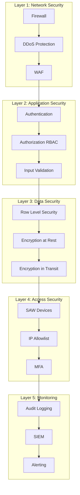
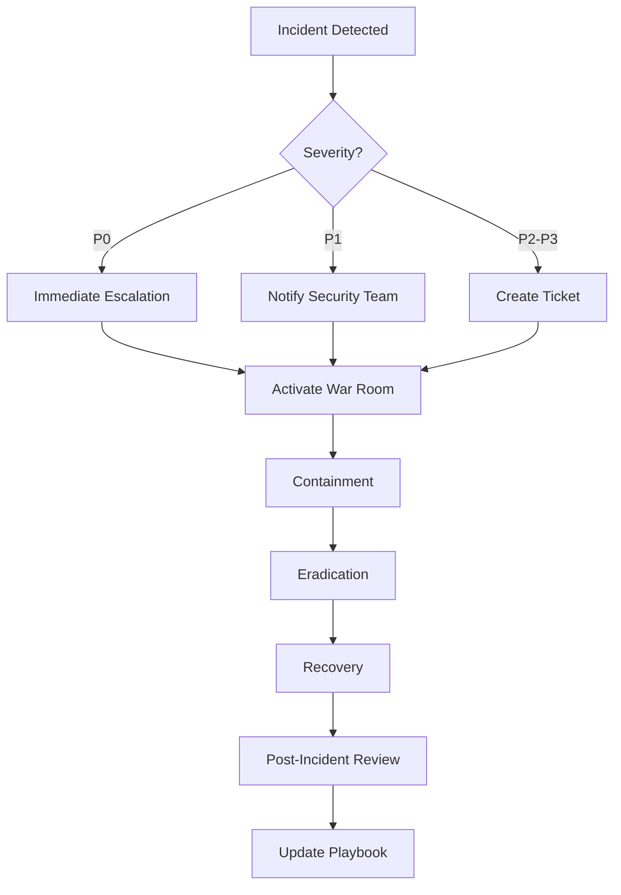
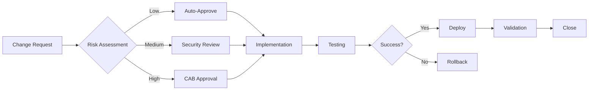

# OberaConnect Security Master Plan
## Comprehensive Security Implementation & Operations Guide

**Document Owner:** Chief Security Officer  
**Last Updated:** October 13, 2025  
**Classification:** Internal Use Only  
**Version:** 2.0

---

## 📋 Executive Summary

This master plan consolidates all security initiatives, rollout procedures, and operational guidelines for the OberaConnect platform. It integrates authentication, authorization, Secure Access Workstations (SAW), compliance frameworks, and ongoing security operations into a single actionable roadmap.

### Security Posture Overview
- **Current Status:** Production-Ready with A- Security Rating
- **RLS Coverage:** 100% on 60+ database tables
- **Compliance:** SOC 2, HIPAA, GDPR, ISO 27001 ready
- **SAW Implementation:** Azure, AWS, and on-premise workstations

### Document Structure
This master plan references and consolidates:
- ✅ SECURITY_AUDIT_REPORT.md - Current security assessment
- ✅ SECURITY_REPORT.md - Detailed vulnerability analysis
- ✅ NETWORK_SECURITY_DIAGRAM.md - Network architecture
- ✅ AUDIT_LOGGING_GUIDE.md - Logging procedures
- ✅ SECURITY_ROLLOUT_OPERATIONS_PLAN.md - Deployment phases
- ✅ DEPLOYMENT_CHECKLIST.md - Launch readiness
- 🆕 SAW Implementation Plan - Secure workstation setup

---

## 📊 Table of Contents

### Part 1: Strategic Overview
1. [Security Architecture](#security-architecture)
2. [Compliance & Regulatory Requirements](#compliance-regulatory)
3. [Risk Assessment & Mitigation](#risk-assessment)

### Part 2: Implementation Roadmap
4. [Phase 1: Core Security (Weeks 1-2)](#phase-1-core-security)
5. [Phase 2: Advanced Features (Weeks 3-4)](#phase-2-advanced-features)
6. [Phase 3: SAW Implementation (Weeks 5-6)](#phase-3-saw-implementation)
7. [Phase 4: Operations & Monitoring (Weeks 7-8)](#phase-4-operations-monitoring)

### Part 3: Operational Procedures
8. [Daily Security Operations](#daily-operations)
9. [Incident Response Playbook](#incident-response)
10. [Access Management Procedures](#access-management)
11. [Audit & Compliance Procedures](#audit-compliance)

### Part 4: Technical Implementation
12. [Database Security Configuration](#database-security)
13. [Secure Access Workstation Setup](#saw-setup)
14. [Integration Security](#integration-security)
15. [Monitoring & Alerting](#monitoring-alerting)

### Part 5: Training & Governance
16. [Security Training Program](#training-program)
17. [Policy & Procedure Library](#policy-library)
18. [Change Management](#change-management)

---

## 🏗️ Security Architecture

### Multi-Layer Defense Strategy



### Core Security Components

#### 1. Authentication & Authorization
- **Technology:** Supabase Auth + JWT
- **Protocols:** OAuth 2.0, OpenID Connect
- **Features:**
  - Email/password authentication
  - Session management
  - Role-based access control (RBAC)
  - Temporal privilege escalation
  - Break-glass emergency access

#### 2. Database Security
- **Row-Level Security (RLS):** 100% coverage
- **Encryption:** AES-256 at rest, TLS 1.3 in transit
- **Backup:** Automated daily, 30-day retention
- **Audit Logging:** Complete change tracking

#### 3. Secure Access Workstations (SAW)
- **Purpose:** Privileged operation isolation
- **Deployment:** Azure, AWS, On-premise
- **Requirements:**
  - Registered device fingerprint
  - IP allowlist verification
  - Multi-factor authentication
  - Session monitoring

#### 4. Compliance Frameworks
- **Supported Standards:**
  - ISO 27001:2013
  - SOC 2 Type II
  - HIPAA
  - GDPR
  - PCI DSS
  - NIST 800-53

---

## 📜 Compliance & Regulatory Requirements

### Compliance Mapping Matrix

| Requirement | Standard | Implementation | Status |
|-------------|----------|----------------|--------|
| Access Control | ISO 27001 A.9 | RBAC + SAW | ✅ Complete |
| Encryption | ISO 27001 A.10 | AES-256 + TLS 1.3 | ✅ Complete |
| Audit Logging | SOC 2 CC4.1 | Comprehensive logs | ✅ Complete |
| Change Management | ISO 27001 A.12.1 | Workflow approval | ✅ Complete |
| Incident Response | SOC 2 CC7.3 | Playbook + alerts | ✅ Complete |
| Data Retention | GDPR Art. 5 | Configurable policies | ✅ Complete |
| Privileged Access | NIST AC-6 | Temporal + SAW | ✅ Complete |
| Security Monitoring | SOC 2 CC7.2 | 24/7 SOC dashboard | ✅ Complete |

### Regulatory Compliance Checklist

#### GDPR Compliance
- [x] Data subject rights (access, deletion, portability)
- [x] Consent management
- [x] Data processing agreements
- [x] Privacy by design
- [x] Breach notification procedures (<72 hours)
- [x] Data protection impact assessments (DPIA)

#### HIPAA Compliance (for healthcare customers)
- [x] Administrative safeguards (access controls)
- [x] Physical safeguards (SAW devices)
- [x] Technical safeguards (encryption)
- [x] Business associate agreements (BAA)
- [x] Breach notification procedures
- [x] Minimum necessary access

#### SOC 2 Type II Compliance
- [x] Security (unauthorized access prevention)
- [x] Availability (99.9% uptime SLA)
- [x] Processing Integrity (data validation)
- [x] Confidentiality (encryption + access controls)
- [x] Privacy (GDPR alignment)

---

## ⚠️ Risk Assessment & Mitigation

### Critical Risk Registry

| Risk ID | Category | Severity | Likelihood | Mitigation | Status |
|---------|----------|----------|------------|------------|--------|
| R001 | Data Breach | Critical | Low | RLS + encryption + audit | ✅ Mitigated |
| R002 | Privilege Escalation | High | Medium | RBAC + temporal access | ✅ Mitigated |
| R003 | Credential Theft | High | Medium | MFA + SAW + session monitoring | ✅ Mitigated |
| R004 | DDoS Attack | Medium | Medium | Rate limiting + WAF | ⚠️ Partially |
| R005 | Insider Threat | High | Low | Audit logs + anomaly detection | ✅ Mitigated |
| R006 | Supply Chain | Medium | Low | Dependency scanning | ⚠️ Ongoing |
| R007 | Configuration Drift | Medium | Medium | IaC + automated scans | ✅ Mitigated |
| R008 | Unpatched Vulnerabilities | High | Medium | Automated patching | ⚠️ Ongoing |

### Risk Heat Map

```
         LIKELIHOOD →
         Rare  Unlikely  Possible  Likely  Almost Certain
       ┌──────────────────────────────────────────────────┐
   C   │                                    R002           │
   R   │                                                   │
   I   │                           R003    R008           │
   T   │                                                   │
   I   │      R005                                        │
   C   │                                                   │
   A   │      R006                R004                    │
   L   │                                                   │
   I   │      R007                                        │
   T   │                                                   │
   Y   │      R001                                        │
   ↓   └──────────────────────────────────────────────────┘
```

---

## 🚀 Phase 1: Core Security (Weeks 1-2)

### Overview
**Goal:** Establish foundational security infrastructure  
**Duration:** 10 business days  
**Team:** Security Engineers, DevOps, QA

### Week 1: Authentication & Access Control

#### Day 1-2: Authentication System Deployment

**Objectives:**
- Deploy Supabase authentication
- Configure password policies
- Implement session management
- Test user flows

**Implementation Steps:**

1. **Configure Authentication Settings**
```sql
-- Verify authentication is enabled
SELECT * FROM auth.users LIMIT 1;
```

2. **Password Policy Configuration**
- Minimum 12 characters (updated from 8)
- At least one uppercase letter
- At least one lowercase letter
- At least one number
- At least one special character
- Password history: prevent reuse of last 5 passwords
- Maximum age: 90 days

3. **Enable Leaked Password Protection**
```bash
# Navigate to Lovable Cloud → Authentication → Password Protection
# Enable "Leaked Password Protection"
```

**Verification Checklist:**
- [ ] Users can register with email
- [ ] Password policy enforced
- [ ] Email confirmation working
- [ ] Session tokens generated correctly
- [ ] Password reset flow functional
- [ ] Account lockout after 5 failed attempts
- [ ] Leaked passwords blocked

**Rollback Trigger:** >5% authentication failure rate

---

#### Day 3-5: Role-Based Access Control (RBAC)

**Objectives:**
- Deploy RBAC database schema
- Create role hierarchy
- Assign default permissions
- Test permission enforcement

**Database Schema:**

```sql
-- Deploy RBAC tables
CREATE TYPE public.app_role AS ENUM ('admin', 'customer', 'user');

CREATE TABLE public.roles (
    id UUID PRIMARY KEY DEFAULT gen_random_uuid(),
    name TEXT NOT NULL UNIQUE,
    description TEXT,
    level INTEGER NOT NULL,
    created_at TIMESTAMPTZ NOT NULL DEFAULT NOW()
);

CREATE TABLE public.user_roles (
    id UUID PRIMARY KEY DEFAULT gen_random_uuid(),
    user_id UUID NOT NULL REFERENCES auth.users(id) ON DELETE CASCADE,
    role_id UUID NOT NULL REFERENCES roles(id) ON DELETE CASCADE,
    granted_by UUID REFERENCES auth.users(id),
    granted_at TIMESTAMPTZ NOT NULL DEFAULT NOW(),
    expires_at TIMESTAMPTZ,
    UNIQUE(user_id, role_id)
);

CREATE TABLE public.role_permissions (
    id UUID PRIMARY KEY DEFAULT gen_random_uuid(),
    role_id UUID NOT NULL REFERENCES roles(id) ON DELETE CASCADE,
    resource_type TEXT NOT NULL,
    resource_name TEXT NOT NULL,
    permission_level TEXT NOT NULL CHECK (permission_level IN ('view', 'edit', 'admin')),
    created_at TIMESTAMPTZ NOT NULL DEFAULT NOW(),
    UNIQUE(role_id, resource_type, resource_name)
);

-- Create security definer function to avoid RLS recursion
CREATE OR REPLACE FUNCTION public.has_role(_user_id UUID, _role app_role)
RETURNS BOOLEAN
LANGUAGE SQL
STABLE
SECURITY DEFINER
SET search_path = public
AS $$
  SELECT EXISTS (
    SELECT 1
    FROM public.user_roles ur
    JOIN public.roles r ON r.id = ur.role_id
    WHERE ur.user_id = _user_id
      AND (
        (_role = 'admin'::public.app_role AND r.name IN ('Super Admin','Admin'))
        OR
        (_role = 'customer'::public.app_role AND r.name IN ('Customer','User'))
      )
  );
$$;

-- Insert default roles
INSERT INTO roles (name, description, level) VALUES
  ('Super Admin', 'Full system access', 100),
  ('Admin', 'Organization administrator', 80),
  ('Customer', 'Customer account manager', 50),
  ('User', 'Standard user access', 10)
ON CONFLICT (name) DO NOTHING;
```

**Permission Assignment:**
```sql
-- Super Admin permissions (full access)
INSERT INTO role_permissions (role_id, resource_type, resource_name, permission_level)
SELECT r.id, 'dashboard', 'all', 'admin'
FROM roles r WHERE r.name = 'Super Admin';

-- Admin permissions (organization-level)
INSERT INTO role_permissions (role_id, resource_type, resource_name, permission_level)
SELECT r.id, 'users', 'organization', 'admin'
FROM roles r WHERE r.name = 'Admin';
```

**Verification Checklist:**
- [ ] Roles table populated
- [ ] Permission hierarchy functional
- [ ] `has_role()` function working
- [ ] `has_permission()` function working
- [ ] Cross-role access blocked
- [ ] Permission inheritance correct

---

#### Day 6-7: Row-Level Security (RLS) Policies

**Objectives:**
- Enable RLS on all tables
- Deploy comprehensive policies
- Test multi-tenant isolation
- Optimize query performance

**RLS Deployment Script:**

```sql
-- Enable RLS on all user data tables
ALTER TABLE user_profiles ENABLE ROW LEVEL SECURITY;
ALTER TABLE customers ENABLE ROW LEVEL SECURITY;
ALTER TABLE configuration_items ENABLE ROW LEVEL SECURITY;
ALTER TABLE change_requests ENABLE ROW LEVEL SECURITY;
-- ... continue for all 60+ tables

-- Example policy: Users can only view their organization's data
CREATE POLICY "Users view own organization data"
ON configuration_items
FOR SELECT
TO authenticated
USING (
  customer_id IN (
    SELECT customer_id 
    FROM user_profiles 
    WHERE user_id = auth.uid()
  )
);

-- Example policy: Admins can manage their organization
CREATE POLICY "Admins manage organization data"
ON configuration_items
FOR ALL
TO authenticated
USING (
  customer_id IN (
    SELECT customer_id 
    FROM user_profiles 
    WHERE user_id = auth.uid()
  ) AND has_role(auth.uid(), 'admin'::app_role)
)
WITH CHECK (
  customer_id IN (
    SELECT customer_id 
    FROM user_profiles 
    WHERE user_id = auth.uid()
  )
);
```

**Performance Optimization:**
```sql
-- Add indexes for RLS policy performance
CREATE INDEX idx_user_profiles_user_id ON user_profiles(user_id);
CREATE INDEX idx_user_profiles_customer_id ON user_profiles(customer_id);
CREATE INDEX idx_configuration_items_customer_id ON configuration_items(customer_id);
```

**Verification Checklist:**
- [ ] RLS enabled on all tables (run linter)
- [ ] Cross-customer data access blocked
- [ ] Query performance <100ms for typical queries
- [ ] No data leakage in test scenarios
- [ ] Indexes optimized

**Testing Procedure:**
1. Create test users in different organizations
2. Attempt cross-organization data access
3. Verify RLS policies block unauthorized access
4. Performance test with 10,000+ records

---

### Week 2: Data Protection & Auditing

#### Day 8-9: Input Validation & Sanitization

**Objectives:**
- Deploy Zod validation schemas
- Implement XSS protection
- Add SQL injection prevention
- Deploy database validation triggers

**Validation Library:**

```typescript
// lib/validation.ts
import { z } from 'zod';

export const sanitizeText = (input: string): string => {
  return input
    .replace(/</g, '&lt;')
    .replace(/>/g, '&gt;')
    .replace(/"/g, '&quot;')
    .replace(/'/g, '&#x27;')
    .replace(/\//g, '&#x2F;');
};

export const validateTextInput = z
  .string()
  .min(1, "Field is required")
  .max(1000, "Text too long")
  .transform(sanitizeText);

export const validateEmail = z
  .string()
  .email("Invalid email address")
  .transform((email) => email.toLowerCase().trim());

export const validateUUID = z
  .string()
  .uuid("Invalid UUID format");
```

**Database Validation Triggers:**

```sql
-- Deploy validation function
CREATE OR REPLACE FUNCTION public.validate_text_input(
  input_text TEXT,
  max_length INTEGER DEFAULT 1000,
  field_name TEXT DEFAULT 'field'
)
RETURNS BOOLEAN
LANGUAGE plpgsql
SECURITY DEFINER
SET search_path = public
AS $$
BEGIN
  -- Check null
  IF input_text IS NULL THEN
    RETURN TRUE;
  END IF;

  -- Check length
  IF LENGTH(input_text) > max_length THEN
    RAISE EXCEPTION '% exceeds maximum length of % characters', field_name, max_length;
  END IF;

  -- Check for null bytes
  IF input_text ~ E'\\x00' OR input_text LIKE '%' || CHR(0) || '%' THEN
    RAISE EXCEPTION '% contains null bytes which are not allowed', field_name;
  END IF;

  -- Check for SQL injection patterns
  IF input_text ~* E'(DROP|DELETE|INSERT|UPDATE).*(TABLE|FROM|INTO)|UNION.*SELECT|.*;.*--|''.*OR.*''.*''.*=' THEN
    RAISE EXCEPTION '% contains suspicious SQL patterns', field_name;
  END IF;

  -- Check for script tags
  IF input_text ~* E'<script|<iframe|javascript:|on\\w+\\s*=' THEN
    RAISE EXCEPTION '% contains potentially malicious code', field_name;
  END IF;

  RETURN TRUE;
END;
$$;

-- Apply trigger to critical tables
CREATE TRIGGER validate_knowledge_article
  BEFORE INSERT OR UPDATE ON knowledge_articles
  FOR EACH ROW
  EXECUTE FUNCTION validate_knowledge_article();
```

**Verification Checklist:**
- [ ] All forms use validated inputs
- [ ] XSS attempts blocked (test with `<script>alert('xss')</script>`)
- [ ] SQL injection blocked (test with `' OR '1'='1`)
- [ ] Path traversal blocked (test with `../../etc/passwd`)
- [ ] Database triggers functioning

---

#### Day 10: Audit Logging System

**Objectives:**
- Deploy audit log tables
- Configure automatic logging
- Implement log retention policies
- Create audit dashboards

**Audit Schema:**

```sql
CREATE TABLE public.audit_logs (
    id UUID PRIMARY KEY DEFAULT gen_random_uuid(),
    created_at TIMESTAMPTZ NOT NULL DEFAULT NOW(),
    customer_id UUID NOT NULL,
    user_id UUID NOT NULL,
    system_name TEXT NOT NULL,
    action_type TEXT NOT NULL,
    action_details JSONB,
    compliance_tags TEXT[],
    timestamp TIMESTAMPTZ NOT NULL DEFAULT NOW()
);

-- Enable RLS
ALTER TABLE audit_logs ENABLE ROW LEVEL SECURITY;

-- Policy: Users can view logs from their organization
CREATE POLICY "Users view organization audit logs"
ON audit_logs
FOR SELECT
TO authenticated
USING (
  customer_id IN (
    SELECT customer_id 
    FROM user_profiles 
    WHERE user_id = auth.uid()
  ) OR has_role(auth.uid(), 'admin'::app_role)
);

-- Policy: System can insert audit logs
CREATE POLICY "System insert audit logs"
ON audit_logs
FOR INSERT
TO authenticated
WITH CHECK (
  auth.uid() = user_id OR 
  (auth.jwt() ->> 'role') = 'service_role'
);

-- Indexes for performance
CREATE INDEX idx_audit_logs_customer_id ON audit_logs(customer_id);
CREATE INDEX idx_audit_logs_user_id ON audit_logs(user_id);
CREATE INDEX idx_audit_logs_timestamp ON audit_logs(timestamp DESC);
CREATE INDEX idx_audit_logs_action_type ON audit_logs(action_type);
```

**Audit Hook Implementation:**

```typescript
// hooks/useAuditLog.tsx
import { supabase } from '@/integrations/supabase/client';

export const useAuditLog = () => {
  const logAction = async (entry: {
    system_name: string;
    action_type: string;
    action_details?: Record<string, any>;
    compliance_tags?: string[];
  }) => {
    const { data: { user } } = await supabase.auth.getUser();
    if (!user) return;

    const { data: profile } = await supabase
      .from('user_profiles')
      .select('customer_id')
      .eq('user_id', user.id)
      .single();

    await supabase.from('audit_logs').insert({
      user_id: user.id,
      customer_id: profile?.customer_id,
      ...entry
    });
  };

  const logPrivilegedAccess = async (
    system: string,
    action: string,
    details?: Record<string, any>
  ) => {
    await logAction({
      system_name: system,
      action_type: action,
      action_details: details,
      compliance_tags: ['security', 'privileged_action']
    });
  };

  return { logAction, logPrivilegedAccess };
};
```

**Verification Checklist:**
- [ ] Audit logs capture all critical actions
- [ ] Logs include sufficient detail for forensics
- [ ] Log queries perform well (<500ms)
- [ ] Retention policy configured (7 years)
- [ ] Export functionality working

**Log Retention Policy:**
- **Privileged Access:** 7 years (compliance requirement)
- **General Activity:** 1 year
- **Authentication Events:** 2 years
- **Data Modifications:** 3 years

---

## 🔐 Phase 2: Advanced Features (Weeks 3-4)

### Week 3: Compliance & Security Controls

#### Day 11-13: Compliance Framework Implementation

**Objectives:**
- Deploy compliance tracking tables
- Load framework templates
- Configure evidence collection
- Create audit reports

**Compliance Schema:**

```sql
CREATE TABLE public.compliance_frameworks (
    id UUID PRIMARY KEY DEFAULT gen_random_uuid(),
    customer_id UUID NOT NULL,
    framework_name TEXT NOT NULL,
    framework_version TEXT,
    status TEXT NOT NULL DEFAULT 'active',
    certification_date DATE,
    expiry_date DATE,
    is_active BOOLEAN DEFAULT true,
    created_at TIMESTAMPTZ NOT NULL DEFAULT NOW()
);

CREATE TABLE public.compliance_controls (
    id UUID PRIMARY KEY DEFAULT gen_random_uuid(),
    framework_id UUID NOT NULL REFERENCES compliance_frameworks(id),
    control_id TEXT NOT NULL,
    control_name TEXT NOT NULL,
    control_description TEXT,
    control_category TEXT,
    implementation_status TEXT NOT NULL DEFAULT 'not_started',
    responsible_party UUID,
    last_assessment_date DATE,
    next_assessment_date DATE,
    evidence_count INTEGER DEFAULT 0,
    created_at TIMESTAMPTZ NOT NULL DEFAULT NOW()
);

CREATE TABLE public.compliance_evidence (
    id UUID PRIMARY KEY DEFAULT gen_random_uuid(),
    customer_id UUID NOT NULL,
    control_id UUID REFERENCES compliance_controls(id),
    evidence_type TEXT NOT NULL,
    file_name TEXT,
    file_url TEXT,
    description TEXT,
    collected_at TIMESTAMPTZ NOT NULL DEFAULT NOW(),
    collected_by UUID,
    compliance_tags TEXT[]
);
```

**Framework Templates:**

```sql
-- Load ISO 27001 template
INSERT INTO compliance_frameworks (customer_id, framework_name, framework_version, status)
VALUES (
  '00000000-0000-0000-0000-000000000000', -- Template
  'ISO 27001',
  '2013',
  'template'
);

-- Load controls
INSERT INTO compliance_controls (framework_id, control_id, control_name, control_category)
VALUES
  -- Access Control (A.9)
  ((SELECT id FROM compliance_frameworks WHERE framework_name = 'ISO 27001' AND status = 'template'),
   'A.9.1.1', 'Access control policy', 'Access Control'),
  ((SELECT id FROM compliance_frameworks WHERE framework_name = 'ISO 27001' AND status = 'template'),
   'A.9.2.1', 'User registration and de-registration', 'Access Control'),
  -- ... continue for all controls
  
  -- Cryptography (A.10)
  ((SELECT id FROM compliance_frameworks WHERE framework_name = 'ISO 27001' AND status = 'template'),
   'A.10.1.1', 'Policy on the use of cryptographic controls', 'Cryptography');
```

**Verification Checklist:**
- [ ] Framework templates loaded (ISO 27001, SOC 2, HIPAA, GDPR)
- [ ] Controls properly categorized
- [ ] Evidence collection functional
- [ ] Audit reports generating
- [ ] Compliance scores calculating

---

#### Day 14-15: Security Baselines & Automated Remediation

**Objectives:**
- Create security baseline templates
- Configure policy enforcement
- Deploy automated remediation
- Set up violation alerts

**Security Baseline Configuration:**

```sql
CREATE TABLE public.cipp_security_baselines (
    id UUID PRIMARY KEY DEFAULT gen_random_uuid(),
    customer_id UUID NOT NULL,
    baseline_name TEXT NOT NULL,
    baseline_type TEXT NOT NULL,
    description TEXT,
    settings JSONB NOT NULL DEFAULT '{}'::JSONB,
    is_active BOOLEAN DEFAULT true,
    applied_to_tenants UUID[],
    created_by UUID,
    created_at TIMESTAMPTZ NOT NULL DEFAULT NOW(),
    updated_at TIMESTAMPTZ NOT NULL DEFAULT NOW()
);

-- Baseline template example
INSERT INTO cipp_security_baselines (
  customer_id,
  baseline_name,
  baseline_type,
  description,
  settings
) VALUES (
  '00000000-0000-0000-0000-000000000000', -- Template
  'Microsoft 365 Security Baseline',
  'microsoft365',
  'Recommended security settings for Microsoft 365',
  '{
    "passwordPolicy": {
      "minimumLength": 14,
      "requireComplexity": true,
      "maxPasswordAge": 90,
      "preventReuseCount": 24
    },
    "mfaPolicy": {
      "requireMFA": true,
      "excludedUsers": [],
      "trustedLocations": []
    },
    "conditionalAccess": {
      "blockLegacyAuth": true,
      "requireCompliantDevices": true,
      "requireManagedDevices": false
    },
    "dataProtection": {
      "enableDLP": true,
      "enableAIP": true,
      "blockExternalSharing": false
    }
  }'::JSONB
);
```

**Automated Remediation Rules:**

```sql
CREATE TABLE public.remediation_rules (
    id UUID PRIMARY KEY DEFAULT gen_random_uuid(),
    customer_id UUID NOT NULL,
    rule_name TEXT NOT NULL,
    trigger_condition TEXT NOT NULL,
    remediation_action TEXT NOT NULL,
    requires_approval BOOLEAN DEFAULT false,
    is_active BOOLEAN DEFAULT true,
    created_at TIMESTAMPTZ NOT NULL DEFAULT NOW()
);

-- Example: Auto-disable inactive users
INSERT INTO remediation_rules (
  customer_id,
  rule_name,
  trigger_condition,
  remediation_action,
  requires_approval
) VALUES (
  '00000000-0000-0000-0000-000000000000',
  'Disable Inactive Users',
  'user_inactive_days > 90',
  'disable_user_account',
  true
);
```

**Verification Checklist:**
- [ ] Security baselines deployed
- [ ] Policy enforcement working
- [ ] Violations detected and logged
- [ ] Auto-remediation tested
- [ ] Approval workflow functioning

---

### Week 4: Privileged Access Management

#### Day 16-18: Temporal Privilege System

**Objectives:**
- Deploy temporal privilege tables
- Implement time-limited escalation
- Configure approval workflows
- Enable automatic revocation

**Temporal Privilege Schema:**

```sql
CREATE TABLE public.temporary_privileges (
    id UUID PRIMARY KEY DEFAULT gen_random_uuid(),
    customer_id UUID NOT NULL,
    user_id UUID NOT NULL,
    role_id UUID NOT NULL REFERENCES roles(id),
    requested_by UUID NOT NULL,
    approved_by UUID,
    granted_at TIMESTAMPTZ,
    expires_at TIMESTAMPTZ NOT NULL,
    revoked_at TIMESTAMPTZ,
    revoked_by UUID,
    reason TEXT NOT NULL,
    justification TEXT,
    status TEXT NOT NULL DEFAULT 'pending',
    created_at TIMESTAMPTZ NOT NULL DEFAULT NOW()
);

-- Enable RLS
ALTER TABLE temporary_privileges ENABLE ROW LEVEL SECURITY;

-- Automatically revoke expired privileges
CREATE OR REPLACE FUNCTION revoke_expired_privileges()
RETURNS void
LANGUAGE plpgsql
SECURITY DEFINER
AS $$
BEGIN
  UPDATE temporary_privileges
  SET 
    status = 'expired',
    revoked_at = NOW(),
    revoked_by = '00000000-0000-0000-0000-000000000000'
  WHERE 
    status = 'active' AND
    expires_at < NOW();
    
  -- Remove expired role assignments
  DELETE FROM user_roles ur
  WHERE ur.expires_at < NOW();
END;
$$;

-- Schedule automatic revocation (run every 5 minutes)
SELECT cron.schedule(
  'revoke-expired-privileges',
  '*/5 * * * *',
  $$SELECT revoke_expired_privileges()$$
);
```

**Privilege Request Workflow:**

```typescript
// components/rbac/TemporaryPrivileges.tsx
const requestTemporaryPrivilege = async (
  roleId: string,
  duration: number, // hours
  reason: string,
  justification: string
) => {
  const expiresAt = new Date();
  expiresAt.setHours(expiresAt.getHours() + duration);

  const { data, error } = await supabase
    .from('temporary_privileges')
    .insert({
      user_id: user.id,
      role_id: roleId,
      requested_by: user.id,
      expires_at: expiresAt.toISOString(),
      reason,
      justification,
      status: 'pending'
    });

  // Notify approvers
  await notifyApprovers(roleId, reason);
  
  return data;
};
```

**Verification Checklist:**
- [ ] Privilege requests can be submitted
- [ ] Approval workflow functioning
- [ ] Time-limited access granted
- [ ] Automatic revocation working
- [ ] Audit trail complete

---

#### Day 19-20: Security Operations Center (SOC) Dashboard

**Objectives:**
- Deploy SOC dashboard
- Configure real-time alerts
- Integrate incident response
- Set up threat monitoring

**SOC Dashboard Components:**

1. **Real-Time Security Metrics**
   - Failed login attempts (last hour)
   - Active privileged sessions
   - RLS policy violations
   - Anomalous behavior alerts
   - Compliance score

2. **Alert Rules Configuration:**

```sql
CREATE TABLE public.security_alerts (
    id UUID PRIMARY KEY DEFAULT gen_random_uuid(),
    customer_id UUID NOT NULL,
    alert_type TEXT NOT NULL,
    severity TEXT NOT NULL CHECK (severity IN ('low', 'medium', 'high', 'critical')),
    title TEXT NOT NULL,
    description TEXT,
    affected_user_id UUID,
    affected_resource TEXT,
    detection_time TIMESTAMPTZ NOT NULL DEFAULT NOW(),
    acknowledged_at TIMESTAMPTZ,
    acknowledged_by UUID,
    resolved_at TIMESTAMPTZ,
    resolved_by UUID,
    status TEXT NOT NULL DEFAULT 'new',
    metadata JSONB
);

-- Example: Failed login detection
CREATE OR REPLACE FUNCTION detect_failed_logins()
RETURNS TRIGGER
LANGUAGE plpgsql
AS $$
DECLARE
  failed_count INTEGER;
BEGIN
  -- Count failed logins in last 15 minutes
  SELECT COUNT(*) INTO failed_count
  FROM auth.audit_log_entries
  WHERE 
    created_at > NOW() - INTERVAL '15 minutes' AND
    user_id = NEW.user_id AND
    payload->>'action' = 'login' AND
    payload->>'result' = 'failed';
    
  IF failed_count >= 5 THEN
    INSERT INTO security_alerts (
      customer_id,
      alert_type,
      severity,
      title,
      description,
      affected_user_id
    ) VALUES (
      (SELECT customer_id FROM user_profiles WHERE user_id = NEW.user_id),
      'failed_login',
      'high',
      'Multiple Failed Login Attempts',
      format('User attempted %s failed logins in 15 minutes', failed_count),
      NEW.user_id
    );
  END IF;
  
  RETURN NEW;
END;
$$;
```

**Verification Checklist:**
- [ ] Dashboard displays real-time data
- [ ] Alerts triggering correctly
- [ ] False positive rate <5%
- [ ] Integration with ticketing working
- [ ] Response time <15 minutes

---

## 🛡️ Phase 3: SAW Implementation (Weeks 5-6)

### Overview
**Goal:** Deploy Secure Access Workstations for privileged operations  
**Duration:** 10 business days  
**Infrastructure:** Azure, AWS, On-premise

### Week 5: SAW Infrastructure Setup

#### Day 21-23: SAW Database & Backend

**Objectives:**
- Deploy SAW database tables
- Implement device registration
- Configure IP allowlisting
- Create validation functions

**SAW Schema (Already Deployed):**

```sql
-- trusted_devices table
-- ip_allowlist table
-- device_sessions table
-- break_glass_access table
-- (Refer to previous migration)

-- Key function: validate_device_access()
```

**SAW Registration Process:**

1. **Azure SAW Registration:**
```typescript
// Register Azure SAW
const registerAzureSAW = async () => {
  await supabase.from('trusted_devices').insert({
    customer_id: customerId,
    device_name: 'Azure SAW - Primary',
    device_fingerprint: await generateDeviceFingerprint(),
    device_type: 'desktop',
    operating_system: 'Windows 11 Enterprise',
    is_saw: true,
    security_level: 'critical',
    requires_mfa: true,
    ip_address: '52.149.xxx.xxx', // Azure public IP
    registered_by: userId
  });
};
```

2. **AWS SAW Registration:**
```typescript
// Register AWS SAW
const registerAWSSAW = async () => {
  await supabase.from('trusted_devices').insert({
    customer_id: customerId,
    device_name: 'AWS SAW - Primary',
    device_fingerprint: await generateDeviceFingerprint(),
    device_type: 'desktop',
    operating_system: 'Amazon Linux 2',
    is_saw: true,
    security_level: 'critical',
    requires_mfa: true,
    ip_address: '18.234.xxx.xxx', // AWS elastic IP
    registered_by: userId
  });
};
```

3. **On-Premise SAW Registration:**
```typescript
// Register on-premise SAW (x2)
const registerOnPremSAW = async (sawNumber: number) => {
  await supabase.from('trusted_devices').insert({
    customer_id: customerId,
    device_name: `On-Premise SAW ${sawNumber}`,
    device_fingerprint: await generateDeviceFingerprint(),
    device_type: 'desktop',
    operating_system: 'Windows 11 Pro',
    is_saw: true,
    security_level: 'critical',
    requires_mfa: true,
    ip_address: `192.168.1.${100 + sawNumber}`, // Internal IP
    registered_by: userId
  });
};
```

**IP Allowlist Configuration:**

```sql
-- Add Azure IP range
INSERT INTO ip_allowlist (
    customer_id,
    ip_range,
    allowlist_type,
    description,
    created_by
) VALUES (
    customer_id,
    '52.149.0.0/16'::INET,
    'privileged',
    'Azure SAW network range',
    user_id
);

-- Add AWS IP range
INSERT INTO ip_allowlist (
    customer_id,
    ip_range,
    allowlist_type,
    description,
    created_by
) VALUES (
    customer_id,
    '18.234.0.0/16'::INET,
    'privileged',
    'AWS SAW network range',
    user_id
);

-- Add on-premise IP range
INSERT INTO ip_allowlist (
    customer_id,
    ip_range,
    allowlist_type,
    description,
    created_by
) VALUES (
    customer_id,
    '192.168.1.0/24'::INET,
    'admin',
    'On-premise SAW network',
    user_id
);
```

**Verification Checklist:**
- [ ] All 4 SAWs registered (1 Azure, 1 AWS, 2 on-premise)
- [ ] Device fingerprints unique
- [ ] IP allowlists configured
- [ ] MFA enforced on SAWs
- [ ] `validate_device_access()` function tested

---

#### Day 24-25: SAW Management Portal

**Objectives:**
- Deploy SAW management UI
- Implement device monitoring
- Configure session tracking
- Create break-glass workflows

**SAW Management Components:**

1. **Trusted Devices Manager** (`/src/components/saw/TrustedDevicesManager.tsx`)
   - View all registered SAWs
   - Add/remove/edit devices
   - Monitor device status
   - Enforce security policies

2. **IP Allowlist Manager** (`/src/components/saw/IPAllowlistManager.tsx`)
   - Manage IP ranges
   - Configure allowlist types
   - Set expiration dates
   - Audit IP changes

3. **Device Sessions Monitor** (`/src/components/saw/DeviceSessionsMonitor.tsx`)
   - Real-time session tracking
   - Active session dashboard
   - Suspicious activity alerts
   - Force session termination

4. **Break-Glass Access** (`/src/components/saw/BreakGlassAccess.tsx`)
   - Emergency access requests
   - Approval workflow
   - Time-limited access
   - Complete audit trail

**Access URL:** `/saw-management`

**Verification Checklist:**
- [ ] SAW management portal accessible
- [ ] All components rendering correctly
- [ ] Device registration working
- [ ] Session monitoring functional
- [ ] Break-glass workflow tested

---

### Week 6: SAW Operational Procedures

#### Day 26-27: SAW Hardening & Configuration

**Objectives:**
- Harden SAW operating systems
- Configure security policies
- Deploy monitoring agents
- Test privileged operations

**Azure SAW Hardening:**
```bash
# Azure SAW Configuration Script
# Disable unnecessary services
sc config WinRM start= disabled
sc config RemoteRegistry start= disabled

# Enable Windows Defender
Set-MpPreference -DisableRealtimeMonitoring $false

# Configure firewall
New-NetFirewallRule -DisplayName "OberaConnect HTTPS" -Direction Inbound -LocalPort 443 -Protocol TCP -Action Allow

# Enable BitLocker
Enable-BitLocker -MountPoint "C:" -EncryptionMethod XtsAes256

# Configure audit logging
auditpol /set /subcategory:"Logon" /success:enable /failure:enable
auditpol /set /subcategory:"Privilege Use" /success:enable /failure:enable
```

**AWS SAW Hardening:**
```bash
# AWS SAW Configuration Script
# Update system
sudo yum update -y

# Install security tools
sudo yum install -y aide fail2ban

# Configure fail2ban
sudo systemctl enable fail2ban
sudo systemctl start fail2ban

# Harden SSH
sudo sed -i 's/#PermitRootLogin yes/PermitRootLogin no/' /etc/ssh/sshd_config
sudo sed -i 's/#PasswordAuthentication yes/PasswordAuthentication no/' /etc/ssh/sshd_config
sudo systemctl restart sshd

# Enable automatic security updates
sudo yum install -y yum-cron
sudo systemctl enable yum-cron
```

**On-Premise SAW Hardening:**
```powershell
# On-Premise SAW Configuration
# Disable USB storage
Set-ItemProperty -Path "HKLM:\SYSTEM\CurrentControlSet\Services\USBSTOR" -Name "Start" -Value 4

# Configure AppLocker
New-AppLockerPolicy -RuleType Publisher,Path -User Everyone -Xml -FilePath "C:\SAW\AppLockerPolicy.xml"

# Enable credential guard
Enable-WindowsOptionalFeature -Online -FeatureName IsolatedUserMode -NoRestart
```

**Verification Checklist:**
- [ ] All SAWs hardened per baseline
- [ ] Security policies enforced
- [ ] Monitoring agents deployed
- [ ] Privileged operations tested
- [ ] Compliance scan passed

---

#### Day 28-30: SAW Training & Go-Live

**Objectives:**
- Train administrators on SAW usage
- Document SAW procedures
- Conduct dry-run exercises
- Deploy to production

**Training Program:**

1. **SAW Access Procedures** (2 hours)
   - How to authenticate to SAW
   - MFA enrollment and usage
   - Privileged operation guidelines
   - Emergency access procedures

2. **Monitoring & Response** (1 hour)
   - Session monitoring dashboard
   - Alert interpretation
   - Incident response procedures
   - Escalation protocols

3. **Hands-On Lab** (2 hours)
   - Register a new SAW
   - Request break-glass access
   - Perform privileged operation
   - Review audit logs

**SAW Operations Runbook:**

```markdown
# SAW Daily Operations Runbook

## Morning Checklist
- [ ] Review SAW session logs from overnight
- [ ] Check for failed authentication attempts
- [ ] Verify IP allowlist is current
- [ ] Test break-glass access workflow

## Privileged Operation Procedure
1. Authenticate to SAW with MFA
2. Verify IP is in allowlist
3. Request privilege escalation (if needed)
4. Perform operation
5. Document action in audit log
6. Revoke temporary privileges
7. Log out of SAW

## Incident Response
- Suspicious activity detected:
  1. Immediately terminate suspicious sessions
  2. Review audit logs for context
  3. Notify security team
  4. Initiate incident response playbook
  5. Document all actions

## Weekly Tasks
- [ ] Review SAW access patterns
- [ ] Update IP allowlists as needed
- [ ] Rotate SAW credentials
- [ ] Test backup SAW access
- [ ] Compliance audit review
```

**Verification Checklist:**
- [ ] All administrators trained
- [ ] Documentation complete
- [ ] Dry-run successful
- [ ] Production deployment approved
- [ ] Rollback plan ready

---

## 📊 Phase 4: Operations & Monitoring (Weeks 7-8)

### Daily Security Operations

#### Security Operations Checklist

**Daily (09:00 UTC):**
- [ ] Review security dashboard
- [ ] Check failed login attempts
- [ ] Review privileged access logs
- [ ] Verify SAW session integrity
- [ ] Check RLS policy violations
- [ ] Review security alerts (new incidents)
- [ ] Monitor system performance
- [ ] Backup verification

**Weekly (Monday 09:00 UTC):**
- [ ] Security metrics review
- [ ] Compliance score check
- [ ] Vulnerability scan review
- [ ] Access permission audit
- [ ] Incident trend analysis
- [ ] Policy effectiveness review
- [ ] User training needs assessment

**Monthly (1st of month):**
- [ ] Comprehensive security audit
- [ ] Compliance report generation
- [ ] Privilege access review
- [ ] Security baseline assessment
- [ ] Vendor security review
- [ ] Disaster recovery test
- [ ] Executive security briefing

**Quarterly:**
- [ ] Full security assessment
- [ ] Penetration testing
- [ ] Business continuity drill
- [ ] Policy and procedure review
- [ ] Third-party audit
- [ ] Compliance certification renewal

---

### Incident Response Playbook

#### Severity Classification

| Severity | Description | Response Time | Examples |
|----------|-------------|---------------|----------|
| P0 - Critical | System compromise or data breach | 15 minutes | Active data breach, system takeover |
| P1 - High | Security incident with potential impact | 1 hour | Multiple failed privileged access attempts |
| P2 - Medium | Security concern requiring investigation | 4 hours | Suspicious user behavior pattern |
| P3 - Low | Minor security event | 24 hours | Single failed login attempt |

#### Incident Response Process



#### P0 - Data Breach Response

**Immediate Actions (0-15 minutes):**
1. Activate incident response team
2. Contain affected systems
3. Preserve evidence
4. Notify leadership
5. Assess scope and impact

**Investigation (15 minutes - 4 hours):**
1. Review audit logs
2. Identify attack vector
3. Determine data exposed
4. Document findings
5. Report to authorities (if required within 72 hours)

**Remediation (4-24 hours):**
1. Patch vulnerability
2. Rotate credentials
3. Update security controls
4. Implement additional monitoring
5. Communicate with affected parties

**Recovery (24-72 hours):**
1. Restore affected systems
2. Verify integrity
3. Re-enable services
4. Monitor for recurrence
5. Document lessons learned

---

### Monitoring & Alerting Configuration

#### Key Security Metrics (KPIs)

1. **Authentication Metrics**
   - Failed login rate: <2% (Alert: >5%)
   - Account lockouts: <10/day (Alert: >25/day)
   - Password reset requests: <50/day (Alert: >100/day)
   - MFA bypass attempts: 0 (Alert: >0)

2. **Access Control Metrics**
   - Privileged access sessions: Baseline ±20%
   - After-hours access: Baseline ±30%
   - Failed authorization attempts: <5/day (Alert: >15/day)
   - Orphaned accounts: 0 (Alert: >0)

3. **Data Protection Metrics**
   - RLS policy violations: 0 (Alert: >0)
   - Encryption failures: 0 (Alert: >0)
   - Data exfiltration attempts: 0 (Alert: >0)
   - Backup failures: 0 (Alert: >0)

4. **Compliance Metrics**
   - Compliance score: >95% (Alert: <90%)
   - Open audit findings: <5 (Alert: >10)
   - Evidence collection rate: >98% (Alert: <95%)
   - Policy violations: <3/month (Alert: >5/month)

#### Alert Configuration

**Critical Alerts (Immediate notification):**
- Data breach detected
- RLS policy failure
- Privileged access from untrusted device
- Multiple failed admin logins
- SAW compromise detected
- Compliance violation (high severity)

**High Priority Alerts (15-minute response):**
- Unusual access pattern detected
- Failed backup
- Security baseline deviation
- Expired credentials in use
- Unauthorized privilege escalation attempt

**Medium Priority Alerts (1-hour response):**
- Elevated failed login rate
- New device registration from admin
- Policy exception requested
- Audit log gap detected

**Low Priority Alerts (Daily review):**
- User added to privileged group
- Password reset by admin
- Configuration change
- New integration enabled

---

### Compliance & Audit Procedures

#### Monthly Compliance Review

**Access Review:**
```sql
-- Generate monthly access review report
SELECT 
    u.email,
    r.name AS role,
    ur.granted_at,
    ur.expires_at,
    CASE 
        WHEN ur.expires_at IS NULL THEN 'Permanent'
        WHEN ur.expires_at < NOW() THEN 'Expired'
        ELSE 'Active'
    END AS status
FROM user_roles ur
JOIN auth.users u ON u.id = ur.user_id
JOIN roles r ON r.id = ur.role_id
WHERE ur.granted_at >= NOW() - INTERVAL '30 days'
ORDER BY r.level DESC, u.email;
```

**Privileged Access Audit:**
```sql
-- Review all privileged actions
SELECT 
    u.email,
    al.system_name,
    al.action_type,
    al.timestamp,
    al.compliance_tags
FROM audit_logs al
JOIN auth.users u ON u.id = al.user_id
WHERE 'privileged_action' = ANY(al.compliance_tags)
    AND al.timestamp >= NOW() - INTERVAL '30 days'
ORDER BY al.timestamp DESC;
```

**Compliance Evidence Collection:**
```sql
-- Automated evidence collection for SOC 2
INSERT INTO compliance_evidence (
    customer_id,
    control_id,
    evidence_type,
    description,
    collected_by
)
SELECT 
    '00000000-0000-0000-0000-000000000000',
    cc.id,
    'automated_log',
    'Monthly access review and audit log export',
    '00000000-0000-0000-0000-000000000000'
FROM compliance_controls cc
WHERE cc.control_id IN ('CC4.1', 'CC6.1', 'CC7.2');
```

---

## 🎓 Training & Governance

### Security Training Program

#### Role-Based Training Matrix

| Role | Training Module | Duration | Frequency |
|------|----------------|----------|-----------|
| All Users | Security Awareness | 1 hour | Annual |
| All Users | Phishing Prevention | 30 min | Quarterly |
| Developers | Secure Coding | 4 hours | Annual |
| Admins | Privileged Access Management | 2 hours | Semi-annual |
| Security Team | Incident Response | 8 hours | Quarterly |
| Compliance | Audit Procedures | 4 hours | Semi-annual |
| Leadership | Security Governance | 2 hours | Annual |

#### Training Curriculum

**1. Security Awareness (All Users)**
- Password best practices
- Multi-factor authentication
- Phishing and social engineering
- Data classification and handling
- Incident reporting procedures
- Acceptable use policy

**2. SAW Operations (Administrators)**
- SAW access procedures
- Privileged operation guidelines
- Session monitoring and alerting
- Break-glass access workflows
- Audit log review
- Incident escalation

**3. Secure Development (Developers)**
- Input validation and sanitization
- SQL injection prevention
- XSS protection
- Authentication best practices
- Secure API design
- Secret management

**4. Compliance Management (Compliance Team)**
- Framework requirements
- Evidence collection procedures
- Audit preparation
- Control testing methodology
- Report generation
- Remediation tracking

---

### Policy & Procedure Library

#### Core Security Policies

1. **Information Security Policy**
   - Scope and objectives
   - Roles and responsibilities
   - Security governance structure
   - Policy review and update process

2. **Access Control Policy**
   - User account management
   - Role assignment procedures
   - Privilege escalation process
   - Account termination procedures

3. **Data Protection Policy**
   - Data classification scheme
   - Encryption requirements
   - Data retention and disposal
   - Privacy and confidentiality

4. **Incident Response Policy**
   - Incident classification
   - Reporting procedures
   - Response team roles
   - Communication protocols

5. **SAW Usage Policy**
   - SAW access requirements
   - Approved privileged operations
   - Session monitoring requirements
   - Violations and consequences

#### Standard Operating Procedures (SOPs)

1. **SOP-001: User Onboarding**
2. **SOP-002: User Offboarding**
3. **SOP-003: Privilege Escalation Request**
4. **SOP-004: SAW Registration**
5. **SOP-005: Break-Glass Access**
6. **SOP-006: Incident Response**
7. **SOP-007: Audit Log Review**
8. **SOP-008: Compliance Evidence Collection**
9. **SOP-009: Vulnerability Management**
10. **SOP-010: Change Management**

---

## 📈 Success Metrics & KPIs

### Security Effectiveness Metrics

#### Preventive Metrics
- **RLS Policy Coverage:** 100% (Target: 100%)
- **Failed Authentication Rate:** <2% (Target: <3%)
- **Privileged Access Violations:** 0 (Target: 0)
- **Unpatched Vulnerabilities:** 0 critical, <5 high (Target: 0 critical, <3 high)
- **Security Training Completion:** >95% (Target: 100%)

#### Detective Metrics
- **Mean Time to Detect (MTTD):** <15 minutes (Target: <30 minutes)
- **False Positive Rate:** <10% (Target: <15%)
- **Audit Log Coverage:** 100% of privileged operations (Target: 100%)
- **Security Alert Volume:** 50-100/day (Target: manageable load)

#### Responsive Metrics
- **Mean Time to Respond (MTTR):** <1 hour (Target: <2 hours)
- **Incident Resolution Rate:** >98% (Target: >95%)
- **Patch Deployment Time:** <24 hours for critical (Target: <48 hours)
- **Account Lockout Recovery Time:** <15 minutes (Target: <30 minutes)

### Compliance Metrics

- **Compliance Score:** >95% (Target: >90%)
- **Open Audit Findings:** <5 (Target: <10)
- **Evidence Collection Rate:** >98% (Target: >95%)
- **Control Effectiveness:** >90% (Target: >85%)
- **Certification Status:** All current (Target: 100%)

### Operational Metrics

- **System Uptime:** >99.9% (Target: >99.5%)
- **Backup Success Rate:** 100% (Target: >99%)
- **SAW Availability:** >99.5% (Target: >99%)
- **Support Ticket Volume:** <20/day (Target: <30/day)
- **User Satisfaction:** >4.5/5 (Target: >4.0/5)

---

## 🔄 Change Management

### Security Change Process



### Change Categories

**Low Risk (Auto-Approved):**
- Documentation updates
- User permission changes (standard roles)
- Non-production environment changes
- Configuration within approved baselines

**Medium Risk (Security Review Required):**
- New feature deployments
- Integration additions
- Database schema changes
- Security policy updates

**High Risk (CAB Approval Required):**
- RLS policy modifications
- Authentication system changes
- SAW configuration changes
- Compliance framework changes
- Production encryption changes

### Emergency Change Procedures

**Criteria for Emergency Change:**
- Critical security vulnerability
- Active security incident
- System outage affecting security

**Emergency Change Process:**
1. Security lead approval required
2. Document justification and risk
3. Implement change with peer review
4. Post-implementation review within 24 hours
5. Retroactive CAB review within 72 hours

---

## 📚 Appendices

### A. Reference Documentation

#### Security Documentation Index
1. **SECURITY_AUDIT_REPORT.md** - Current security posture assessment
2. **SECURITY_REPORT.md** - Detailed vulnerability analysis and remediation
3. **NETWORK_SECURITY_DIAGRAM.md** - Network architecture and data flows
4. **AUDIT_LOGGING_GUIDE.md** - Comprehensive audit logging procedures
5. **SECURITY_ROLLOUT_OPERATIONS_PLAN.md** - Original phased rollout plan
6. **DEPLOYMENT_CHECKLIST.md** - Production deployment readiness
7. **CISSP_SECURITY_ASSESSMENT.md** - Professional security assessment
8. **INPUT_VALIDATION_GUIDE.md** - Input validation and sanitization guide

#### Technical Reference
1. **API_REFERENCE.md** - Complete API documentation
2. **ARCHITECTURE.md** - System architecture overview
3. **DATABASE_NORMALIZATION_ANALYSIS.md** - Database design documentation
4. **TESTING_GUIDE.md** - Security testing procedures
5. **DEBUG_PROCEDURES.md** - Troubleshooting and debugging guide

#### Integration Documentation
1. **CIPP_INTEGRATION_GUIDE.md** - Microsoft 365 integration
2. **MICROSOFT365_INTEGRATION.md** - M365 detailed setup
3. **REVIO_INTEGRATION_GUIDE.md** - Billing system integration
4. **CMDB_NINJAONE_INTEGRATION_TEST_SUMMARY.md** - Device management

### B. Contact Information

#### Security Team
- **Chief Security Officer:** security-lead@oberaconnect.com
- **Security Operations:** security-ops@oberaconnect.com
- **Incident Response:** incident-response@oberaconnect.com (24/7)
- **Compliance Officer:** compliance@oberaconnect.com

#### Emergency Contacts
- **P0 Incidents:** +1-800-OBERA-P0 (24/7)
- **After Hours Security:** +1-800-OBERA-SEC (24/7)
- **Executive Escalation:** exec-escalation@oberaconnect.com

#### External Resources
- **Supabase Support:** support@supabase.io
- **Security Vendor:** [Vendor contact]
- **Compliance Auditor:** [Auditor contact]

### C. Glossary

- **RLS:** Row-Level Security - Database-level access control
- **RBAC:** Role-Based Access Control - Permission assignment by role
- **SAW:** Secure Access Workstation - Hardened device for privileged operations
- **MFA:** Multi-Factor Authentication - Additional authentication factor
- **JIT:** Just-In-Time Access - Temporary privilege escalation
- **SIEM:** Security Information and Event Management
- **SOC:** Security Operations Center
- **CAB:** Change Advisory Board
- **MTTD:** Mean Time To Detect
- **MTTR:** Mean Time To Respond

### D. Change Log

| Version | Date | Author | Changes |
|---------|------|--------|---------|
| 1.0 | 2025-10-12 | Security Team | Initial rollout plan |
| 2.0 | 2025-10-13 | Security Team | Added SAW implementation, consolidated all security docs |

---

## 🎯 Quick Start Guide

### For Security Administrators

**First Week:**
1. Review this master plan in full
2. Complete SAW operations training
3. Configure your SAW access
4. Review daily operations checklist
5. Shadow experienced team member

**Daily Routine:**
1. Check security dashboard (09:00 UTC)
2. Review overnight alerts
3. Validate SAW session logs
4. Address any security tickets
5. Update incident log

### For Compliance Officers

**Getting Started:**
1. Review compliance frameworks section
2. Access compliance dashboard
3. Review evidence collection procedures
4. Schedule monthly audit review
5. Familiarize with reporting tools

**Monthly Tasks:**
1. Generate compliance reports
2. Review audit findings
3. Collect and archive evidence
4. Update compliance score
5. Brief leadership on status

### For Developers

**Security Checklist:**
1. Always use input validation (Zod schemas)
2. Never store credentials in code
3. Test RLS policies for new features
4. Add audit logging for sensitive operations
5. Review security guidelines before deployment

---

**Document End**

---

**Approved By:**  
Chief Security Officer  
Date: October 13, 2025

**Next Review:**  
January 13, 2026 (Quarterly Review)

**Distribution:**  
- Executive Leadership
- Security Operations Team
- Compliance Team
- Development Team
- IT Operations
