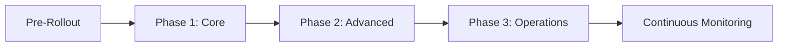
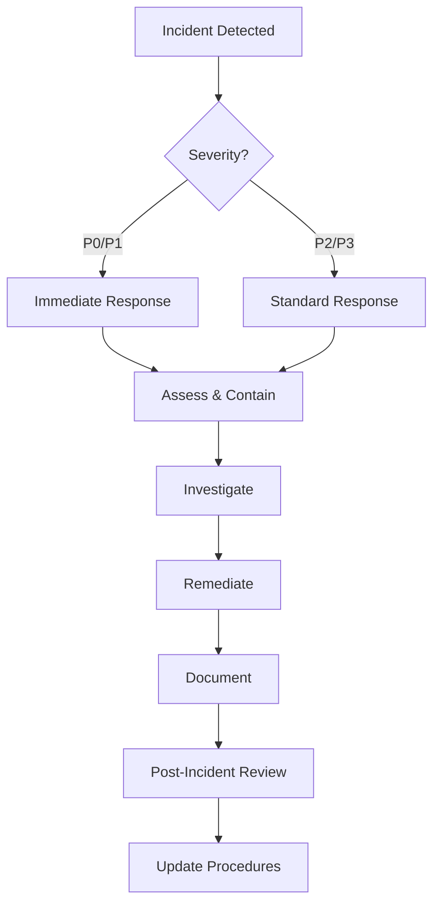

# Security Rollout and Operations Plan
## OberaConnect Platform - Version 1.0

**Document Owner:** Security Operations Team  
**Last Updated:** October 12, 2025  
**Classification:** Internal Use Only

---

## Table of Contents

1. [Executive Summary](#executive-summary)
2. [Rollout Phases](#rollout-phases)
3. [Pre-Rollout Preparation](#pre-rollout-preparation)
4. [Phase 1: Core Security Infrastructure](#phase-1-core-security-infrastructure)
5. [Phase 2: Advanced Security Features](#phase-2-advanced-security-features)
6. [Phase 3: Security Operations & Monitoring](#phase-3-security-operations--monitoring)
7. [Operations Procedures](#operations-procedures)
8. [Monitoring & Maintenance](#monitoring--maintenance)
9. [Incident Response](#incident-response)
10. [Training & Documentation](#training--documentation)
11. [Success Metrics](#success-metrics)
12. [Rollback Procedures](#rollback-procedures)

---

## Executive Summary

### Purpose
This document outlines the phased approach for rolling out and operating the comprehensive security features of the OberaConnect platform. It provides detailed procedures for deployment, operations, monitoring, and incident response.

### Scope
- Authentication and authorization systems
- Row-Level Security (RLS) policies
- Data encryption and protection
- Audit logging and monitoring
- Compliance frameworks
- Security incident response
- Privileged access management
- Input validation and sanitization

### Timeline Overview
- **Phase 1:** Weeks 1-2 (Core Security Infrastructure)
- **Phase 2:** Weeks 3-4 (Advanced Security Features)
- **Phase 3:** Weeks 5-6 (Security Operations & Monitoring)
- **Post-Rollout:** Ongoing operations and optimization

---

## Rollout Phases

### Phase Overview



---

## Pre-Rollout Preparation

### Week -1: Environment Preparation

#### 1. Infrastructure Assessment
- [ ] Review current database schema and RLS policies
- [ ] Verify backup and recovery procedures
- [ ] Confirm staging environment mirrors production
- [ ] Test rollback procedures

#### 2. Team Preparation
- [ ] Security team training completed
- [ ] Operations team briefed on procedures
- [ ] Support team trained on security features
- [ ] Stakeholder communication plan activated

#### 3. Documentation Review
- [ ] Security Audit Report reviewed
- [ ] CISSP Security Assessment completed
- [ ] Deployment checklist prepared
- [ ] Runbooks created for all procedures

#### 4. Communication Plan
- [ ] Customer notification templates prepared
- [ ] Internal announcement drafted
- [ ] Status page updated
- [ ] Support documentation published

---

## Phase 1: Core Security Infrastructure

### Week 1: Authentication & Authorization

#### Day 1-2: Authentication System
**Objective:** Deploy core authentication infrastructure

**Activities:**
1. **Enable Supabase Authentication**
   ```sql
   -- Verify auth schema is properly configured
   SELECT * FROM auth.users LIMIT 1;
   ```

2. **Configure Authentication Settings**
   - Enable email authentication
   - Enable auto-confirm for non-production
   - Configure password requirements:
     - Minimum 8 characters
     - At least one uppercase letter
     - At least one number
     - At least one special character

3. **Deploy User Profiles Table**
   ```sql
   -- Verify user_profiles table and RLS policies
   SELECT * FROM user_profiles LIMIT 1;
   ```

**Verification:**
- [ ] Users can sign up with email
- [ ] Users can log in successfully
- [ ] Profile creation triggers on signup
- [ ] Session management working correctly

**Rollback Trigger:** If authentication fails for >10% of test users

#### Day 3-4: Role-Based Access Control (RBAC)
**Objective:** Implement role hierarchy and permissions

**Activities:**
1. **Deploy RBAC Tables**
   - roles
   - user_roles
   - role_permissions
   - role_hierarchy

2. **Create Default Roles**
   ```sql
   INSERT INTO roles (name, description, level) VALUES
     ('Super Admin', 'Full system access', 100),
     ('Admin', 'Organization administrator', 80),
     ('Customer', 'Customer account manager', 50),
     ('User', 'Standard user', 10);
   ```

3. **Assign Initial Permissions**
   - Configure resource permissions
   - Set up permission inheritance
   - Test permission checks

**Verification:**
- [ ] Role hierarchy functioning correctly
- [ ] Permissions properly enforced
- [ ] has_role() function working
- [ ] has_permission() function working

#### Day 5: Row-Level Security (RLS) Policies
**Objective:** Enable and verify RLS policies across all tables

**Activities:**
1. **Enable RLS on Critical Tables**
   ```sql
   ALTER TABLE user_profiles ENABLE ROW LEVEL SECURITY;
   ALTER TABLE customers ENABLE ROW LEVEL SECURITY;
   -- Continue for all tables
   ```

2. **Verify Policy Coverage**
   - Run security linter
   - Review policy effectiveness
   - Test multi-tenant isolation

3. **Performance Testing**
   - Benchmark query performance with RLS
   - Optimize slow policies
   - Add necessary indexes

**Verification:**
- [ ] 100% RLS coverage on user data tables
- [ ] Users can only access their organization's data
- [ ] Performance degradation <10%
- [ ] No data leakage between customers

**Critical Success Criteria:**
- Zero cross-customer data access
- All automated tests passing
- Security linter shows no critical issues

---

### Week 2: Data Protection & Audit Logging

#### Day 6-7: Input Validation & Sanitization
**Objective:** Deploy input validation across all forms and APIs

**Activities:**
1. **Deploy Validation Library**
   - Implement Zod schemas
   - Deploy validation functions
   - Add sanitization utilities

2. **Update All Forms**
   - Add ValidatedInput components
   - Implement server-side validation
   - Test XSS prevention

3. **Database Validation Triggers**
   ```sql
   -- Deploy validation triggers
   CREATE TRIGGER validate_knowledge_article
     BEFORE INSERT OR UPDATE ON knowledge_articles
     FOR EACH ROW EXECUTE FUNCTION validate_knowledge_article();
   ```

**Verification:**
- [ ] All forms using validated inputs
- [ ] XSS attempts blocked
- [ ] SQL injection attempts blocked
- [ ] Path traversal attempts blocked

#### Day 8-9: Audit Logging System
**Objective:** Deploy comprehensive audit logging

**Activities:**
1. **Enable Audit Tables**
   - audit_logs (general actions)
   - ci_audit_log (CMDB changes)
   - cipp_audit_logs (CIPP actions)
   - privileged_access_logs (admin actions)

2. **Configure Audit Triggers**
   - User authentication events
   - Data modification events
   - Privileged access events
   - Security-relevant actions

3. **Deploy Log Retention Policies**
   ```sql
   -- Set up log retention
   -- Keep privileged access logs for 7 years (compliance)
   -- Keep general logs for 1 year
   ```

**Verification:**
- [ ] All critical actions logged
- [ ] Logs contain sufficient detail
- [ ] Log integrity maintained
- [ ] Log retrieval performance acceptable

#### Day 10: Encryption & Data Protection
**Objective:** Verify encryption at rest and in transit

**Activities:**
1. **Verify Encryption Configuration**
   - Database encryption at rest (Supabase default)
   - TLS/SSL for all connections
   - Encrypted backup storage

2. **Deploy Secrets Management**
   - Store API keys in Supabase secrets
   - Implement credential rotation schedule
   - Document secret access procedures

3. **Data Classification**
   - Mark PII fields
   - Implement data masking for sensitive fields
   - Configure data retention policies

**Verification:**
- [ ] All data encrypted at rest
- [ ] All connections use TLS 1.2+
- [ ] Secrets properly stored
- [ ] No plaintext credentials in code

---

## Phase 2: Advanced Security Features

### Week 3: Compliance & Security Controls

#### Day 11-13: Compliance Framework Implementation
**Objective:** Deploy compliance tracking and evidence collection

**Activities:**
1. **Deploy Compliance Tables**
   - compliance_frameworks
   - compliance_controls
   - compliance_evidence
   - compliance_audit_reports

2. **Load Framework Templates**
   - ISO 27001
   - SOC 2
   - HIPAA
   - GDPR
   - PCI DSS

3. **Configure Evidence Collection**
   - Automated evidence gathering
   - Manual evidence upload procedures
   - Evidence retention policies

**Verification:**
- [ ] All frameworks properly configured
- [ ] Evidence collection functioning
- [ ] Reports generating correctly
- [ ] Compliance scores calculated

#### Day 14-15: Security Baselines & Policies
**Objective:** Implement security baselines and policy enforcement

**Activities:**
1. **Deploy CIPP Security Baselines**
   - Create baseline templates
   - Configure policy enforcement
   - Set up policy violation alerts

2. **Configure Security Controls**
   - Password policies
   - Session timeout policies
   - Failed login policies
   - Account lockout policies

3. **Deploy Automated Remediation**
   - Configure auto-remediation rules
   - Set up approval workflows
   - Test remediation actions

**Verification:**
- [ ] Baselines applied to all tenants
- [ ] Policies properly enforced
- [ ] Violations detected and logged
- [ ] Remediation functioning correctly

---

### Week 4: Access Management & Monitoring

#### Day 16-18: Privileged Access Management
**Objective:** Implement privileged access controls and monitoring

**Activities:**
1. **Deploy Temporary Privileges System**
   - Time-limited role escalation
   - Approval workflow for privilege requests
   - Automatic privilege revocation

2. **Configure Access Monitoring**
   - Real-time privileged access logging
   - Access pattern analysis
   - Anomaly detection

3. **Implement Just-In-Time Access**
   - On-demand privilege elevation
   - Session recording for privileged actions
   - Break-glass emergency access

**Verification:**
- [ ] Temporary privileges working correctly
- [ ] All privileged actions logged
- [ ] Automatic revocation functioning
- [ ] Emergency access procedures tested

#### Day 19-20: Security Monitoring Dashboard
**Objective:** Deploy security operations center (SOC) dashboard

**Activities:**
1. **Configure SOC Dashboard**
   - Real-time security alerts
   - Incident tracking
   - Threat intelligence feed
   - Compliance status overview

2. **Set Up Alert Rules**
   - Failed login attempts (5+ in 15 minutes)
   - Privileged access anomalies
   - Data exfiltration patterns
   - Compliance violations

3. **Integrate with Incident Response**
   - Automated ticket creation
   - Escalation procedures
   - Response playbooks

**Verification:**
- [ ] Dashboard displays real-time data
- [ ] Alerts triggering correctly
- [ ] Incident workflow functioning
- [ ] Integration with ticketing system working

---

## Phase 3: Security Operations & Monitoring

### Week 5: Operational Readiness

#### Day 21-23: Security Operations Procedures
**Objective:** Establish operational security procedures

**Activities:**
1. **Deploy Security Runbooks**
   - Incident response procedures
   - Escalation procedures
   - Disaster recovery procedures
   - Business continuity procedures

2. **Configure Security Automation**
   - Automated security scans
   - Vulnerability assessments
   - Patch management
   - Configuration compliance checks

3. **Establish Security Metrics**
   - Mean time to detect (MTTD)
   - Mean time to respond (MTTR)
   - Security incident frequency
   - Compliance score trends

**Verification:**
- [ ] All runbooks accessible and tested
- [ ] Automation functioning correctly
- [ ] Metrics collecting properly
- [ ] Dashboards updated in real-time

#### Day 24-25: Team Training & Documentation
**Objective:** Train operations team and finalize documentation

**Activities:**
1. **Conduct Training Sessions**
   - Security operations training
   - Incident response drill
   - Tool usage training
   - Compliance procedures training

2. **Finalize Documentation**
   - Operations procedures
   - Troubleshooting guides
   - User documentation
   - API documentation

3. **Knowledge Transfer**
   - Shadow operations for 48 hours
   - Q&A sessions
   - Create FAQ document

**Verification:**
- [ ] All team members trained
- [ ] Documentation complete and accessible
- [ ] Mock incident response successful
- [ ] Team confident in procedures

---

### Week 6: Go-Live & Stabilization

#### Day 26-27: Production Rollout
**Objective:** Deploy to production and monitor closely

**Activities:**
1. **Pre-Deployment Checklist**
   - [ ] All staging tests passed
   - [ ] Rollback plan ready
   - [ ] Communication sent to stakeholders
   - [ ] Support team on standby
   - [ ] Monitoring dashboards active

2. **Phased Deployment**
   - **Phase 1:** Deploy to 10% of users (Day 26 morning)
   - **Monitor:** 4 hours
   - **Phase 2:** Deploy to 50% of users (Day 26 afternoon)
   - **Monitor:** Overnight
   - **Phase 3:** Deploy to 100% of users (Day 27)

3. **Post-Deployment Verification**
   - Run security linter
   - Verify all RLS policies active
   - Check authentication flows
   - Test critical user journeys

**Verification:**
- [ ] All features functioning in production
- [ ] No critical errors in logs
- [ ] Performance within acceptable limits
- [ ] User feedback positive

#### Day 28-30: Stabilization & Optimization
**Objective:** Monitor, optimize, and stabilize

**Activities:**
1. **Intensive Monitoring**
   - Monitor security logs 24/7
   - Track performance metrics
   - Review user feedback
   - Address issues immediately

2. **Performance Optimization**
   - Optimize slow queries
   - Adjust RLS policies if needed
   - Fine-tune caching
   - Review and optimize indexes

3. **Documentation Updates**
   - Document lessons learned
   - Update procedures based on experience
   - Create additional troubleshooting guides

**Success Criteria:**
- [ ] System stable for 72 hours
- [ ] <0.1% error rate
- [ ] Response times within SLA
- [ ] Zero critical security issues
- [ ] User satisfaction >90%

---

## Operations Procedures

### Daily Operations

#### Morning Checks (Every Day @ 8:00 AM)
1. **Security Dashboard Review**
   - Check for overnight security alerts
   - Review failed login attempts
   - Verify all security systems operational

2. **Audit Log Review**
   - Review privileged access logs
   - Check for unusual patterns
   - Verify compliance with policies

3. **System Health Check**
   - Verify database performance
   - Check authentication system status
   - Review error logs

#### Continuous Monitoring
- Real-time security alert monitoring
- Automated threat detection
- Performance monitoring
- Compliance violation detection

#### End of Day Review (Every Day @ 6:00 PM)
1. **Daily Security Report**
   - Summary of security events
   - Any incidents or near-misses
   - Actions taken
   - Recommendations

2. **Ticket Review**
   - Review and prioritize security tickets
   - Assign for next-day action
   - Escalate urgent issues

### Weekly Operations

#### Security Review Meeting (Every Monday @ 10:00 AM)
1. **Review Week's Security Events**
   - Security incidents
   - Compliance status
   - Vulnerability findings
   - Remediation progress

2. **Risk Assessment**
   - New risks identified
   - Risk mitigation progress
   - Risk acceptance decisions

3. **Planning**
   - Week's security tasks
   - Scheduled maintenance
   - Training sessions

#### Compliance Review (Every Friday @ 2:00 PM)
1. **Compliance Score Review**
   - Review framework compliance scores
   - Identify gaps
   - Plan remediation

2. **Evidence Collection**
   - Verify automated evidence collection
   - Review manual evidence
   - Update audit reports

3. **Policy Updates**
   - Review policy effectiveness
   - Update as needed
   - Communicate changes

### Monthly Operations

#### Security Audit (First Monday of Month)
1. **Comprehensive Security Review**
   - Run security linter
   - Review all RLS policies
   - Audit user permissions
   - Review access logs

2. **Vulnerability Assessment**
   - Scan for vulnerabilities
   - Review dependencies
   - Plan patching schedule

3. **Compliance Audit**
   - Review all framework compliance
   - Generate compliance reports
   - Address deficiencies

#### Access Review (Second Monday of Month)
1. **User Access Review**
   - Review all user accounts
   - Verify appropriate access levels
   - Remove inactive accounts
   - Update role assignments

2. **Privileged Access Review**
   - Review admin accounts
   - Verify justification for privileges
   - Remove unnecessary privileges
   - Update access logs

3. **Service Account Review**
   - Review all service accounts
   - Rotate credentials
   - Update documentation

#### Security Training (Third Monday of Month)
1. **Team Training**
   - Security awareness training
   - New threat briefings
   - Tool updates training

2. **Mock Incident Response**
   - Run incident response drill
   - Test communication procedures
   - Update response playbooks

### Quarterly Operations

#### Comprehensive Security Assessment (First Week)
1. **Full Security Audit**
   - Penetration testing
   - Security architecture review
   - Compliance assessment
   - Third-party security review

2. **Risk Assessment Update**
   - Review risk register
   - Update risk scores
   - Plan mitigation activities

3. **Disaster Recovery Test**
   - Test backup restoration
   - Test failover procedures
   - Update DR documentation

#### Strategic Planning (Last Week)
1. **Security Roadmap Review**
   - Review progress against roadmap
   - Update priorities
   - Plan next quarter initiatives

2. **Budget Review**
   - Review security spending
   - Plan budget for next quarter
   - Approve security investments

---

## Monitoring & Maintenance

### Key Performance Indicators (KPIs)

#### Security KPIs
| Metric | Target | Measurement |
|--------|--------|-------------|
| Mean Time to Detect (MTTD) | <15 minutes | Time from security event to detection |
| Mean Time to Respond (MTTR) | <1 hour | Time from detection to remediation start |
| Security Incident Frequency | <5 per month | Number of confirmed security incidents |
| RLS Policy Coverage | 100% | % of tables with RLS enabled |
| Failed Login Rate | <1% | % of login attempts that fail |
| Privileged Access Violations | 0 | Unauthorized privileged access attempts |

#### Compliance KPIs
| Metric | Target | Measurement |
|--------|--------|-------------|
| Overall Compliance Score | >95% | Weighted average of all frameworks |
| ISO 27001 Compliance | >98% | % of controls implemented |
| SOC 2 Compliance | >98% | % of controls implemented |
| Evidence Collection Rate | 100% | % of required evidence collected |
| Policy Violations | <10 per month | Number of policy violations |

#### Operational KPIs
| Metric | Target | Measurement |
|--------|--------|-------------|
| Authentication Success Rate | >99.5% | % of successful authentications |
| System Availability | >99.9% | % uptime of security systems |
| Audit Log Completeness | 100% | % of actions logged |
| Backup Success Rate | 100% | % of successful backups |
| Password Reset Time | <5 minutes | Average time to reset password |

### Monitoring Tools

#### Real-Time Monitoring
1. **Security Operations Dashboard (SOC)**
   - Location: `/soc-dashboard`
   - Refresh: Real-time
   - Monitors: Security events, incidents, threats

2. **System Health Dashboard**
   - Location: Supabase Dashboard
   - Refresh: 1 minute
   - Monitors: Database, auth, edge functions

3. **Audit Log Monitor**
   - Location: `/privileged-access-audit`
   - Refresh: Real-time
   - Monitors: Privileged access, data changes

#### Automated Alerts
1. **Critical Security Alerts** (Immediate notification)
   - Multiple failed login attempts (5+ in 15 min)
   - Unauthorized privilege escalation
   - Data exfiltration patterns
   - RLS policy violations
   - Authentication system failures

2. **Warning Alerts** (15-minute delay)
   - Unusual access patterns
   - Policy violations
   - Performance degradation
   - Compliance score drops

3. **Informational Alerts** (Daily digest)
   - Daily security summary
   - Compliance status update
   - Performance metrics
   - User activity summary

### Maintenance Procedures

#### Weekly Maintenance (Every Sunday 2:00 AM - 4:00 AM)
1. **Database Maintenance**
   - Vacuum analyze tables
   - Rebuild indexes if needed
   - Review query performance
   - Archive old audit logs

2. **Security Updates**
   - Review and apply security patches
   - Update dependencies
   - Review vulnerability reports

3. **Log Rotation**
   - Archive old logs
   - Compress archived logs
   - Verify log retention policies

#### Monthly Maintenance (First Sunday 2:00 AM - 6:00 AM)
1. **Full System Backup**
   - Complete database backup
   - Backup configuration files
   - Test backup restoration
   - Store offsite

2. **Credential Rotation**
   - Rotate service account passwords
   - Update API keys
   - Review and update secrets

3. **Performance Optimization**
   - Analyze slow queries
   - Optimize indexes
   - Review and update caching strategies

---

## Incident Response

### Incident Classification

#### Severity Levels

**Critical (P0)**
- Data breach or suspected breach
- Complete authentication system failure
- RLS policy bypass
- Ransomware or malware infection
- **Response Time:** Immediate (24/7)
- **Resolution Time:** <2 hours

**High (P1)**
- Partial system unavailability
- Multiple failed security controls
- Significant policy violations
- Unauthorized privilege escalation
- **Response Time:** <15 minutes
- **Resolution Time:** <4 hours

**Medium (P2)**
- Single security control failure
- Minor policy violations
- Performance degradation
- Suspicious activity detected
- **Response Time:** <1 hour
- **Resolution Time:** <24 hours

**Low (P3)**
- Security configuration issues
- Non-critical compliance gaps
- User access issues
- Documentation updates needed
- **Response Time:** <4 hours
- **Resolution Time:** <7 days

### Incident Response Process



### Response Procedures

#### Phase 1: Detection & Assessment (0-15 minutes)
1. **Receive Alert**
   - Automated alert via monitoring system
   - Manual report from user or team member
   - External notification (security researcher, customer)

2. **Initial Assessment**
   - Verify incident is real (not false positive)
   - Classify severity level
   - Identify affected systems and data
   - Estimate scope of impact

3. **Notification**
   - Notify on-call security engineer
   - Notify security team lead
   - For P0/P1: Notify CTO and executive team
   - Log incident in tracking system

#### Phase 2: Containment (15-60 minutes)
1. **Immediate Actions**
   - Isolate affected systems if needed
   - Revoke compromised credentials
   - Block malicious IP addresses
   - Enable additional logging

2. **Preserve Evidence**
   - Take snapshots of affected systems
   - Export relevant logs
   - Document timeline of events
   - Save all evidence securely

3. **Prevent Spread**
   - Review related systems for compromise
   - Strengthen authentication requirements
   - Implement additional monitoring
   - Review and update firewall rules

#### Phase 3: Investigation (1-4 hours)
1. **Root Cause Analysis**
   - Review audit logs
   - Analyze attack patterns
   - Interview involved parties
   - Review system configurations

2. **Impact Assessment**
   - Identify all affected data
   - Determine data accessed or exfiltrated
   - Assess compliance implications
   - Calculate business impact

3. **Attribution**
   - Identify attack source (if possible)
   - Determine attack methodology
   - Assess sophistication level
   - Check for related incidents

#### Phase 4: Remediation (4-24 hours)
1. **Fix Root Cause**
   - Patch vulnerabilities
   - Update configurations
   - Strengthen security controls
   - Implement additional safeguards

2. **Restore Services**
   - Verify systems are clean
   - Restore from clean backups if needed
   - Test functionality thoroughly
   - Monitor closely for recurrence

3. **Communication**
   - Update stakeholders on progress
   - Notify affected customers if needed
   - Prepare public statement if required
   - Document all actions taken

#### Phase 5: Recovery & Lessons Learned (24-72 hours)
1. **Full System Verification**
   - Run comprehensive security scans
   - Verify all security controls functioning
   - Test disaster recovery procedures
   - Review access logs for anomalies

2. **Post-Incident Report**
   - Timeline of events
   - Root cause analysis
   - Impact assessment
   - Response effectiveness evaluation
   - Lessons learned
   - Recommendations for improvement

3. **Process Improvement**
   - Update incident response procedures
   - Enhance monitoring and detection
   - Strengthen security controls
   - Update training materials
   - Schedule team debrief

### Incident Response Team

#### Roles & Responsibilities

**Incident Commander**
- Overall coordination of response
- Decision-making authority
- Stakeholder communication
- Resource allocation

**Security Lead**
- Technical investigation
- Containment strategy
- Remediation planning
- Evidence preservation

**Operations Lead**
- System restoration
- Service availability
- Performance monitoring
- Infrastructure management

**Communications Lead**
- Internal communications
- Customer notifications
- External communications
- Media relations (if needed)

**Legal/Compliance**
- Regulatory notification requirements
- Legal implications
- Compliance assessment
- Evidence handling

### Communication Templates

#### Internal Alert Template
```
SECURITY INCIDENT ALERT - [SEVERITY]

Incident ID: INC-YYYY-NNNN
Detected: YYYY-MM-DD HH:MM:SS UTC
Severity: [P0/P1/P2/P3]

Summary:
[Brief description of incident]

Affected Systems:
[List of affected systems]

Current Status:
[Investigation/Containment/Remediation/Resolved]

Actions Taken:
[List of actions]

Next Steps:
[Planned actions]

Response Team:
[Names and roles]

Updates will be provided every [15/30/60] minutes.
```

#### Customer Notification Template
```
Subject: Security Update - [BRIEF DESCRIPTION]

Dear [Customer Name],

We are writing to inform you of a security incident that may have affected your account.

What Happened:
[Clear, non-technical explanation]

What Information Was Affected:
[Specific data types]

What We're Doing:
[Actions taken to remediate]

What You Should Do:
[Specific actions for customer]

Questions:
If you have questions, please contact security@oberaconnect.com

We apologize for any concern this may cause and appreciate your understanding.

Sincerely,
OberaConnect Security Team
```

---

## Training & Documentation

### Security Training Program

#### Initial Training (Week -1)
**All Team Members**
- Security awareness basics
- Password policy and best practices
- Phishing identification
- Incident reporting procedures
- **Duration:** 2 hours
- **Format:** Interactive workshop

**Security Team**
- Security architecture overview
- RLS policy implementation
- Incident response procedures
- Tool usage training
- **Duration:** 8 hours
- **Format:** Hands-on lab

**Operations Team**
- Security monitoring procedures
- Alert triage and escalation
- Basic incident response
- Audit log review
- **Duration:** 4 hours
- **Format:** Hands-on lab

**Development Team**
- Secure coding practices
- Input validation requirements
- Authentication integration
- Security testing procedures
- **Duration:** 4 hours
- **Format:** Workshop + code review

#### Ongoing Training
**Monthly Security Awareness (All Staff)**
- Topic: Rotating security topics
- Duration: 30 minutes
- Format: Lunch & learn

**Quarterly Security Drills (Security & Ops Teams)**
- Mock incident response
- Red team exercises
- Tabletop exercises
- Duration: 2 hours

**Annual Security Certification**
- Comprehensive security training
- Policy acknowledgment
- Testing and certification
- Duration: 4 hours

### Documentation Requirements

#### Operations Documentation
- [x] Security Operations Procedures
- [x] Incident Response Playbooks
- [x] Monitoring and Alert Procedures
- [x] Backup and Recovery Procedures
- [x] Disaster Recovery Plan

#### Technical Documentation
- [x] Security Architecture Diagram
- [x] RLS Policy Reference
- [x] Authentication Flow Documentation
- [x] API Security Documentation
- [x] Database Schema Documentation

#### User Documentation
- [x] User Security Guide
- [x] Administrator Security Guide
- [x] Security Feature Documentation
- [x] Compliance Documentation
- [x] FAQ and Troubleshooting

#### Compliance Documentation
- [x] Security Audit Reports
- [x] Compliance Assessment Reports
- [x] Risk Assessment Documentation
- [x] Policy Documents
- [x] Evidence Collection Procedures

---

## Success Metrics

### Rollout Success Criteria

#### Technical Metrics
- [ ] 100% RLS policy coverage on user data tables
- [ ] Zero critical security findings
- [ ] <10% performance degradation
- [ ] >99.9% authentication success rate
- [ ] All automated tests passing
- [ ] Security linter shows no critical issues

#### Operational Metrics
- [ ] Mean Time to Detect (MTTD) <15 minutes
- [ ] Mean Time to Respond (MTTR) <1 hour
- [ ] Zero data breaches
- [ ] <5 security incidents per month
- [ ] >90% team confidence in procedures

#### User Experience Metrics
- [ ] >90% user satisfaction score
- [ ] <1% authentication failure rate
- [ ] <5 second average login time
- [ ] <2% support ticket increase
- [ ] Positive user feedback

#### Compliance Metrics
- [ ] >95% overall compliance score
- [ ] All framework requirements met
- [ ] 100% evidence collection
- [ ] Zero critical compliance gaps
- [ ] Audit-ready status achieved

### Post-Rollout Metrics (30/60/90 Days)

#### 30-Day Metrics
- System stability demonstrated
- All teams confident in procedures
- User adoption >80%
- No major incidents
- Compliance scores stable or improving

#### 60-Day Metrics
- Performance optimization complete
- Advanced features fully utilized
- Security metrics trending positively
- User satisfaction >90%
- Process improvements implemented

#### 90-Day Metrics
- Full operational maturity
- Continuous improvement established
- Security posture industry-leading
- Compliance audit ready
- Team expertise at peak level

---

## Rollback Procedures

### When to Rollback

**Immediate Rollback (Within 1 hour):**
- Critical security vulnerability introduced
- >10% authentication failure rate
- Data breach or data loss
- Complete system unavailability
- Compliance violation introduced

**Planned Rollback (Within 24 hours):**
- >10% performance degradation
- >5% user error rate
- Multiple non-critical issues
- User experience significantly impacted
- Business operations disrupted

### Rollback Process

#### Phase 1: Decision (15 minutes)
1. **Assess Situation**
   - Review metrics and error logs
   - Consult with technical lead
   - Assess risk of continuing vs. rolling back
   - Get approval from Incident Commander

2. **Notify Stakeholders**
   - Notify executive team
   - Alert operations team
   - Prepare customer communication
   - Update status page

#### Phase 2: Preparation (30 minutes)
1. **Backup Current State**
   - Take snapshot of current system
   - Export current configuration
   - Save all logs for analysis

2. **Prepare Rollback**
   - Identify last known good state
   - Review rollback procedure
   - Assemble rollback team
   - Clear rollback checklist

#### Phase 3: Execution (1-2 hours)
1. **Database Rollback**
   ```sql
   -- Revert to previous migration
   -- Disable new RLS policies
   -- Restore previous configuration
   ```

2. **Application Rollback**
   - Revert to previous deployment
   - Clear caches
   - Restart services

3. **Verification**
   - Test critical user journeys
   - Verify authentication working
   - Check system performance
   - Review error logs

#### Phase 4: Recovery (4-24 hours)
1. **Root Cause Analysis**
   - Investigate what went wrong
   - Document lessons learned
   - Plan corrective actions

2. **Re-planning**
   - Update rollout plan
   - Address identified issues
   - Schedule new rollout date
   - Communicate new timeline

### Rollback Checklist

**Pre-Rollback**
- [ ] Rollback decision approved by Incident Commander
- [ ] All stakeholders notified
- [ ] Current state backed up
- [ ] Rollback team assembled
- [ ] Rollback procedure reviewed

**During Rollback**
- [ ] Database reverted to previous state
- [ ] Application code reverted
- [ ] Configuration restored
- [ ] Caches cleared
- [ ] Services restarted

**Post-Rollback**
- [ ] System functionality verified
- [ ] Authentication tested
- [ ] Performance verified
- [ ] Users notified
- [ ] Post-mortem scheduled

---

## Appendices

### Appendix A: Contact Information

**Security Team**
- Security Lead: security-lead@oberaconnect.com
- On-Call Security Engineer: oncall-security@oberaconnect.com
- Security Operations: security-ops@oberaconnect.com

**Escalation**
- CTO: cto@oberaconnect.com
- CEO: ceo@oberaconnect.com
- Legal: legal@oberaconnect.com

**External**
- Security Researcher Contact: security@oberaconnect.com
- Vulnerability Disclosure: hackerone.com/oberaconnect

### Appendix B: Useful Links

**Documentation**
- Security Audit Report: `/SECURITY_AUDIT_REPORT.md`
- CISSP Assessment: `/CISSP_SECURITY_ASSESSMENT.md`
- Architecture Diagram: `/SYSTEM_ARCHITECTURE_DIAGRAM.md`
- Testing Procedures: `/TESTING_PROCEDURES.md`

**Dashboards**
- SOC Dashboard: `/soc-dashboard`
- System Validation: `/system-validation`
- Privileged Access Audit: `/privileged-access-audit`
- RBAC Portal: `/rbac-portal`

**Tools**
- Lovable Cloud Backend: [Backend Access]
- Security Linter: Automated via Lovable Cloud
- Monitoring: Built-in dashboards

### Appendix C: Glossary

**RLS (Row-Level Security)**
- PostgreSQL feature that restricts which rows users can access

**RBAC (Role-Based Access Control)**
- Access control method based on user roles

**MFA (Multi-Factor Authentication)**
- Authentication using multiple verification methods

**MTTD (Mean Time to Detect)**
- Average time to detect a security incident

**MTTR (Mean Time to Respond)**
- Average time to respond to a security incident

**PII (Personally Identifiable Information)**
- Data that can identify an individual

**XSS (Cross-Site Scripting)**
- Security vulnerability allowing script injection

**SQL Injection**
- Code injection technique attacking databases

### Appendix D: Change Log

| Date | Version | Author | Changes |
|------|---------|--------|---------|
| 2025-10-12 | 1.0 | Security Team | Initial document creation |

---

## Document Approval

**Prepared By:**  
Security Operations Team  
Date: October 12, 2025

**Reviewed By:**  
- CTO: _________________ Date: _______
- Security Lead: _________________ Date: _______
- Operations Lead: _________________ Date: _______

**Approved By:**  
CEO: _________________ Date: _______

---

## Next Review Date

This document should be reviewed and updated:
- After each major security rollout
- Quarterly as part of security review
- After any significant security incident
- When compliance requirements change

**Next Scheduled Review:** January 12, 2026

---

*This is a living document. All team members are encouraged to suggest improvements.*

**Document Classification:** Internal Use Only  
**Distribution:** Security Team, Operations Team, Executive Team
