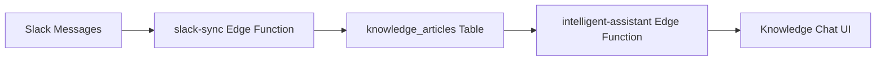

# Slack Integration for Knowledge Chat

## Overview
Slack messages are now synced to the knowledge base and accessible via the Intelligent Assistant (Knowledge Chat). This enables AI to learn from team communications, decisions, and discussions happening in Slack.

## Architecture

### Database Tables
- **`slack_sync_config`**: Stores Slack workspace connection details
  - workspace_id, workspace_name, channel_ids
  - access_token_encrypted (OAuth token)
  - sync_enabled, last_sync_at, sync_frequency_hours
- **`slack_sync_logs`**: Tracks sync operations
  - status (running, completed, failed)
  - messages_synced, messages_failed
  - sync_details (channels, errors)

### Edge Function: `slack-sync`
**Location**: `supabase/functions/slack-sync/index.ts`

**Functionality**:
1. Fetches messages from configured Slack channels (last 7 days)
2. Gets channel info and user details
3. Creates `knowledge_articles` with Slack content
4. Tracks sync progress in `slack_sync_logs`

**API Calls**:
- `conversations.info` - Get channel details
- `conversations.history` - Fetch messages
- `users.info` - Get message author info

**Deduplication**: Uses `source_metadata` to prevent re-syncing messages

### Frontend: `/slack-sync`
**Location**: `src/pages/SlackSync.tsx`

**Features**:
- Add/remove Slack workspaces
- Configure channel IDs to sync
- Enable/disable sync per workspace
- Manual sync trigger
- View sync activity logs

## How Slack Content Reaches Knowledge Chat



### Data Flow
1. **Sync**: `slack-sync` fetches messages → stores in `knowledge_articles`
2. **Query**: User asks question in Knowledge Chat
3. **Retrieval**: `intelligent-assistant` queries `knowledge_articles` (includes Slack)
4. **Context**: AI receives Slack messages as context
5. **Response**: AI answers using knowledge from Slack discussions

## Configuration

### Slack App Setup
1. Create Slack App at api.slack.com/apps
2. Enable OAuth Scopes:
   - `channels:history` - Read public channel messages
   - `channels:read` - View channel info
   - `users:read` - Get user info
3. Install app to workspace
4. Copy OAuth token (starts with `xoxb-`)

### Adding Workspace in UI
1. Navigate to `/slack-sync`
2. Click "Add Workspace"
3. Enter:
   - Workspace ID (e.g., `T01234ABCD`)
   - Workspace Name
   - Channel IDs (comma-separated, e.g., `C01234ABCD, C56789EFGH`)
   - OAuth Access Token

### Sync Frequency
- Default: 24 hours
- Manual sync available anytime
- Configurable per workspace

## Knowledge Article Structure

Slack messages are stored as:
```json
{
  "title": "Slack: #general - John Doe - 10/17/2025",
  "content": "**Channel:** #general\n**Author:** John Doe\n**Date:** 10/17/2025, 1:45 PM\n\n[message text]",
  "article_type": "guide",
  "status": "published",
  "tags": ["slack", "general", "team-communication"],
  "accessible_departments": ["all"],
  "source_type": "slack",
  "source_metadata": {
    "workspace_id": "T01234ABCD",
    "workspace_name": "My Team",
    "channel_id": "C01234ABCD",
    "channel_name": "general",
    "message_ts": "1697564700.123456",
    "user_id": "U01234ABCD",
    "user_name": "John Doe",
    "synced_at": "2025-10-17T01:45:00Z"
  }
}
```

## Security

### RLS Policies
- **slack_sync_config**: Customer-isolated (users can only see their org's configs)
- **slack_sync_logs**: Read-only for users in same org
- **knowledge_articles**: Existing RLS applies (department-based access)

### Token Storage
- **Current**: Stored as plain text in `access_token_encrypted` column
- **Production TODO**: Implement proper encryption using Vault or similar

## Intelligent Assistant Integration

### How AI Uses Slack Data
1. User query triggers `intelligent-assistant` edge function
2. Function queries `knowledge_articles` WHERE `customer_id` matches
3. Includes articles with `source_type = 'slack'`
4. AI receives Slack messages as context:
   ```
   Relevant Knowledge Base Articles:
   
   [GUIDE] Slack: #engineering - Jane Smith - 10/15/2025
   Channel: #engineering
   Author: Jane Smith
   We decided to use React Query for state management...
   ```
5. AI answers using Slack discussions as reference

### Example Use Cases
- "What did the team decide about the new feature?"
- "Has anyone discussed the Q4 budget?"
- "What solutions were proposed for the login issue?"
- "Who is working on the API refactor?"

## Monitoring

### Sync Logs
View in UI at `/slack-sync` → "Recent Sync Activity"
- Status (running, completed, failed)
- Messages synced/failed counts
- Error details
- Timestamp

### Database Queries
```sql
-- Check sync history
SELECT * FROM slack_sync_logs ORDER BY sync_started_at DESC LIMIT 10;

-- View Slack articles
SELECT title, source_metadata->>'channel_name' as channel
FROM knowledge_articles
WHERE source_type = 'slack'
ORDER BY created_at DESC
LIMIT 20;

-- Check AI usage of Slack content
SELECT user_query, ai_response, knowledge_sources
FROM ai_interactions
WHERE knowledge_sources @> (
  SELECT ARRAY_AGG(id) FROM knowledge_articles WHERE source_type = 'slack'
)
LIMIT 10;
```

## Future Enhancements

### Planned Features
1. **Thread Support**: Sync message threads as single articles
2. **File Attachments**: Download and process Slack files
3. **Reactions**: Track message importance via reaction counts
4. **User Mentions**: Highlight mentioned users in articles
5. **Auto-Sync**: Schedule syncs via cron jobs
6. **Selective Sync**: Filter by date range, keywords, or users

### Performance Optimization
1. **Incremental Sync**: Only fetch messages since last sync
2. **Batch Processing**: Process multiple channels in parallel
3. **Rate Limiting**: Respect Slack API limits (50 req/min)
4. **Caching**: Cache channel/user info to reduce API calls

## Troubleshooting

### Common Issues

**"Failed to sync Slack messages"**
- Check OAuth token is valid
- Verify app has required scopes
- Ensure bot is added to channels

**"No messages synced"**
- Verify channel IDs are correct (starts with `C`)
- Check messages exist in last 7 days
- Ensure messages aren't bot messages (filtered out)

**"Slack API error: invalid_auth"**
- Token expired or revoked
- Re-authenticate and update token in config

### Debugging
1. Check edge function logs: Backend → Functions → `slack-sync`
2. View sync log details in UI
3. Query `slack_sync_logs` for error messages
4. Test API calls directly using Postman/curl

## Production Readiness

### ✅ Complete
- Database schema with RLS
- Edge function with error handling
- UI for configuration and monitoring
- Knowledge Chat integration
- Deduplication logic
- Audit trail (sync logs)

### ⏳ TODO
- Token encryption (use Vault)
- Automated sync scheduling (cron)
- Thread support
- File attachment processing
- Rate limit handling
- Webhook integration for real-time sync

## Related Documentation
- `FABRIC_AI_PATTERN_SYSTEM.md` - AI pattern library
- `RECENT_FIXES_2025_10_17.md` - Recent changes
- `consolidated_INTEGRATIONS.md` - All integrations

## Quick Start

1. Get Slack OAuth token from api.slack.com/apps
2. Navigate to `/slack-sync`
3. Add workspace with token and channel IDs
4. Click sync button
5. Go to `/intelligent-assistant` and ask questions about Slack discussions

**Slack is now feeding your Knowledge Chat! 🚀**